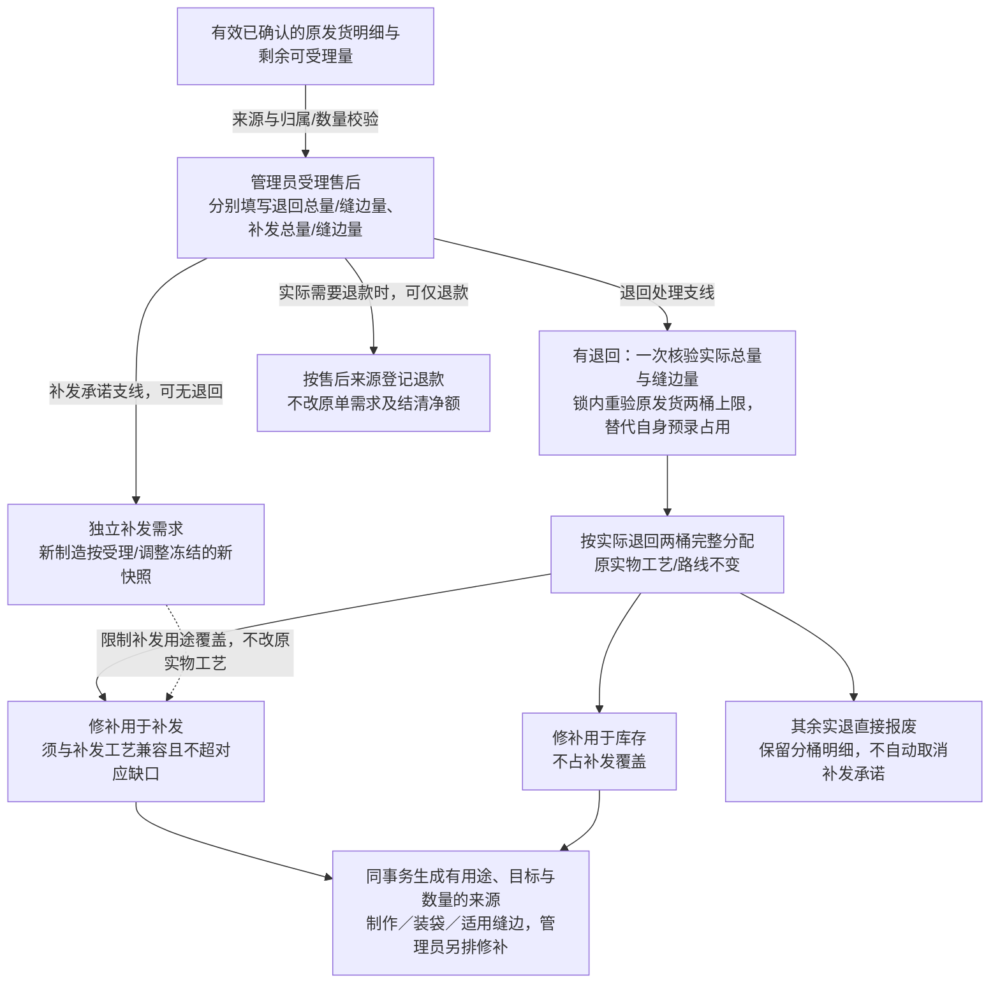
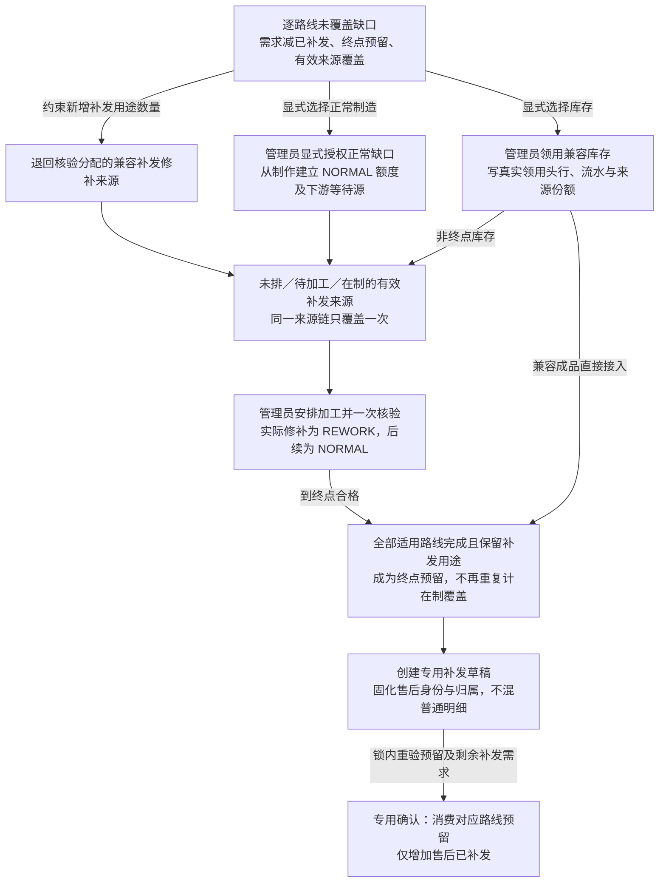
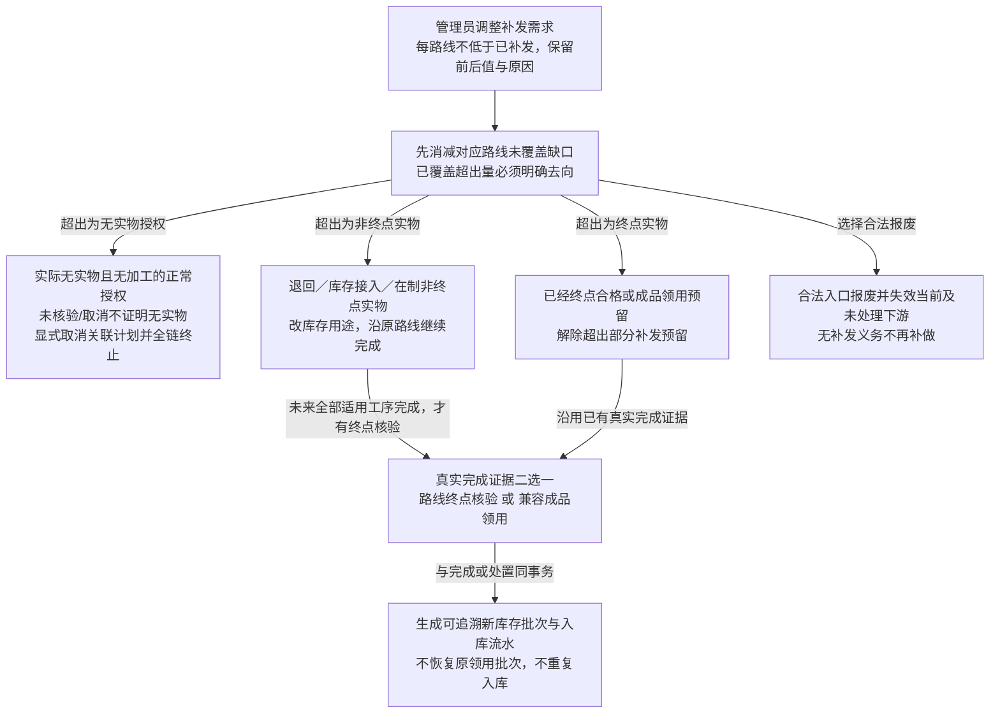

# 售后模块施工文档（阶段八：售后受理、退回核验、补发与售后退款）

日期：2026-09-27

修改人：chen

状态：**2026-09-27 新目标待评审 / 未实施**。本文同步已确认业务规则，描述目标设计，不代表字段、迁移、API 或事务已落地；原阶段八任务号仅作历史定位，不代表任务完成或验收通过。

上游依据：`openspec/specs/order-lifecycle/spec.md`、`openspec/specs/inventory-management/spec.md` 及 `openspec/changes/restructure-scheduling-module/` 的新目标 delta。基线与已归档 specs 保持不变；历史设计中的生产命名、手工返工来源、超额及未来预占口径不再作为本次目标。

## 1. 范围

**本阶段目标**：售后单与编号 `AS`、有效已确认发货明细受理、退回核验及同事务返工来源、独立的退回与补发需求、售后库存领用、修补及后续加工、补发覆盖与发货确认、修补转库存的真实入库、补发需求调整、售后退款与更正历史，以及订单详情「发货与售后」Tab 的显式操作与验收。

全模块目标命名由 `production` 改为 `scheduling`；售后属于 `orders`，可复用排班执行能力，但所有权、实物来源与数量台账独立于原订单。商品数量任务只有 `NORMAL` / `REWORK`，取消超额任务、`OVERTIME` 和未来预占机制。售后普通加工、报废后从制作补做及修补后的后续正常加工均使用 `NORMAL`，只有实际修补段使用 `REWORK`。

**本阶段不做**：售后补差价、补应收或补收款；把退回本身自动变库存；顶级售后工作区。库存用途必须显式决定，但决定后应沿路线完成实际入库，不能只留下待办提示。**不建空实现、不建占位服务。**

售后**不回写**原订单订购数量、累计发货、未交付需求、应收或主状态，也不增加原客户需求。下面表、字段和接口均是待评审设计建议，不预设迁移版本或宣称既有表结构已满足目标。

## 2. 编号

| 空间 | 前缀 | 宽度 | 示例 | `number_sequences.sequence_key` |
| --- | --- | --- | --- | --- |
| 售后单 | `AS` | 6 | `AS000001` | `after_sales_cases` |

## 3. 表结构

以下为目标逻辑模型，物理拆表与字段映射在实施首阶段落实；本机未上线，按排班施工文档重写单V1并清库重建，不做字段兼容或历史搬迁。数量沿用非负整数，金额沿用 `DECIMAL(19,4)`；事实保留版本、创建/更新人和时间、请求 ID、幂等键。售后业务事实归 `orders`；共享排班任务与执行事实归 `scheduling`，不能因此把售后需求划归原订单履约。

### 3.1 `after_sales_cases`（售后单）

建议保留 `id` / `case_no`（`AS`，唯一）、`order_id`、`status`（`OPEN` / `COMPLETED` / `CANCELLED`）、`problem`（必填）、`solution`、`note`、关闭人与时间及审计列。

原 `case_type` 的分类不足以表达无退回补发、只退不补或仅退款，不能用它推导数量或限制组合；实施时同步类型校验，业务以独立退回事实、补发需求和退款事实为准。

### 3.2 `after_sales_items`（售后明细）

保留 `case_id`、`order_id`、`order_item_id`、**`shipment_item_id`（有效已确认原发货批次明细）**、商品、`accepted_quantity`、`returned_quantity`、`returned_seam_quantity`、选中的原发货有效消费份额及原实物 `routeSnapshotId`、`replacement_required_quantity`、`replacement_seam_quantity`、独立的新制造工艺快照、退回核验引用和审计列。原实物路线与本次补发路线需求分开，不能直接套用原订单剩余需求或缝边数量。

**剩余可受理量** = 该有效发货明细数量 − 其他有效售后占用。受理数量为正且不得超过该余额，事务内锁定来源并重算；本轮不扩展售后受理次数规则，既有有效占用约束保留，来源唯一键不能替代数量校验。

`returned_quantity` 与 `replacement_required_quantity` 独立，可不同；允许无退回补发、只退不补、仅退款。受理必须显式提供 `returnedSeamQuantity`，满足 `0 <= returnedSeamQuantity <= returnedQuantity`，退回0时也必须填0。服务端从所引原发货的有效 `shipment_source_links` 校验有缝/无缝退回量及扣除其他有效退回占用后的余额，同事务冻结两桶数量、选中原份额及其路线/工艺，不从整单 seam、补发 seam 或比例猜测。

受理界面独立填写/确认 `replacementRequiredQuantity`（补发总量）及必填 `replacementSeamQuantity`（其中缝边量），满足 `0 <= replacementSeamQuantity <= replacementRequiredQuantity`。补发总量仅在未提供时默认退多少补多少，显式0必须保留；零补发时补发 seam 也必须填0。服务端冻结新制造可用的缝边种类及标准分钟，不接受客户端伪造分钟；没有合法工艺快照时拒绝正缝边量，不擅造配置。不得把退回与补发当受理量的互斥分解，不校验“退回 + 补发 = 受理”或“受理 ≤ 退回 + 补发”，也不另造售后数量上限。

退回核验显式提交实际returnedQuantity/returnedSeamQuantity（0≤seam≤total≤acceptedQuantity），可与受理预录不同；同事务重新锁原发货及售后明细，校验扣除其他有效退回占用后的两桶实际剩余原份额，保存预录到实际的差异及替代占用历史，原子替代本明细未核验占用而不双扣自身预录，不影响其他有效退回或独立补发承诺。现有更正仅留审计，不能假设存在先改未核验退回占用的接口。已核验事实不可覆盖。

**工艺身份（C7/C8）**：不可变 `routeSnapshotId` 标识具体路线、缝边工艺及冻结分钟版本，贯穿实物、用途、任务与flow。退回及修补/重过继承原发货实物快照；新正常补发制造使用受理冻结的新制造快照；库存按真实工艺校验兼容。有缝/无缝只是汇总两桶，`routeSeamRequired=true` 不代表工艺A与B兼容，不能互换覆盖或覆写历史。本轮不新增实物改造或跨工艺替代许可；不兼容退回物只能选择已确认的库存用途或合法报废，不能覆盖新补发承诺。

### 3.3 `after_sales_return_verifications`（退回核验）

每个售后明细一次退回核验，建议保存核验头与数量分配明细：本次显式提交并在锁内重验原发货剩余份额的实际退回总量及两桶、受理预录到实际的差异和本明细未核验占用替代历史、修补用于补发量、修补用于库存量、逐路线直接报废量及其汇总 `scrapQuantity`、原因、核验人和时间。实际份额允许不同于受理预录，不能要求先通过 correct 改占用或把预录当成实退上限；仍须满足 `0 <= returnedSeamQuantity <= returnedQuantity <= acceptedQuantity` 及原发货真实路线剩余份额约束。修补分配显式提交 `routeSeamRequired`、用途、目标工序和数量；服务端解析并持久化对应原发货消费份额和 `routeSnapshotId`，所有修补/报废处置均保留原份额引用，不能只靠boolean推定工艺。**用途与目标工序是两维**，同一用途可按数量拆到多个目标。

目标允许 `MAKING` / `PACKING_BAG` / `SEAM_CUTTING`，必须符合退回原实物的适用路线，不能按新补发 seam 改写实物路线。补发用途分配须同时满足具体工艺兼容及同路线 gap；库存用途不占补发覆盖。核验一次分配全部退回量，逐路线非负守恒：

```text
returned[有缝] = 本次核验显式提交并锁内验证的 returnedSeamQuantity
returned[无缝] = 本次核验显式提交并锁内验证的 returnedQuantity − returnedSeamQuantity
repair[r] = 修补用于补发[r] + 修补用于库存[r]
0 <= repair[r] <= returned[r]
scrap[r] = returned[r] − repair[r]
scrapQuantity = scrap[有缝] + scrap[无缝]
退回数量 = 总修补数量 + scrapQuantity
```

核验、分配明细、带来源/用途/目标/数量的返工来源和直接报废事实同事务写入；失败整体回滚。无需也不允许再独立手工创建返工来源；生成来源不是自动安排员工、日期或任务。

### 3.4 `after_sales_fulfillment_entries`（售后可补发/已补发台账，不可变）

建议保存 `after_sales_item_id`、事实类型、方向、数量、来源类型/头/行、实物覆盖链标识、业务日期、操作人与审计。事实应能区分库存接入、路线终点合格并预留补发、解除补发预留转库存、补发消耗及冲销；具体类型映射在单V1重写时落实，不做兼容迁移，不能沿用“任意工序合格即可补发”的含义。

```text
r ∈ {有缝, 无缝}
required[有缝] = replacementSeamQuantity
required[无缝] = replacementRequiredQuantity − replacementSeamQuantity
reserved[r] = 已完成该路线且仍保留补发用途的合格实物余额（含兼容库存接入）
shipped[r] = 该路线有效补发确认事实数量
covered[r] = 该路线已指定补发的未排/待加工/在制有效来源覆盖
待补发[r] = required[r] − shipped[r]
gap[r] = required[r] − shipped[r] − reserved[r] − covered[r]
各项总量 = 该项有缝桶 + 无缝桶
```

可补发即 reserved；上述两桶仅为数量汇总，计入及消费份额前还须按 `routeSnapshotId` 校验具体工艺兼容，不能以同为有缝把A工艺当成B承诺的覆盖。需求、覆盖、预留、已发和 gap 均逐路线核验，不能用总 gap 抵另一线路超额，不能截零掩盖负桶。上述减项按物理数量/来源链互斥计一次，不按经过的工序累加。来源到任务、下一工序、再次返工、合格预留、补发确认均是同一覆盖的状态迁移，不是新增覆盖。用途为库存的来源不占补发覆盖；若减少需求导致已覆盖超出，必须先按 §4.6 明确去向，不能靠截断负数掩盖超出。

来源事实幂等键负责“一笔事实只入账一次”，不应用 `unique(source_id)` 限制来源只能分配给一个任务。汇总与可补发余额必须能从不可变事实重建。

### 3.5 `after_sales_shipment_links`（补发发货关联）

保留 `after_sales_item_id`、`shipment_id`、`shipment_item_id`、`quantity` 与审计列，关联明细去重。**只有补发批次确认才增加已补发**；来源生成、排班、修补合格、路线终点合格和入库均不能代替补发确认。

### 3.6 `after_sales_corrections`（售后更正记录）

保留目标类型/ID、修改前后值、必填原因、操作人与时间；补发需求调整还需保留未覆盖减量、计划处置、在制用途转换、合格品库存去向与关联事实。**不覆盖原事实**，原值、数量及来源链完整保留。

### 3.7 售后排班来源（原售后生产来源，任务 8.4/8.5）

目标使用 `scheduling` 命名，建议来源记录所有者类型及售后明细、有效发货明细、退回核验或任务核验、发生工序、目标工序、用途（补发/库存）、总量、有效分配量、可安排余额、轮次及父来源、实物覆盖链、原因与审计。退回入口记录为退回核验，不伪造其已发生制作或其他加工核验。

售后需求、用途决定、覆盖与售后台账由 `orders` 拥有；共享排班来源、用途/路线份额映射、分配与核验由 `scheduling` 管理，保留售后业务所有者，按§8请求方自有端口及底层ledger同事务协作，不允许orders导入scheduling类型或上层互注。来源统一建源时即持久化非空 `purposeAllocationId`、稳定 `physicalShareId` 及不可变 `routeSnapshotId`；授权、退回、库存接入与各轮子源均生成或继承，单用途也不能省，6.5仅追加替代映射。source单值purpose只表示起始用途，查询/建任务/核验/回源均读有效份额。物理来源表映射在实施首阶段落实；不得照搬原 `after_sales_production_sources` 的“用途=返工/补发”混合分类。修补任务类型、修补用途、目标工序必须分开。

来源按**来源 + 目标工序**分余额，允许同一来源拆成多个日期/员工/任务，不能以 `unique(source_id)` 禁止重复安排。分配明细与事实幂等键防重复占用；事务内保证总有效分配不超对应余额。多轮不合格生成带父源的新轮次，不能把失败量加回旧轮可修补余额。

## 4. 口径

### 4.1 受理来源与上限（任务 8.2）

- 售后必须引用有效已确认原发货批次明细；发货草稿、已作废批次、未发商品一律拒绝，可沿用 `AFTER_SALES_SOURCE_INVALID`。
- 受理不得超过剩余可受理量，否则 `AFTER_SALES_QUANTITY_EXCEEDED`；事务锁定该发货明细并重算其他有效占用，防并发超量。
- 退回与补发需求独立；初次录入默认退多少补多少不是强制等式，不能相加约束受理。
- 订单部分发货但未关闭即可受理；原订单剩余需求继续正常排班与发货。有效售后占用仍阻止直接使原发货来源失效。
- **原发货路线生产者（C8）**：普通草稿创建/修改每行必填 `quantity`、`seamQuantity`，草稿不占用。确认在所有者锁内按请求两桶、具体工艺及稳定可发份额ID消费真实且尚未被其他有效发货消费的终点份额；来源须为真实库存领用行或终点核验份额。`shipment_source_links` 保存可发份额ID、路线/工艺快照及数量，`sourceLineId` 不得为0；不能每批从全部原始IN流水重新分摊或由整单 seam 推断。累计有效消费不超源额，确认不二扣库存；售后受理依赖该真实生产链，不以补发入口隔离代替。
- **普通逆向同份额**：合法普通 `/void` 按原链接追加反向事实，仅恢复同份可发及路线余额，不恢复库存、不删链接；`/corrections` 在既有状态/权限和售后占用限制下原子把同路线、同来源份额传给替代批次，不随机另取来源。失败原批次仍有效，重放不重复释放。补发四入口隔离不禁止普通合法逆向。

### 4.2 退回核验（任务 8.3）

先按§3.2显式提交实际退回两桶，锁内校验同一原发货的实际份额，保存与预录差异及占用替代；不是静默换路线，也不假设通用更正会先替核验改量。一次核验将全部实退分为修补用于补发、修补用于库存、直接报废，并按适用目标拆量。每路线修补不得超过该路线实退，按§3.3取差额为直接报废，两路线差额合计必须等于 `scrapQuantity`；总量相等不能掩盖错路线，等式错误返回 `AFTER_SALES_EQUATION_INVALID`，任何错误不留下部分核验、来源或报废。

**退回不自动入库、不恢复原发货库存**。选择库存用途是显式决策，只有走完适用路线后才形成实际库存批次/流水。直接报废也不会自动消除补发承诺，补发缺口独立计算。

普通/在制核验不合格与售后退回入口的返工目标不同：

| 入口/当前实际发生工序 | 可选修补目标 |
| --- | --- |
| 普通或在制 `MAKING` 核验 | `MAKING` |
| 普通或在制 `PACKING_BAG` 核验 | `MAKING` |
| 普通或在制 `SEAM_CUTTING` 核验 | `MAKING` / `PACKING_BAG` |
| 售后退回核验 | `MAKING` / `PACKING_BAG` / `SEAM_CUTTING`（须符合适用路线） |

返工再次不合格时，以**当前实际修补工序**套用前三行目标规则，不沿用最初退回入口的宽范围。缝边剪袋仍禁止报废但允许返工，核验满足 `completed = qualified + rework`；其他适用工序满足 `completed = qualified + rework + scrap`。

**退回来源回归（待实施验证）**：原订单有缝4/无缝6，首批仅发无缝5，受理退1、另需有缝补1时必须填returnedSeamQuantity=0、replacementSeamQuantity=1；退回不得选缝边修补，也不能用无缝退回覆盖有缝承诺。本例原批仅无缝5，核验申报有缝1须拒绝；若原批确有其他未被占用的实际路线份额，可显式提交实际两桶并在核验同事务重验、保存差异和替代占用，不静默推算。原批实退有缝2/无缝3、修补1/2，则直接报废必须1/1且scrapQuantity=2，任一路线超修补或报废汇总错误整笔回滚。原工艺A退回、新制造工艺B即使同为有缝仍各保留routeSnapshotId，不得仅按boolean互换覆盖；普通原发货作废/更正必须按原链接反向/传递同份额，重放不重复恢复。

### 4.3 补发来源（任务 8.4–8.6）

- **售后修补**：退回核验同事务生成来源。只有实际修补段为 `REWORK`，不占正常产能、不计正常工时；合格后按适用路线顺序进入后续工序，每段后续均为 `NORMAL`。制作修补合格不能直接成为可补发。
- **售后正常加工**：仅未覆盖缺口可形成从 `MAKING` 开始的 `NORMAL` 制作授权，不自动排任务；通过显式 `POST /api/after-sales/{caseId}/scheduling-sources` 提交售后明细、`quantity`、`seamQuantity` 和原因。`0 <= seamQuantity <= quantity` 且 quantity 为正；锁内分别验证 `seamQuantity <= gap[有缝]`、`quantity - seamQuantity <= gap[无缝]`。同事务创建 quantity 的 MAKING / PACKING_BAG 额度及 seamQuantity 的 SEAM_CUTTING 等待源，绑定相同 root 的路线份额；这不是三份覆盖，同 root 物理份额只覆盖一次，也不是实际下游流入。不能用于手工建返工来源。已终止额度不会复活，后续增量仍须此命令新授权。适用路线终点才成为可补发或可入库，不能跳过后续工序。
- **库存领用**：请求明确quantity及其中seamQuantity，满足0≤seamQuantity≤quantity；兼容库存按批次及真实路线/工艺份额原子扣减，同事务持久化初始用途/路线份额，形成独立售后阶段接入。依tasks C5扩展既有 `inventory_allocations` / `inventory_allocation_lines` 的 `owner_type` 及互斥订单/售后归属，普通/售后、非终点/终点均使用这套真实领用事实；售后领用必须同事务实际生成头、行并关联原出库 `movementLine`、批次、`routeSnapshotId` 和实物份额，维持既有HTTP响应形状但可追溯真实ID。现实现只有movement line，不能把目标 `inventoryAllocationLineId` 当成已存在证据，不能为满足FK虚构行或另建售后影子领用表；列名与映射待1.2核对、1.4及5.6落地。新增补发覆盖不得超过对应路线 gap，不能按总量任意猜配有缝/无缝。已完成适用路线的库存才直接进入可补发，完成证据为 `FINISHED_INVENTORY_ALLOCATION`，保留真实批次、领用/出库行及实物路线份额（见§4.6），不要求期初等合法成品库存拥有不存在的终点任务核验；未到终点的仍须正常加工并取得 `TERMINAL_VERIFICATION`，不得冒用成品分支。库存扣一次，补发确认不二扣。
- **库存用途修补**：走完适用后续加工后生成可追溯库存批次和入库事实，不计可补发、不计已补发。用途已显式决定后，终点入库是该决策的落地，不仅生成待办；加工完成证据为 `TERMINAL_VERIFICATION`，必须关联真实终点任务核验。

**期初证据与成品锚点（C2/C5）**：既有 `OpeningRequest` / `InventoryPage` 显式输入 routeSeamRequired，正缝边选择合法 seamTypeId，inventory 服务端冻结本域路线/工艺版本/分钟，node/seamState 校验完成阶段；单批单工艺，混合分批，调整增量继承原证据，不接受客户端分钟或用目标订单工艺回填。scheduling adapter 验证兼容后生成/关联排班 routeSnapshotId，inventory 不引用排班 DTO，不要求期初存在终点核验。

所有成品直接领用（普通及售后）亦在领用同事务创建真实 `INVENTORY_INFLOW` root/source、physicalShare、初始 purposeAllocation 及终点流入，不能拿 inventoryAllocationLineId 当 sourceId。`targetNode=SHIPPABLE` 只是终点追溯锚点，不是加工 Node，total 保存原接入量、balance/executableQuantity 恒0，不建加工额度、任务或核验。售后只记一次 RESERVED，普通直接可发；份额 terminalAvailableQuantity 独立由真实有效终点流入扣有效发货/补发、转库和接入逆向派生，普通发货作废恢复原消费、更正传递原份额，非终点该值为0，不能套加工余额公式。case/scheduling-sources 及普通 fulfillment GET 返回真实 source/root、allocationId/physicalShareId/routeSnapshotId、terminalAvailableQuantity、completionEvidenceType 及适用证据 ID，GET 不补建。3→1减需从 GET 选择真实 sourceId/allocationId 转库2；创建表单过滤 SHIPPABLE，服务端同样拒绝其建任务。

所有售后 `NORMAL`（正常加工、报废补做、返工后的后续段）计入产品 + 日期 + 工序的正常产能与正常工时，但不登记原订单需求占用或原订单合格流入。`REWORK` 的资源豁免仅限实际修补段，不能传播到后续正常段。

**覆盖与来源余额**：

- 用途为补发且尚未排班的返工来源已经覆盖补发需求，不得因“未安排”再造同量制作额度。已有未排正常补做来源也不能重复创建。
- 退回分配为补发、库存接入补发、正常制作建来源等任何新增覆盖，都须锁内重算未覆盖缺口；新增补发覆盖不得超过该缺口。这限制的是同一承诺的覆盖，不限制实退量或另加受理上限。超出部分须显式选择库存用途或合法报废处置，不能静默改用途；同链阶段迁移不当成新增覆盖。
- 以物理数量/来源链迁移覆盖；不能把制作、装袋、缝边数量或多轮返工数量相加，不能同时算来源覆盖和终点合格预留。
- 任务未完成中仅仍有效未处理部分返回同一来源、同一目标余额，可重新安排；已失效份额关联原报废，不回可排（§4.6）。这不是新增来源或新覆盖。来源分配、合格流转、失效与未完成回退均在一次核验事务内处理。
- 所有PENDING且无核验事实的计划均可填写原因后显式取消，不论任务日期或现场是否加工；锁内释放本计划有效来源占用、实物流入分配及正常资源，不删真实流入、不自动取消上下游、不复活失效份额、不自动解除补发覆盖。已核验绝不取消。每明细只能在任务日期之后一次核验，正完成无需开始标记，零完成也可直接核验；已核验历史计划保留历史日期资源，不因未完成、返工、报废或补做释放。

**真实流入分配（已确认规则，目标未实施）**：2026-09-27 已否决执行登记及 C9 候选，不再待审批，不新增显式或隐式开始任务。所有有效未核验计划在同所有者、来源/承接链、目标、有效用途及完整路线兼容池内按 `taskDate/itemId` 稳定分配已存在的真实流入，现场加工与否不改变排序；读模型与核验锁内重算共用算法，读不落绑定事实。后到流入沿同一排序分配，不保留开始优先或保护，不绑定未来实物、不增额度/覆盖。核验消费实际完成，释放有效未完成；取消释放本计划有效占用，失效部分按§4.6处理。来源10、流入5、B计划5未核验，再建更早A计划5，重算A可执行5、B为0；新到5后双方各5，B在任务日之后核验3只消费3并释放有效未完成2。此例是待实施验证的稳定分配，不证明现场实物可被任意撤销或改用途。

**报废与补做（C7）**：保留发生工序、来源、原因、数量、核验明细及父源链。仍需履约/补发的失败实物须结束旧覆盖，再从 `MAKING` 新建 `NORMAL` 补做额度及新的 `physicalShareId`，保存 `replacesPhysicalShareId`、`scrapRecordId`、数量及前后allocation替代映射，旧root只保留追溯、不同时覆盖；同一缺口只增加一次。按数量将旧份额尚未处理的等待source/task授权映射到新补做份额，保留等待ID、原计划及历史资源，不重复加等待额度；此时仍无实际流入，补做合格才流入。已处理而需重过的段另建重过额度。再次报废追加下一次替代，不能复活旧废件；与减量/取消竞争时重验当前有效替代链。不伪造原发生工序合格，不自动排班，返工报废不退旧修补余额。无需补发或已转库存用途的报废留报废及对应失效事实而不补做；退回直接报废不降低独立补发需求，其缺口须显式正常授权，不冒充加工核验自动补做。

待实施场景：制作1、原装袋等待1，连续两次制作报废补做后最终合格1承接原装袋等待；每次新实物均可追溯替代链，覆盖始终只计1、等待授权仍1、终点1，失败实物不再可执行。

### 4.4 补发发货（任务 8.7）

对每条路线 r 校验 `本次补发[r] <= reserved[r]` 且 `shipped[r] + 本次[r] <= required[r]`，否则 `AFTER_SALES_REPLACEMENT_INSUFFICIENT`。确认事务引用并消费真实路线份额的合格补发预留、追加补发消耗事实和发货关联，并增加对应桶的售后已补发；不可仅给总量由服务端任意猜配路线。**原订单订购数量、累计发货、未交付需求、应收与主状态全部不变**，原库存不重复扣减。

补发草稿每行必填quantity及其中seamQuantity，满足0≤seamQuantity≤quantity，并固化两类路线数量；草稿不占用预留，确认时锁内按路线及稳定份额ID重新分配实际消费并记录关联，不能把草稿候选引用当成已锁定实物。补发批次从草稿创建起就具有不可变的补发身份和售后归属，身份与全部明细关联同事务落地，不得与普通发货明细混批。服务端从持久化身份/关联判定，不信任客户端类型、备注或仅前端隐藏入口；“原发货已被售后受理”不是“本批次是售后补发”。

普通 `/api/orders/{orderId}/shipments/{shipmentId}` 的草稿修改及其 `/confirm`、`/void`、`/corrections` 数量写入口，必须先核验路径归属和批次身份，对补发批次返回 `STATE_NOT_EDITABLE`，不得进入普通履约扣减或恢复逻辑。专用售后补发确认必须锁内校验批次、全部明细均归属当前售后单，只写售后台账。当前不提供补发作废、等量更正或草稿改量能力，售后通用更正也不能绕过；这些动作在明确独立逆向规则前一律拒绝，不自动分流到普通逻辑。只读与既有物流修改可复用，但仍校验资源归属且不得修改数量、类型、售后关联或履约状态。

回归基线：原订购10、已发5、可发5，另有售后补发2。普通入口尝试修改、确认、作废或更正补发批次均拒绝，普通已发仍5、可发仍5；合法专用确认后售后已补2，随后被拒绝的作废/更正不改变批次有效性或已补2。普通发货与被售后受理的原发货仍遵循各自既有规则，不因身份判断混淆被一律当补发。

### 4.5 售后退款（任务 8.8）

维持原退款规则：退款 `source_type = AFTER_SALES` + 售后单 ID，校验关联售后单存在性及退款累计不超过收款；售后退款单列进入**累计实际净收**，**不冲减订单结清净额，不产生新的原订单待收/待退**。仍履约或已关闭订单均保持主状态。首期不支持售后补差价、补应收或补收款。本段是规则延续，不代表新目标已实现。

### 4.6 更正（任务 8.9）

受理预录与实际退回不同，由一次退回核验按§3.2显式记录实际两桶、前后差异和原份额占用替代，不另增更正HTTP。既有RETURN_VERIFICATION更正仅保留说明审计，不改变核验数量、来源、覆盖或库存；本change不新增退回核验逆向能力，通用文本不能绕过不可覆写事实，**不通过取消已核验任务更正**。补发需求调整仅按以下结构化契约处理。

补发需求调整必须显式提供新 `replacementRequiredQuantity` + `replacementSeamQuantity`、原因并保存前后值与历史；满足 seam 范围且每路线 `newRequired[r] >= shipped[r]`，无合法冻结缝边工艺时拒绝正 seam。对每路线独立计算 `reduction[r] = max(oldRequired[r] - newRequired[r], 0)`，以调整前 `gap[r]` 消减未覆盖，再对 `max(reduction[r] - gap[r], 0)` 明确已覆盖处置；不能用另一桶的 gap 抵减。

1. 各路线增加需求仅产生该路线未覆盖缺口，不自动生成来源或任务。
2. 各路线减少需求先消减本路线未覆盖部分；涉及已有来源或货品覆盖的部分必须明确去向，不能仅改需求数字。即使总量不变，换路线也必须作为一减一增处理，增量只出 gap、减量须处置，不能直接改实物 route。
3. 尚无实物的正常制作授权与退回/库存/在制实物分开处理。对减量明确选中的 NORMAL 制作授权份额，须实际无实物且无加工，服务端锁内重验既有来源、退回/库存接入、核验处理及下游流入证据，才可追加按数量的额度终止事实；PENDING、未核验或计划已取消不足以证明此前提，不使用开始标记、客户端声明或新增人工确认操作/字段代替证据。合法终止同时减少有效补发覆盖；保留原授权总量、原因、调整引用与终止量，不删除来源、不生成报废或入库。有效授权=原授权−累计终止；可安排=有效授权−PENDING原占用−已核验处理−invalidatedUnoccupied（失效口径见本节末）。已终止量不得再次排班或重复终止，之后需求增加须重新按缺口授权。
4. 若待终止份额已排计划，调整请求必须显式列出受影响且合法可取消的制作及后续等待明细，同事务取消、释放占用/正常资源并终止各段对应额度；不能自动级联取消、不允许遗留失去来源额度的有效计划。部分减量不能直接改原计划：计划5减2时可显式取消整条5、终止2，余下3保留有效来源等待重新安排，不自动创建任务。若实际已有加工/实物，或关联占用无法合法解除，整笔无实物终止拒绝；未核验计划仍可取消，但不能借取消把实物当成空授权，须按原份额、用途及工艺继续处置。
5. 所有未核验退回修补计划均可显式取消并释放同源同目标有效占用，不论任务日期或现场加工与否；但实物不消失，仍沿原份额、用途及工艺继续处置。`SCRAP_RETURNED` 仅适用于退回后实际未修补加工、未被消费且符合直接处置条件的实物；未核验或计划已取消不能证明符合条件，已实际加工部分仍按实际工序规则处置，不能绕过缝边加工禁报废。直接报废须显式合法解除全部占用，不抹除加工/核验/消费事实；同事务记录报废并使**当前未处理source及全部对应未处理下游等待份额**失效，按 `scrap + targetSource + physicalShare` 去重，不能只失效下游，不记任务 `processed` 或无实物 `terminated`。源1退回后实际未修补加工→需求0并合法报废1，结果必须为 `balance=0 / processed=0 / terminated=0`；重放、取消、未完成回退或投影重建均不得复活。服务端按既有来源/流转/核验/消费证据校验实物条件，不用不存在的开始标记，不新增人工确认操作或字段，也不宣称可自动识别未登记现场加工。
6. `CONTINUE_TO_INVENTORY` 适用于**所有尚未到终点的真实有效未处理份额**，包括退回、库存接入、前段合格，以及无任务、等待加工或现场已加工但尚未核验的部分，不以开始状态为前提；已消费份额仅可选择当前有效后继。由当前实物前沿追加用途替代并解除一次对应补发覆盖，沿原路线完成；保留历史任务及事实，实际修补仍为 `REWORK`，后续正常加工按 `NORMAL` 计资源，不能提前入库或借取消计划抹除实际加工/消费事实，不生成开始记录。物理 `physicalShareId` 贯穿 root、来源、任务分配、用途与 flow；即使单用途，源创建同事务也须生成初始真实 `purposeAllocationId`。change 细化任务6.5只追加选中未处理份额的用途替代映射，不是首次初始化、不改整条 `source.purpose`；6.4退回实物改用途复用同一服务，不以是否开工作为入口条件。锁内把替代映射传播到既有下游等待源及计划的对应 share，不新增加工额度、不改原计划量/历史资源或已处理用途历史；已被下游消费时只能选当前有效后继，不得冒用上游在制分支。前段合格2等待装袋且尚无任务，减需2也可走此分支，后续真实加工到终点才入库，不当空授权终止。HTTP核验以allocationId引用真实purposeAllocationId，由服务端解析用途、physicalShareId与路线；仅唯一有效份额可省组规范化，同用途多路线仍须按组分别提交合格/返工/报废及返工目标，分组完成不超有效未处理份额和可执行、各组汇总等于明细结果。未完成仅仍有效未处理部分回同源同目标，子源与下游继承对应 share 的用途和路线；补发份额报废才按义务补做，库存份额报废不补做。
7. 已合格超出部分转库存并解除补发预留，原子创建可追溯新批次/入库事实；不能同时算可补发与库存。按下述完成证据区分加工终点与成品库存直接领用，不将所有来源泛化为必须有终点任务核验。
8. 例：无退回、正常来源5且实际无实物、无加工，补5改补3后有效来源/覆盖3、累计终止2、库存0、报废0；退5补5且已合格5改补3，则预留3、库存2；期初成品直接领用3且无终点任务核验，补3改补1，则预留1、新库存2，原领用仍有效且仅扣3一次，不恢复旧批次；已补4不能改3。需求、全部计划处置、额度终止、覆盖与去向同事务，幂等重放不重复释放，并发排班/取消/核验任一改变前提均锁内重验，不能把无核验记录当成现场无加工的证明。

**合格转库完成证据（待评审 / 未实施）**：入库关联售后明细、有效发货、用途转换及选中实物份额；减量转库还关联真实 `demandAdjustmentId`。按 `completionEvidenceType` 校验以下两个分支，不能将所有关联统一放宽为可空：

| 完成证据 | 必须追溯与校验 | 不得替代的边界 |
| --- | --- | --- |
| `TERMINAL_VERIFICATION` | 真实 `terminalVerificationId`、实际加工来源、`physicalShareId`、适用路线及终点合格数量；存在退回/返工时另关联退回核验、目标分配及适用轮次父源 | 无退回 `NORMAL` 加工转库仍必须有真实终点核验，只是不伪造退回核验或返工父源；未到终点不得入库 |
| `FINISHED_INVENTORY_ALLOCATION` | 真实原 `batchId`、allocation/line（`inventoryAllocationLineId`）、原领用出库 movementLine（`inventoryMovementLineId`）、`physicalShareId`、实际路线份额、用途转换及减量时的 `demandAdjustmentId` | 仅适用于已完成适用路线并直接进入售后 `RESERVED` 的成品库存；不要求不存在的 `terminalVerificationId`，不虚构终点任务或以新入库流水替代原出库证据 |

Receipt 服务与 DTO 均由 inventory 持有：售后用 `AfterSalesInventoryReceiptService.ReceiptRequest`，带 afterSalesItemId 及适用 demandAdjustmentId/售后处置引用；普通余量用 `OrderSurplusReceiptService.OrderReceiptRequest`，必填 orderItemId/orderChangeItemId，不复用售后 FK。两者均由 scheduling adapter 调用同一库存底层写核心，orders 不引用库存类型，Receipt 不回调 scheduling。先改用途后加工到终点时 origin 为真实终点核验分组且追溯原调整；当场终点转库 origin 为真实处置行。

服务端从持久化批次、领用/出库与售后份额证明完成路线、归属一致、原领用扣减有效及尚未消费数量；客户端声明证据类型不是证明。缺少该分支必需引用、错链、路线不符、余额不足或已取消领用均拒绝。入库 origin 唯一键仍为 type/id/line，完成证据不替代 origin，也不以单个 allocation line 唯一约束阻断合法分次按份额转库。

成品领用超出转库新建批次及入库流水，不恢复原领用批次或原发货库存，不冲销原领用、不再扣一次原库存；原领用出库持续有效，对应 `reserved` 仅减少一次。需求调整、用途转换、份额消费、解除预留、新批次/入库流水及来源关联在同一事务提交，任一失败全部回滚；同键同载荷重放返回原结果，不新增批次或重复解除预留，同键不同载荷拒绝。

**既有领用冲销边界（5.6，不新增能力）**：当前无**专用售后领用cancel入口**，但已有 `InventoryService.reverseMovement` 通用冲销，不得将库存delta中的“无取消入口”解释为无可达逆向。本修订不新增、改名或删除HTTP，也不把reverseMovement改造成专用取消接口。5.6必须通过inventory自有端口由scheduling适配编排，先按同一L锁序锁所有者、任务、source/flow/coverage及容量，再由库存writer锁批次；识别售后归属并锁内重验，禁止先恢复库存后补售后逆向。

只有接入份额在接入后均实际未加工、未核验、未转库、未补发且未被其他业务消费，且所有关联计划已显式合法解除时，才可按既有规则同事务追加原领用及全部 `flow/source/coverage` 关联的逆向事实、撤销阶段流入/预留/覆盖并恢复原库存一次；保留原领用/出库及逆向引用，不删除事实、不留下可排来源或有效覆盖，不复活已终止/报废份额。任一份额接入后已实际加工/核验/转库/补发消费或计划未解除即拒绝整笔，即使还有未消费余额也不得整单冲销。任一步失败全部回滚，同键重放不重复恢复。冲销与用途调整、取消/核验、转库或补发在同份额上互斥：转库先成功则拒绝冲销；合法冲销先成功则拒绝以该领用作完成证据再转库。不能同时恢复旧批次又生成新库存，售后通用更正亦不能绕行；计划取消不代表领用可逆向，PENDING、未核验或已取消均不足以证明实际未加工。服务端按既有来源、flow、核验及消费证据锁内重验，不用不存在的开始标记，也不新增人工确认操作或字段；本模型不宣称能自动识别未登记现场加工。

排班核验或普通/售后需求处置生成的入库，不允许通用 reverseMovement 孤立冲销，返回 `STATE_CANNOT_CANCEL`，否则会留下核验/处置有效而库存已撤销的断链。本 change 不新增核验或处置逆向；独立期初/库存调整的既有合法冲销保留，不因上述守卫被一刀切禁用。普通领用 cancel 与通用 reverse 对同一原起因串行去重，不能各恢复一次。

**库存证据回归（待实施验证）**：以下与库存 delta 的同名 Scenario 对齐，不表示实现或验收通过。

- **期初成品领用三件减需一件转新库存两件**：无终点任务核验的兼容同路线期初成品领用3进入 `RESERVED`，需求3改1并显式转库2；成品证据完整，预留1、新批次库存2，旧批次不恢复、原领用只扣3一次、已补发不增加。
- **成品领用减量转库同键重放不重复记账**：上述请求同键同载荷重放返回原结果，预留仍1、新库存仍2，原出库和解除预留各仅一次；origin仍为type/id/line，同键不同载荷拒绝。
- **成品领用减量转库失败全部回滚**：需求调整、用途转换、份额消费、解除预留、新批次/流水或来源关联任一步失败，需求/预留仍3，原领用有效且只扣3一次，不残留调整、份额消费、新库或成功幂等结果。
- **成品领用取消与转库互斥**：场景名沿库存delta，实际既有入口为 `InventoryService.reverseMovement` 通用冲销，而非专用售后cancel。与转库竞争按同一L锁内重验；转库先成功则冲销拒绝，既有合法冲销先成功则转库拒绝，不同时恢复旧批次与增加新库存，不新增HTTP。
- **领用已有下游消费拒绝取消**：任一份额接入后已实际加工、核验、转库或确认补发，或关联计划未合法解除时，通用冲销必须整笔拒绝；有未消费余额亦不例外，库存、预留、已补发及原出库事实不变。
- **未消费领用通用冲销完整逆向**：接入后实际未加工/未核验/未消费等原条件满足且合法解除全部关联计划后，5.6对该终点/非终点领用按L一次逆向flow/source/coverage及库存，原库只恢复一次、售后接入不残留；重放不二恢复，任一逆向失败全回滚，不以只有movement反向证明整链已完成。
- **完成证据不得缺失错链或冒用成品分支**：无退回 `NORMAL` 缺终点核验、非终点库存冒用成品证据、成品领用/出库引用缺失或份额路线/余额不符均拒绝，不生成入库或解除预留；不允许把成品分支解释成全部核验可空。

**当前/下游等待份额失效（C7，目标未实施）**：库存 share 在上游加工核验报废且不补做时，同一核验事务为对应下游未处理额度追加失效；`SCRAP_RETURNED` 直接处置则在同一处置事务覆盖当前未处理source及其全部对应未处理下游份额。均以 `scrap_record_id + target_source_id + physical_share_id` 幂等关联原报废，只处理选中实物，不按同root清空其他用途或路线。此举不是6.2无实物终止，不在失效目标伪造processed、不再记一次报废、不再次释放覆盖。失效本身不取消计划或释放资源，PENDING原计划不改，失效share可执行为0；后续核验仍为 `unfinished = 原计划 - completed = returnableUnfinished + invalidatedUnfinished`，仅前者回可排，后者关联原报废、标记已处置且不再提示重排。合法取消释放自身原计划正常资源，但仅恢复有效份额的可排，绝不复活失效部分；直接处置仍须事先在同事务显式合法解除占用。

加工来源/目标的完整余额为 `total - terminated - pending原占用 - processed - invalidatedUnoccupied`；SHIPPABLE 终点锚点不适用，balance/executable恒0、terminalAvailableQuantity按§4.3独立重建；加工公式中的invalidatedUnoccupied仅含已不由 PENDING 扣除且未处理的失效份额，仍在 PENDING 原占用中的失效量不得再扣一次。上文无实物终止也遵守此完整公式，不涉及失效时该减项为0。View 可列 `invalidatedQuantity` 及 `invalidatedUnoccupiedQuantity`，不将失效量混入 completed。

**固定回归（待实施验证）**：同一无缝链制作5 + 装袋等待计划5，制作已有真实在制实物但尚未核验，按有效份额将需求改为补发3、其余2转库存（无开始登记，不把PENDING当作实物证据）；制作核验为补发合格3、库存合格1、库存报废1。下游原计划仍5，有效4（补发3/库存1）、失效1；装袋核验4后 unfinished=1 但可重排=0，终点补发预留3、库存1，无补做。制作及装袋各自原日期资源均仍按计划5保留。

## 5. 状态与派生

- **售后单状态**：`OPEN` → `COMPLETED` / `CANCELLED`，由事实派生并通过明确命令转换。完成须补发承诺已履行或无需补发，且退回修补、库存/报废去向已实际处理；不能仅因补发需求为零就隐藏待加工实物。
- 整单取消仅限尚无退回核验或补发等执行事实且关联计划与占用已合法处理，且实际无加工等原整单取消条件均满足；有事实只能更正或继续完成，不做部分取消。退回实物不能随取消或减量消失。
- **售后占用**：按有效受理数量派生，既有有效占用约束保留，事务内仍须重算数量上限。
- **补发覆盖**：来源、在制、合格预留与已补发按物理链互斥派生；库存用途和已失败覆盖不纳入。
- 售后不影响原订单派生状态，原发货进度、需求处理与结清状态仍只看原订单事实。

## 6. API 契约（阶段八）

以下均为目标契约建议，沿现有订单上下文及来源/任务能力调整，不宣称已存在。来源生成内聚于核验或明确的缺口处置，不提供独立手工 create rework source。

| 能力 | 方法与目标路径 | 幂等 | 成功结果 | 主要拒绝条件/候选码 |
| --- | --- | --- | --- | --- |
| 售后列表/详情 | `GET /api/orders/{id}/after-sales`、`GET /api/after-sales/{caseId}` | 否 | 独立需求、退回分配、覆盖、可补发/已补发与库存去向 | `ORDER_NOT_FOUND`, `NOT_FOUND` |
| 创建售后 | `POST /api/orders/{id}/after-sales` | 写入幂等 | `AS`及来源占用；必传 `returnedSeamQuantity`，按有效原发货份额冻结退回两桶/工艺；独立填写 `replacementRequiredQuantity`、必传 `replacementSeamQuantity`，保留显式0并冻结新制造快照 | 缺任一 seam、退回源份额/余额错误、正补发 seam 无合法快照 |
| 退回核验 | `POST /api/after-sales/{caseId}/verify-return` | 必须幂等 | 实际`returnedQuantity/returnedSeamQuantity`锁内校验原批份额，记录预录差异及替代占用；修补分配带 `routeSeamRequired`，逐路线差额报废汇总为 `scrapQuantity`；核验/用途/目标/原份额/返工来源/报废同事务，无任务 | 实际退回超受理/原份额、等式/工艺错误、超同路线gap、`STATE_ALREADY_VERIFIED` |
| 售后排班来源 | `GET /api/after-sales/{caseId}/scheduling-sources` | 否 | SourceView 含真实 source/root、afterSalesItemId/afterSalesCaseId，份额 allocationId/physicalShareId/routeSnapshotId、有效用途及覆盖；包含 SHIPPABLE 锚点，其 balance/executable=0，terminalAvailableQuantity 独立返回，并带 completionEvidenceType 及 terminalVerificationId 或 inventoryAllocationLineId/inventoryMovementLineId；失效两项见§4.6 | `NOT_FOUND` |
| 售后正常缺口授权 | `POST /api/after-sales/{caseId}/scheduling-sources` | 必须幂等 | 输入明细、正 `quantity`、`seamQuantity`、原因；按§4.3建MAKING/装袋及缝边等待源，同root覆盖一次，不建任务、不复活终止量 | 数量/工艺错误、任一路线超 gap；拒绝手工返工建源 |
| 售后排班任务 | `POST /api/after-sales/{caseId}/scheduling-sources/tasks` | 写入幂等 | 全批来源锁内匹配路径case，仅消费既有来源；复用 `NORMAL` / `REWORK` 创建核心一次 | `SOURCE_INVALID`（跨case/混选）、`SOURCE_INSUFFICIENT`、工艺/日期/资格/产能错误 |
| 售后库存领用 | 既有 `POST /api/inventory/after-sales-allocations` | 写入幂等 | `{afterSalesItemId,batchId,quantity,seamQuantity,reason}`；真实领用头/行、出库、份额、阶段flow或RESERVED及覆盖同事务，沿既有流水摘要响应 | 库存不足、工艺不兼容、超同路线gap；通用冲销依§4.6/5.6，不新增cancel HTTP |
| 补发需求调整 | 复用 `POST /api/after-sales/{caseId}/corrections` 的数量调整命令 | 写入幂等 | 新总量 + `replacementSeamQuantity`、原因及逐路线处置原子生效；等总量换路线也一减一增 | 任一路线低于 shipped、去向不完整、计划不可取消、并发版本冲突 |
| 补发发货 | `POST /api/after-sales/{caseId}/replacement-shipments`、`POST .../confirm` | 必须幂等 | 草稿原子固化身份与关联，确认锁内验证整批归属后增加已补发 | `AFTER_SALES_REPLACEMENT_INSUFFICIENT`、归属/状态错误 |
| 普通发货数量入口隔离 | `PATCH /api/orders/{orderId}/shipments/{shipmentId}` 及其 `POST /confirm`、`/void`、`/corrections` | 沿既有写协议 | 普通批次按既有规则；补发批次不得进入普通履约写入 | 补发身份返回 `STATE_NOT_EDITABLE` |
| 补发未提供的逆向/改量操作 | 草稿改量、作废、等量更正（含通用售后更正绕行） | 不新增能力 | 不执行普通逆向逻辑；合法只读/物流能力保留 | `STATE_NOT_EDITABLE` 或未提供路径 `NOT_FOUND` |
| 售后退款 | `POST /api/orders/{id}/refunds`（`sourceType=AFTER_SALES`） | 写入幂等 | 单列售后退款、累计实际净收 | `REFUND_EXCEEDS_RECEIPTS`, `REFUND_REFERENCE_REQUIRED` |
| 售后更正 | `POST /api/after-sales/{caseId}/corrections` | 写入幂等 | 保留原事实的更正与关联链 | `VALIDATION_INVALID`, `NOT_FOUND` |

**全局来源归属（C2/C7）**：所有来源查询（包括全局返工列表）返回服务端关联的 `SourceView.afterSalesItemId` 和 `afterSalesCaseId`；普通来源二者均null，售后来源二者必非空且匹配。全局统一新建直接从响应取真实case调用售后路径，不依赖此前导航参数、不猜ID；禁止普通/售后混选、售后跨case混选，服务端整批复核。各用途份额返回真实 `allocationId`、`physicalShareId`、`routeSnapshotId`、有效量、可排/可执行及失效量；GET只读，不补建来源或伪造份额。

排班任务预览由服务端计算来源、正常产品日期工序产能及工作量提示，不接受客户端覆盖派生值。**制作工作量提示仅汇总员工 + 日期的 `MAKING` 未取消 `NORMAL` 标准分钟**，包括售后正常加工、报废补做及落在制作工序的后续正常任务；上限为 `workday_hours × 60 × making_effective_hour_rate`。只给余量/超差软提示，不阻断、不产生超额或未来预占入口。其他工序仍计各自正常工时/产能，但不提供该制作工作量提示；`REWORK` 不计正常工时。

写命令要求 `Idempotency-Key`，同键重试不重复事实。目标路径与锁序以 `scheduling-module-design.md` §8/§10 为准，业务时区沿用平台统一约定；错误码映射在实施时验证，不能声称全部已在 `ErrorCode` 登记。

## 7. 前端页面要点

| 路由 | 位置 | 关键点 |
| --- | --- | --- |
| `/orders/:id` | 「发货与售后」Tab 的售后区域 | 展示有效发货来源、受理/实退/补发需求、三类退回去向、独立用途与目标、来源余额与多轮链、未覆盖/在制覆盖/合格预留/已补发、库存批次、退款及调整历史；查看只展示事实；创建售后、退回核验、显式排班、需求调整、用途决策、补发确认、退款及更正均从明确按钮进入独立操作状态；不预置编辑表单，不建顶级售后工作区，草稿批次无售后入口 |

受理分别必填 `returnedSeamQuantity` 与 `replacementSeamQuantity`，各自总量为0时对应seam仍填0；补发总量仅缺省时默认退多少补多少，保留显式0。展示原发货有效份额、退回两桶/原工艺与独立新制造快照，不复制或比例猜测整单seam，不用有缝标记掩盖工艺A/B不兼容。退回核验显示受理预录两桶及原源份额，显式填写实际两桶并展示差异，服务端锁内重验并记录替代占用；修补按用途/目标/routeSeamRequired拆分，逐路线显示退回减修补的报废差额及scrapQuantity，不再提供手工返工建源。

需求减量须展示当前实物前沿并收集去向；非终点真实份额无任务或尚未加工也可选择继续加工转库存，退回后实际尚未修补加工、未消费且符合直接处置条件的实物可选SCRAP_RETURNED，终点按真实完成证据转库，不以提示代替入账。全局来源选择使用SourceView真实case，禁止混选；任务仅正常/返工，制作工作量由预览响应提供。不提供开始登记或流入保护界面；未核验计划均可取消，但不得以未核验/取消推定实物未加工或允许库存逆向，实物沿原份额/用途/工艺处置。

## 8. 模块边界、事务与锁定

### 8.1 无环模块端口与真实生产者（C5/C10，目标未实施）

售后仍为 `orders`（`com.yumi.orders.aftersales`），其需求、覆盖和终点ledger归orders；共享来源、份额、计划与执行归scheduling；批次、领用、库存流水、receipt及writer归inventory。Java依赖固定为 `scheduling → orders`、`scheduling → inventory → orders`，运行时通过请求方拥有的端口反向调用适配器，不意味着反向编译依赖。禁止orders引用scheduling/inventory类型，禁止inventory引用scheduling类型，包括DTO、泛型、record及枚举；不新建共享业务模块或用Object/Map/JSON藏反向类型。

以下均为待落地端口，接口和**全部DTO**属于请求方；实现均在 `com.yumi.scheduling.integration` 内，不把scheduling View直接放进orders契约：

| 端口所有者 / 接口 | 调用与实现职责 |
| --- | --- |
| orders / `OrderSchedulingSourceQueryPort` | FulfillmentService调用；scheduling的 `OrderSchedulingSourceQueryAdapter` 批量只读返回orders自有 `SchedulingSourceView` 及份额DTO，映射全局case/路线字段，GET不建源 |
| orders / `OrderSchedulingLifecyclePort` | orders确认/取消/关闭/退回入口调用；仅 initializeOrder、cancelOrder、verifyOrderClosure 及 applyReturnVerification，退回建源仍在原核验事务，不回调上层服务；不提供 applyOrderChange 或普通无实物变更旁路 |
| orders / `AfterSalesSchedulingDispositionPort` | AfterSalesDemandAdjustmentService调用；orders自有 `DemandDispositionRequest`（caseId及调整载荷）、`Influence`、`LockedPlan`；scheduling实现 `inspect`、`lockAndValidate`、`applyLocked(plan, adjustmentId)`，执行整批取消/终止/用途替代/解除预留/转库 |
| orders / `OrderSchedulingDispositionPort` | 全单普通 ADD、无实物增减、路线/工艺变化及实物/取消处置统一独立请求及一份 Influence/LockedPlan，整批 inspect/lockAndValidate/applyLocked；真实 orderChange 起因不得塞入售后 FK，不调用 Lifecycle.applyOrderChange |
| inventory / `InventorySchedulingPort` | InventoryService调用；inventory自有领用请求/响应DTO；scheduling适配 `allocateToOrder`、`allocateToAfterSales`、`cancelAllocation`、既有 `reverseMovement`，进入编排后才由writer取batch锁 |

ADD 确认由 orders 在同一变更事务落 `order_change_item_applications(order_change_item_id UNIQUE,created_order_item_id,route_snapshot_id)`，真实变更行映射新明细及 orders 自有冻结快照，UPDATE/REMOVE 使用原 orderItemId。该 route_snapshot_id 不指向 scheduling 内部表；adapter 从 orders 公开证据生成/关联排班份额快照并保留起因映射，不假设跨模块本地 ID 相同。同商品双 ADD 各自可追溯，不按商品、行号或查询顺序猜；先整批收集旧行/源/任务/库存引用并完成一次 L，再由 orders 写应用结果，applyLocked 同时建新源和处置旧份额，新行不补锁不存在资源，任一失败连映射及需求/金额/库存回滚。

外层应用服务仅注入本域端口；scheduling适配器仅依赖排班核心、orders底层 `FulfillmentLedger/AfterSalesLedger/AfterSalesCoverageLedger` 及inventory底层 `InventoryAllocationWriter/AfterSalesInventoryReceiptService`（普通余量用对应OrderSurplusReceiptService）。ledger只依赖本域repo；writer负责库存锁/校验及真实批次、流水、领用头行写入，不注入反向端口；receipt复核库存事实而不回调scheduling。适配器不回注OrderService、AfterSalesService、FulfillmentService或InventoryService，禁止上层服务互注，禁止 `@Lazy` 或循环引用开关规避问题。

orders/port、inventory/port按C10导出命名接口，ledger沿既有导出、receipt/writer由inventory持有；跨模块不开放或直接写内部Repository。转库由orders自有处置端口进入scheduling，由后者解析源/份额/工艺/终点并调用inventory自有Receipt DTO/服务；inventory复核批次、真实领用/出库、防重，必要只读证据用inventory自有Reference，不引入scheduling类型。跨域只读SQL另记数据耦合，不能当Java无环证据；不提供空实现冒充生产者就绪。

### 8.2 全批次一次事务与锁序L

外层命令拥有事务：受理；退回核验+分配+返工来源+报废；任务创建/取消+占用；批量核验+flow+返工/报废补做替代+失效/未完成回退+终点台账/库存；需求调整+全部去向；领用/通用冲销；补发确认；更正，分别原子执行。写端口和底层写服务通过Spring代理以 `MANDATORY` 参与同线程同事务，无事务直调拒绝；查询不强制写事务。不得异步、提交后补源、内部HTTP、`REQUIRES_NEW`、独立连接提交或吞异常后继续提交。

**统一L已由tasks约定，不再留作另行选择**：只读收集全批次引用 → 所有者/来源上限行（售后受理先原发货明细）→ 任务头及明细 → 来源/份额/flow/覆盖余额 → 产品日期工序容量锁 → 库存批次；每层按稳定ID/复合键排序，锁内重验归属、版本、余额及消费前提。具体物理锁行映射仍由1.2落实，不改变该顺序。

整个批次只执行一次 `inspect → owner锁 → lockAndValidate其余L锁 → 真实业务起因写入 → applyLocked`；Influence只包含服务端收集的既有资源ID/版本，LockedPlan是锁内解析结果，不接受客户端“已加锁”标记。不逐行重新走L，不循环调用外层取消服务。锁后发现遗漏既有资源须整笔重新收集重试或拒绝，不能取得库存锁后再回锁owner/source；库存领用、冲销和receipt遵循同一顺序，不先扣/恢复库再通知排班。全部业务锁取得后按固定序列键顺序统一分配编号。任一步失败回滚全批业务事实、占用、投影、需求历史与库存。

**幂等与历史**：来源生成按核验分配/目标/用途去重，补做按失败事实及缺口链去重且保留新旧share替代，失效按报废/目标源/share去重；领用、逆向、覆盖迁移、入库与补发确认均保留真实起因和幂等键。任务一源可多分配。核验历史计划及日期资源保留，未完成回源不释放历史资源，新日期NORMAL补做/后续任务计当日资源。

**待实施验证而非本轮执行**：ModuleStructureTest验证DAG及端口签名，真实全Spring上下文分别证明唯一适配器及无Bean环；真实普通领用→原发货→受理→退回/排班→转库/补发贯通。多owner/多明细全批锁序、领用争批次、调整争取消/核验、转库争补发/通用冲销及逐写点故障均须取证；仅无偶发死锁不算L证明，局部消费者通过不能替代真实allocation line、source或flow生产者。执行登记及C9候选已否决，不再待审批；验证同兼容池taskDate/itemId稳定分配、读与核验锁内共用算法、正完成无需开始及零完成直接核验、所有未核验计划可取消且不删真实流入/不复活失效量，并验证取消不放开实际已加工/消费领用的逆向。

## 9. 不变量与错误码

1. 有效已确认发货明细才可受理，累计有效受理不超过其剩余来源额度；不增加其他售后数量上限。
2. 退回/补发总量及必填 `returnedSeamQuantity/replacementSeamQuantity` 独立，不相加约束受理；实际退回由核验显式提交两桶并锁内校验原批剩余份额，保存预录差异和替代占用，不改独立补发承诺。routeSnapshotId隔离原实物与新制造工艺，不以boolean允许A/B互换。
3. 一次退回核验逐路线 `scrap[r]=returned[r]−repair[r]>=0`，汇总等于scrapQuantity；保留真实原份额，核验/来源/报废同事务，无手工补建、无自动任务。
4. 用途与目标独立，返工按当前实际工序选择目标；缝边加工核验可返工但不得报废，退回入口合法直接处置不是缝边加工核验。
5. 只有实际修补为 `REWORK`；后续全部适用段 `NORMAL` 计正常资源，不增加原订单需求。
6. 来源按来源 + 目标管理余额，支持拆任务、多轮父源；未完成仅有效未处理份额退同源同目标，失效部分关联原报废不回可排，取消不复活；报废不退旧修补余额。
7. 无开始任务；每明细在任务日期之后直接一次核验，正完成无需开始标记、零完成可直接提交。所有未核验计划不论日期或现场加工均可取消，释放本计划有效占用及正常资源；已核验绝不取消，历史资源保留。所有有效未核验计划在同兼容池按taskDate/itemId分配已有流入，不绑定未来实物、不增额度/覆盖。
8. 补发覆盖按物理链只算一次，未排来源已覆盖；非终点真实份额无任务或尚未加工也可继续加工转库存用途，但终点才可补发/实际入库，仅补发确认增加已补发。
9. 报废补做结束旧覆盖、创建新physicalShare及replaces映射，从制作NORMAL承接未处理等待且不重复额度；SCRAP_RETURNED使当前及未处理下游失效，balance0/processed0/terminated0，不复活、不伪造合格或自动排任务。
10. 库存用途终点入真实批次/流水，解除预留而不恢复原发货库存；真实加工终点与成品领用两类完成证据严格分支。既有reverseMovement仅在接入后全份额实际未加工/未核验/未消费且计划合法解除等原条件满足时同L逆向flow/source/coverage并恢复库存一次；未核验或计划取消不是未加工证明，不用开始标记，无专用售后cancel HTTP。
11. 补发需求调整须原因和历史，减少先未覆盖、再明确已覆盖去向，不得低于已确认补发；退回实物不因减量消失。
12. 售后不改变原订购、累计发货、未交付、应收及主状态；退款只影响累计实际净收，不改结清净额或新增原订单待收/待退。
13. 事实不可覆盖，汇总可重建；错误使整笔事务回滚。沿用错误码的最终映射及新增需求错误码待评审。

## 10. 不做项

- 不做售后补差价、补应收或补收款（首期不支持）。
- 不把退回本身自动变通用库存；库存必须有显式用途/转库存决定，并在路线终点实际生成批次与流水，不止提示。
- 不做顶级售后工作区，一律在订单上下文处理。
- 不做售后单部分取消；已产生事实只能更正或继续完成，不取消已核验任务。
- 不做售后原因/方案静态数据目录，仍使用自由文本与快照。
- 不做独立手工返工来源创建，不自动安排员工/日期任务，不做超额、`OVERTIME` 或未来预占。
- 不将制作合格直接视为可补发，不逐工序重复覆盖，不把报废转成原工序虚构合格，不把返工报废退回旧修补余额。

## 11. 售后独立闭环图

以下均为**重构目标，未实施**，依据本文 §3–5 和 [领域数量模型](domain-and-quantity-model.md) §12；现有售后入口不证明这些来源/覆盖链已经接通。售后从有效普通发货进入，部分发货后即可受理，不要求整单交付或关闭，也不要求先退回才允许补发。售后补发批次不是新的普通发货受理来源。全系统入口见 [总体架构 §1](system-architecture.md)。

### 11.1 受理与退回：原实物路线和补发承诺分开



退回核验不是普通缝边工序核验，因此可登记退回件直接报废；该分支不自动派生加工报废补做，剩余补发缺口由管理员另行显式正常授权。实退可与受理预录不同，但不得越受理量或原发货真实路线剩余额；同事务记录差异并替代本明细占用，不双扣自身预录、不挤占其他售后、不改独立补发承诺。每桶「实退＝修补用于补发＋修补用于库存＋直接报废」，不能拿另一桶抵账；用途可拆数量，修补目标也可拆数量。

同为有缝不代表工艺兼容：退回沿原实物快照，新制造沿新补发快照，不通过换标签改工艺。仅退款、只退不补、无退回补发都不是新任务类型；图中三条受理支线按事实组合，不强制全部执行。

### 11.2 补发覆盖：来源不必已排班，覆盖不等于可补发



图中的 gap→来源是**数量约束与管理员选择**，不是自动创建来源；返工来源只能由真实核验分配产生。实际领用才扣库，补发确认不再次扣库存。中间工序合格继续加工，不可提前补发；工序间、返工轮次间是覆盖迁移，不是新增多份覆盖。报废若仍需补发，从制作补做用新份额承接同一需求，旧实物不得复活，详见 [排班 §16.2](scheduling-module-design.md)。

售后补发数量不回写原订单已发；普通草稿修改、确认、作废、等量更正均不得接收补发身份。当前目标没有专用补发草稿改量、作废、等量更正入口，也不靠通用更正绕过；只读及物流复用不改变身份、数量和履约事实。

### 11.3 库存用途与补发减量后的去向



例如成品领用并预留 3，需求减为 1：用查询返回的真实 source/allocation 选择 2，保留预留 1、入新库存 2；原领用仍只扣一次，不能伪造任务/终点核验，也不是撤销原领用。非终点实物即使无任务或尚未加工也能选择继续转库存，但不能提前入库。无实物授权才可走终止分支，退回/领用实物不能借此消失。

仅减少尚未覆盖的缺口时，到 gap 节点即可完成需求调整，不额外生成库存或报废。等总量换路线是一减一增，不以总缺口抵销；新增路线缺口仍须显式授权/领用。终点 Receipt 的来源证据、转库数量与起因防重复，核验/处置生成的入库不允许通用孤立冲销。未核验计划虽均可取消，但取消不消灭已有实物、不撤销实际加工/消费、不自动解除覆盖；库存逆向仍须满足接入后实际未加工等原条件，直接退回报废仍限退回后未修补加工等合法实物，不能用PENDING或取消状态替代证据，也不新增开始标记或人工确认操作。售后处理状态按 §5 由退回、来源及补发事实派生，不以这张图新增人工「完成」命令或强制退款前置。
