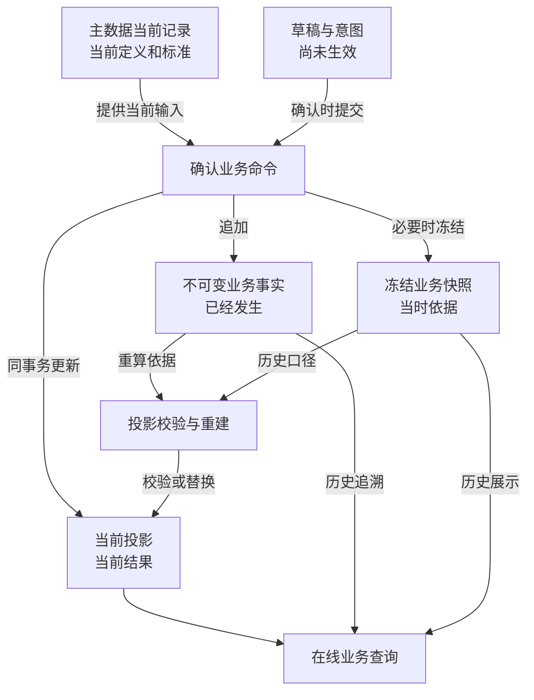

# YUMI V2 数据、事实、快照与投影架构

> 状态：权威数据源模型已确认
>
> 日期：2026-09-28
>
> 修改人：chen
>
> 关联文档：
> - `docs/architecture/making-centered-target-architecture.md`
> - `docs/architecture/backend-architecture.md`
>
> 本文确定后端数据的语义分类、权威来源、写入顺序和投影重建边界。本文不锁定最终表名、全部字段、索引、具体命令锁顺序和 HTTP API。

## 1. 设计结论

YUMI V2 采用以下混合数据模型：

```text
主数据当前记录
+ 不可变业务事实
+ 冻结业务快照
+ 当前投影
+ 草稿与意图
```

五类数据承担不同职责：

```text
主数据当前记录：现在采用什么定义和标准
不可变业务事实：实际发生过什么
冻结业务快照：当时依据什么处理
当前投影：依据有效事实计算后，现在是什么结果
草稿与意图：准备做什么，但尚未生效
```

系统不采用纯事件溯源，也不只保存可覆盖的当前状态。正式命令在单一 MySQL 事务中追加事实、保存必要快照并同步更新当前投影。

## 2. 权威来源总图



图中的“重算依据”不表示所有投影只由事实单独决定。部分重建还需要对应的冻结快照、有效更正链以及业务模块拥有的当前定义。

## 3. 主数据当前记录

### 3.1 定义

主数据当前记录保存当前有效的业务定义和标准，例如：

- 商品；
- 客户；
- 员工；
- 静态数据；
- 全局设置；
- 商品工序预算模板；
- 商品具体物料预算；
- 商品定制方案。

### 3.2 权威性

当前记录是“现在采用什么定义和标准”的权威来源。它可以按业务规则新增、修改、停用或归档，不要求每次修改都转化为领域事件流。

主数据修改必须保存：

- 当前版本号；
- 创建与最后修改时间；
- 创建人与最后修改人；
- 必要的变更审计；
- 被历史业务引用时需要保留的稳定业务标识。

### 3.3 与历史业务的关系

主数据更新只影响之后读取当前标准的新业务。已经确认的订单、排班、核验、发货、工资、成本和资金事实使用对应冻结快照，不被主数据更新回溯覆盖。

示例：

```text
商品胶水预算单价从 0.0340 改为 0.0360
→ 商品当前预算使用 0.0360
→ 之后创建或主动刷新的方案使用 0.0360
→ 已确认订单仍使用订单确认时冻结的预算单价
```

## 4. 不可变业务事实

### 4.1 定义

不可变业务事实保存已经发生并对业务产生影响的动作，例如：

- 订单确认与订单变更；
- 生产核验与核验更正；
- 包装加工与包装还原；
- 质量问题与处置；
- 责任认定与责任更正；
- 发货、退回和退出履约；
- 收款、退款与资金更正；
- 工资封账与补差；
- 成本归集与成本更正；
- 真实现金收入、支出与更正。

### 4.2 不可变规则

已确认事实：

- 不覆盖其原始业务内容；
- 不物理删除；
- 不通过通用编辑接口修改；
- 错误通过取消、失效、冲销或追加更正事实处理；
- 更正事实必须引用被更正事实；
- 原事实与全部更正链永久保留。

“不可变”不表示记录永远有效。事实可以被后续事实取消、失效、冲销或部分更正，但不能抹去原来发生过的记录。

### 4.3 事实最小内容

每类事实至少需要表达：

- 事实编号；
- 事实类型；
- 所属业务根；
- 业务发生时间；
- 系统记录时间；
- 操作人；
- 来源命令执行标识和操作类型；
- 来源业务标识或上游事实标识；
- 本次业务数量、金额或状态变化；
- 关联的上游事实；
- 被更正事实，可空；
- 事实有效性关系；
- 必要的规则版本和快照引用。

具体字段由各模块根据业务语义定义，不建立一张承载所有业务的通用事件表。

### 4.4 事实不是审计日志

业务事实决定数量、金额、状态或义务，是业务权威来源。审计日志记录谁在何时调用了什么操作及其结果，用于安全和操作追踪。

```text
业务事实 ≠ 审计日志
```

审计日志不能替代订单变更、核验、更正、发货、收付款和成本归集事实。

## 5. 冻结业务快照

### 5.1 定义

冻结快照保存业务确认时采用的外部定义、标准、约定和计算结果，回答“当时依据什么执行”。

典型快照包括：

- 订单确认时的商品名称和制作规格；
- 交付约定组的工序、具体物料供应方和成交价格；
- 订单预计成本及公式版本；
- 排班时的标准分钟、标准产能和参数版本；
- 发货时采用的交付约定版本；
- 工资结算采用的生产事实集合和规则版本；
- 成本归集采用的来源事实和分摊规则版本。

### 5.2 权威性

快照是对应历史业务“当时口径”的权威来源，不是可随主数据变化刷新的缓存。主数据后续改名、改价或改规则不能覆盖已经确认业务的快照。

### 5.3 快照建立时机

只在业务需要冻结历史口径时建立快照，不机械复制所有字段：

```text
当前值会变化
且
历史业务必须按当时值解释或计算
→ 冻结快照
```

能够通过稳定事实直接解释且不受未来变化影响的数据，不重复保存无意义快照。

### 5.4 快照与事实

事实描述“发生了什么”，快照描述“依据什么发生”。两者可以一对一、一对多或由事实引用独立快照版本，但都必须保持来源可追溯。

## 6. 当前投影

### 6.1 定义

当前投影是依据有效事实、快照和业务规则维护的当前结果，用于在线校验、加锁和查询。例如：

- 当前有效订购数量；
- 当前制作缺口；
- 制作完成、捏毛装袋完成和缝边剪袋完成数量；
- 质量待判断、待修复和待报废数量；
- 修复池余额；
- 未核验任务占用；
- 当前可交付数量；
- 累计有效发货；
- 当前应收、已收和待收；
- 已归集经营成本。

### 6.2 投影不是事实来源

投影可以原地更新，因为它表达当前结果，而不是完整历史。但投影不能成为业务历史的唯一保存位置。

禁止只保存：

```text
当前数量 = 30
```

却无法回答：

- 这 30 件来自哪些核验；
- 其中多少经过修复；
- 哪些已被还原；
- 哪些更正使原数量失效；
- 当前结果为何与昨日不同。

### 6.3 在线职责

正式投影表是正常在线路径，用于：

- 快速读取当前状态；
- 锁定当前余额；
- 防止重复占用和超卖；
- 校验命令前置条件；
- 支撑业务工作台和详情查询。

日常请求不通过全量回放全部事实计算当前余额。

### 6.4 投影所有权

每个投影由一个业务模块拥有并负责写入、校验和重建。跨模块不得直接更新或扫描对方投影表。

```text
事实所有者
通常也是由该事实直接派生的当前投影所有者
```

若一个业务动作同时影响多个模块投影，由最外层应用用例通过公开端口在同一事务中协调各模块分别更新自己的事实和投影。

## 7. 草稿与意图

### 7.1 定义

草稿与意图保存尚未生效、允许继续修改的用户输入，例如：

- 订单草稿；
- 发货草稿；
- 未确认订单变更；
- 未确认核验提交；
- 文件导入暂存；
- 需要多步录入的业务表单草稿。

### 7.2 语义

```text
持久化 ≠ 生效
草稿存在 ≠ 业务事实发生
草稿数量 ≠ 已占用数量
```

草稿是否产生资源占用必须由具体业务明确规定。若产生占用，占用本身必须是单独、可追溯、可释放的正式记录，不能仅凭草稿行推断。

例如发货草稿需要防止重复选择制品，因此确认保存草稿时可以建立正式发货占用；订单编辑草稿默认不改变正式需求和生产缺口。

### 7.3 生命周期

草稿可以修改、替换或删除。确认命令必须重新读取并校验当前业务状态，不能假设草稿创建时的余额、价格或资格仍然有效。

确认成功后：

- 产生正式事实；
- 保存必要快照；
- 更新当前投影；
- 草稿标记已确认或不再参与后续编辑。

## 8. 正式命令写入流程

所有影响正式业务状态的命令遵循：

```text
1. 识别操作者、请求编号与幂等键
2. 锁定业务根和相关当前投影
3. 读取当前有效事实、冻结快照与投影
4. 重新校验权限、状态、余额和业务前置条件
5. 计算本次业务差额
6. 追加业务事实
7. 保存本次必要的冻结快照
8. 同事务更新本模块当前投影
9. 通过公开端口同步其他模块更新各自事实和投影
10. 保存审计与幂等结果
11. 一次提交
```

任何一步失败，事实、快照、投影、占用、审计和幂等结果整体回滚。

### 8.1 为什么同步更新

YUMI V2 当前采用单应用、单数据库。订单、生产、排班、发货、售后和资金之间存在大量强一致数量与金额约束。

因此正式投影在原业务事务中同步更新：

- 命令成功返回后立即可读；
- 不出现事实已写入但当前余额尚未更新的窗口；
- 不需要消息队列、重试消费者和最终一致补偿；
- 事务失败时不留下部分业务结果。

## 9. 更正与有效事实

更正不是修改原事实，而是追加一条引用原事实的新事实，并按差额更新当前投影。

```text
原事实
→ 更正事实 1
→ 如更正 1 仍有错误，再追加更正事实 2
```

读取历史时保留完整链；计算当前结果时使用有效事实关系和累计差额。

各类事实采用以下更正边界：

| 事实类型 | 允许的处理 | 下游约束 | 同步更新 |
|---|---|---|---|
| 未核验排班 | 追加取消事实 | 已核验不可取消；订单变更或包装还原影响任务时须经管理员核实并统一取消 | 任务状态、产能分配、来源占用 |
| 生产核验 | 追加数量或状态差额更正 | 有效来源不得低于包装、交付、报废、退出等已消费数量；不得产生负余额 | 生产来源、物理与质量投影、缺口和成本基础 |
| 包装还原 | 追加还原事实 | 已交付数量必须先退回；发货草稿占用先释放；任务占用须核实并统一取消 | 物理阶段、来源参与状态和相关缺口 |
| 普通发货 | 追加取消、失效或更正事实 | 实物已发不得恢复来源；存在售后引用须先处理；支撑订单完成时先使完成事实失效 | 发货、交付履约、来源消费和来源余额 |
| 售后交付 | 追加售后交付更正事实 | 实物已交付不得仅以账面更正恢复来源；须按售后退回和义务处理 | 售后履约、来源消费和来源余额 |
| 订单或售后完成 | 追加完成失效事实 | 仅用于证明原完成条件因数据错误不成立；不删除原完成事实、不自动重新完成 | 完成状态和义务投影 |
| 收款、退款、赔付和现金 | 追加冲销或金额差额更正 | 已参与分配、对账或下游结算时先处理对应关系 | 业务结算投影和财务现金投影 |
| 工资封账 | 追加补差或更正事实 | 已支付部分不得通过覆盖封账消失；实际支付由 `finance` 更正 | 工资应付、支付关联和成本归集基础 |
| 成本归集 | 追加成本更正事实 | 不反向修改生产、工资或现金来源事实 | 成本归集和分摊投影 |

所有更正必须引用原事实或当前有效更正链，并在锁内校验下游引用和已消费数量。不建立一个通用“把任意事实设为无效”的管理接口，也不允许通过投影直接编辑绕过事实更正。

## 10. 投影校验与重建

### 10.1 能力要求

每个拥有投影的模块必须能够依据自己拥有的：

- 有效业务事实；
- 取消、失效、冲销和更正关系；
- 冻结业务快照；
- 本模块拥有的当前定义；

重新计算理论投影，并与正式投影比较。

### 10.2 两种操作

#### 校验

```text
依据权威来源计算理论值
→ 与当前投影逐维度比较
→ 只报告差异，不修改业务数据
```

用于日常巡检、发布验证、迁移验证和问题排查。

#### 重建

```text
锁定目标业务范围
→ 依据权威来源重新计算
→ 验证数量与金额不变量
→ 原子替换或修正目标投影
→ 记录重建批次、原因和前后值
```

重建是受控运维动作，不是普通管理员页面的自由编辑功能。

### 10.3 重建范围

优先支持按明确业务根重建：

- 单订单；
- 单订单商品或交付约定组；
- 单生产需求来源；
- 单修复池；
- 单售后单；
- 单工资期间；
- 单成本归集范围。

全库重建只用于初始化、迁移或灾难恢复，不作为日常修复首选。

### 10.4 跨模块边界

模块不能为了重建自身投影而直接扫描其他模块表。需要跨模块信息时：

1. 使用本模块事实中已经冻结的来源标识与快照；或
2. 通过对方公开查询端口读取受控数据；或
3. 由平台级校验流程分别调用各模块校验能力，再比较跨模块不变量。

跨模块校验报告可以聚合结果，但不能绕过模块所有权直接修表。

## 11. 查询与报表

### 11.1 业务查询

业务操作页面优先读取所属模块的当前投影，并在需要追溯时附带事实和快照。

```text
列表与工作台：当前投影
详情当前状态：当前投影 + 当前有效约定
历史时间线：业务事实 + 更正关系
历史金额和标准：冻结快照
```

### 11.2 跨模块报表

跨模块报表通过公开查询端口组合数据。若在线组合无法满足稳定性或性能要求，可以建立 `reporting` 拥有的只读报表投影。

报表投影：

- 不参与业务写入校验；
- 不反向修改业务模块；
- 标明数据更新时间与来源范围；
- 可以重新生成；
- 不能取代业务模块的正式当前投影。

## 12. 数据命名与结构约束

概念层面采用以下后缀区分语义：

```text
*_facts           已发生业务事实
*_snapshots       冻结历史口径
*_projections     当前业务结果
*_drafts          尚未生效草稿
*_reservations    已生效资源占用
*_corrections     引用原事实的更正
*_audit_logs      操作审计，不是业务事实
```

最终表名允许根据模块语义调整，但不能用一个含义不清的表同时混合事实、投影和草稿。

所有数量与金额结构必须：

- 明确单位和精度；
- 区分原值、差额和当前累计值；
- 禁止负数时使用数据库约束；
- 通过唯一约束防止同一来源重复生效；
- 使用稳定业务标识追溯来源；
- 为锁定、余额查询和历史追溯建立明确索引。

## 13. 明确不采用

- 通用事件存储；
- Event Sourcing 框架；
- 依赖回放全部事件才能读取系统；
- 消息队列驱动的核心投影最终一致；
- 只保存当前余额而没有来源事实；
- 使用审计日志代替业务事实；
- 使用草稿行暗示正式业务已经生效；
- 主数据变化回溯覆盖历史快照；
- 跨模块直接读取或修改数据库表来维护投影；
- 允许管理员直接编辑投影数字作为修复手段；
- 一张通用事件表或 EAV 表承载所有业务事实。

## 14. 已确认不变量

```text
主数据当前记录负责现在采用什么定义和标准
不可变业务事实负责实际发生过什么
冻结业务快照负责当时依据什么处理
当前投影负责依据有效事实计算后的当前结果
草稿与意图负责尚未生效的准备内容
持久化草稿不等于业务生效
占用必须是明确、可追溯、可释放的正式记录
已确认事实不覆盖、不物理删除
错误通过取消、失效、冲销或追加更正处理
事实和审计日志不能互相替代
投影可以更新，但不能成为唯一历史来源
正式事实与当前投影在同一事务中同步维护
日常查询不回放全部事实
每个模块负责自己的事实、快照和投影
跨模块不得直接读写对方表
投影必须支持按业务根校验和受控重建
报表投影不参与业务写入校验
```

## 15. 尚未冻结的内容

事实处理原则、更正类型和核心命令的全局锁序已经由本文及模块接口与事务矩阵冻结。后续仍需逐项确定实现细节：

1. 各模块具体事实、快照和投影清单；
2. 投影版本号、并发冲突返回方式以及版本推进规则；
3. 投影校验与重建工具的执行入口、权限、运行窗口和失败恢复方式；
4. 跨模块一致性检查清单及异常修复流程；
5. 归档、保留期限和敏感数据处理；
6. 最终表结构、索引、唯一约束和外键约束。

这些内容在数据库设计、平台能力、运维架构和测试架构中继续细化。
