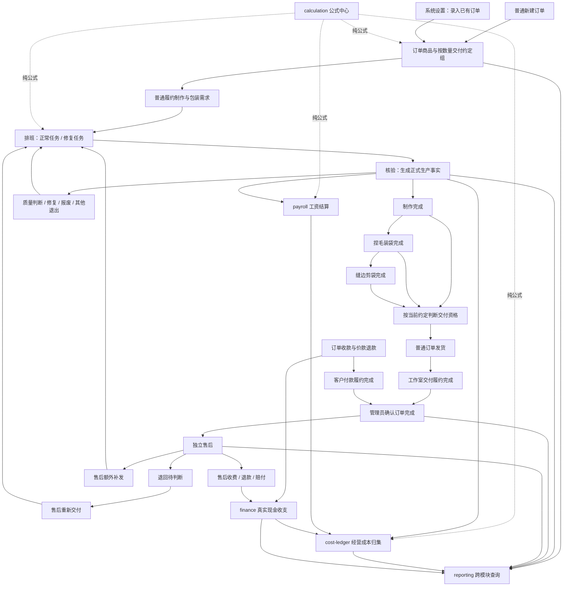
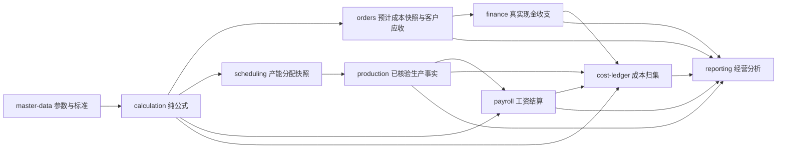

# YUMI V2 制作核心目标架构设计

> 状态：已确认目标设计
>
> 日期：2026-09-28
>
> 适用范围：YUMI V2 订单履约、制作与包装加工、排班核验、发货、售后、成本归集、工资结算及真实现金收支
>
> 本文描述目标架构。现有固定路线、统一可发货节点、公共库存与跨订单领用等实现均按迁移对象处理，不再作为目标设计依据。

## 1. 设计结论

YUMI V2 服务于捏捏手工工作室。制作是唯一必经的核心工序；捏毛装袋、缝边剪袋属于制作完成后的包装加工。系统采用单一 Spring Boot 应用、单一 MySQL 数据库和内部多模块的模块化单体，不拆微服务，不引入通用流程引擎。

目标模型围绕以下主线组织：

```text
客户订单需求
→ 制作产出
→ 可选包装加工
→ 按交付约定发货
→ 工作室交付履约与客户付款履约
→ 订单完成
→ 完成后的新事项进入独立售后
```

系统按数量管理同一商品和制作规格，不逐件编号。客户要求、实物当前状态、加工历史、质量责任、客户收费、经营成本和真实现金收支分别建模，不用单一状态或金额字段混合表达。

## 2. 完整业务总图



## 3. 全局架构原则

### 3.1 模块化单体

- 单一 Spring Boot 应用和单一部署单元。
- 单一 MySQL 数据库。
- 业务模块通过公开应用接口或端口交互。
- 禁止跨模块直接访问 Entity、Repository 或数据库表。
- 跨模块强一致操作在同一个 MySQL `@Transactional` 事务中原子完成。
- 查询报表可以通过公开查询端口组合数据，不得反向修改业务事实。

### 3.2 事实、快照与投影

系统区分三类数据：

1. **不可变业务事实**：订单确认、核验、加工、还原、发货、退回、责任认定、收付款、成本归集等已经发生的业务。
2. **业务快照**：订单确认时的交付约定与预计成本、任务安排时的标准时间与产能参数、发货时的约定版本等。
3. **当前投影**：当前制作缺口、工序数量、修复池、累计发货、待收金额等，用于高效查询和校验。

已经确认的事实不直接覆盖。录入错误使用引用原事实的追加更正记录，并更新当前投影。

### 3.3 数量管理

- 同一商品、同一制作规格按数量管理，不逐件编号。
- 不建立无订单公共制品池。
- 不建设跨订单制品领用。
- 不建设复杂库存逆向模型。
- 转线下摆摊、内部留用、赠送只记录退出事实，不继续管理后续库存、销售和收入。

### 3.4 金额口径分离

以下口径不能互相替代：

- 订单预计成本；
- 已归集经营成本；
- 客户成交价和处理收费；
- 员工工资结算结果；
- 真实现金收入和支出。

## 4. 模块划分

```text
master-data    商品、客户、员工、静态数据、全局设置
calculation    纯数值公式、精度和代码化规则版本
orders         订单、交付约定、变更、普通发货、订单资金、完成事实、已有订单接管
production     制作品、包装状态、加工历史、质量、责任、处置和数量投影
scheduling     正常/修复任务、数量占用、产能分配、取消和核验入口
after-sales    完成订单后的退回、重新交付、额外补发、售后金额与完成事实
payroll        员工工资、责任修复、扣款、免扣额度、封账与补差
cost-ledger    经营成本归集、分摊、更正与成本分析基础
finance        客户及经营活动的真实现金收支
reporting      跨模块只读查询、对账和经营分析
platform       认证、权限、文件、审计、幂等和请求上下文
```

售后按独立领域边界设计。首轮实施可以保留在 `orders` 顶级模块内的独立包，但数据库所有权、应用端口和依赖方向必须按独立模块约束。

### 4.1 商品、工序预算与定制方案

商品属于 `master-data`，拥有商品身份、核心制作规格和用于接单前估算的标准预算。制作规格包括商品克重、制作标准分钟、模具数量和每日批次数；这些字段与商品一一对应、没有独立生命周期，首期不拆成通用多规格模型。

商品预算不能只保存一个混合总成本。系统按工序建立结构化预算模板，并在每道工序内区分人工成本和具体物料成本：

```text
商品标准预算
├─ 制作（必经）
│  ├─ 制作人工
│  ├─ 胶水
│  ├─ 色浆
│  └─ 其他制作物料
├─ 捏毛装袋（可选）
│  ├─ 装袋人工
│  ├─ 袋子
│  ├─ 填充物
│  └─ 其他装袋物料
├─ 缝边剪袋（可选）
│  ├─ 缝边剪袋人工
│  ├─ 缝线
│  └─ 其他缝边剪袋物料
├─ 商品级预计分摊
│  ├─ 模具摊销
│  ├─ 日常杂费
│  └─ 房租水电
└─ 交付级预算项目
   ├─ 装箱
   ├─ 外层运输包装
   └─ 标准运费估算
```

每个物料项至少表达所属工序、物料类型、标准用量、计量单位、预算单价和预算成本。物料类型使用受控目录或明确代码，不采用任意键值的 EAV 参数模型。只有拆到具体物料项，订单才能表达“客户提供胶水、工作室提供色浆”而不是把整道制作物料成本一并归零。

商品可以建立多个结构化定制预算方案。方案保存常用的交付终点、各工序预算模板、各物料默认供应方、默认成交价格及预算结果，并指定一个默认标准方案用于展示商品的正常预计利润。定制方案是预算和录单模板，不是订单业务事实；创建订单时复制方案内容，允许按本次交易调整，确认后由交付约定组独立冻结。订单也允许不选择商品方案而直接建立交付约定。

商品预算同时区分：

- 标准完整资源成本：按方案所含工序计算全部人工和物料的标准价值；
- 工作室承担预计成本：排除客户自供物料后由工作室预计承担的部分；
- 客户自供材料标准价值：客户提供物料按当前标准预算计算的参考价值；
- 预计收入、预计利润和预计利润率。

客户自供只改变本次方案或交付约定的成本承担方，不改变商品制作规格，也不删除物料需求。首期不据此建立客户材料库存、领用、消耗、退回或余额管理。

`calculation` 负责工序预算、方案汇总和利润的纯公式；`master-data` 保存商品当前预算模板、定制方案及其计算快照；`orders` 保存本次交付约定与预计成本快照；`payroll` 决定正式工资；`cost-ledger` 只归集已发生经营成本；`finance` 只记录真实现金收支。

## 5. 订单与交付约定

### 5.1 普通新订单

普通新订单从零生产进度开始。订单确认时创建订单商品，并允许同一商品按数量形成多个交付约定组。

每个交付约定组至少保存：

- 订单商品；
- 来源商品定制方案，可空；
- 有效约定数量；
- 要求交付阶段：制作完成、捏毛装袋完成或缝边剪袋完成；
- 本次采用的各工序标准与包装规格；
- 按具体物料项保存的供应方约定；
- 成交价约定；
- 按工序、人工和具体物料拆分的预计成本快照；
- 标准完整资源成本、工作室承担预计成本和客户自供材料标准价值；
- 预计利润与预计利润率；
- 生效版本和来源订单变更。

示例：

```text
商品甲100件
├─ 40件：制作完成交付
├─ 30件：使用客户袋子，捏毛装袋后交付
└─ 30件：使用工作室袋子，缝边剪袋后交付
```

### 5.2 客户自供材料

首期按具体物料项记录供应方及其对预计成本的影响，不使用覆盖整道工序的笼统“客户供料”字段。例如制作工序可以同时约定客户提供胶水、工作室提供色浆；捏毛装袋工序可以约定客户提供袋子、工作室承担装袋人工。

客户自供物料仍保留标准用量和标准价值，但不计入工作室承担预计成本。首期不管理客户材料的入库、领用、消耗、退回和余额。材料供应方不自动决定成交价格，也不自动决定客户是否获得价格减免。

客户承诺在售后中提供袋子等材料但尚未提供时，对应客户配合义务未完成，并阻断该售后完成。

### 5.3 订单变更

订单完成前可以按数量变更：

- 有效订购数量；
- 交付阶段；
- 包装要求；
- 材料供应方；
- 成交价格；
- 处理费用和减免；
- 收货资料及其他商业约定。

订单变更通过拆分、合并或新建交付约定版本表达，不覆盖历史约定。已发货数量保留发货时的约定和价格快照，不能被后续变更覆盖。

订单变更确认前调用生产模块评估：

- 当前各实物状态数量；
- 可重新归组数量；
- 必须包装还原的数量；
- 冻结或不可处理数量；
- 变更后的制作与包装加工缺口；
- 受影响的未核验排班任务。

订单变更和生产实物影响在同一事务内生效。

### 5.4 变更收费

交付约定变化不机械地按新数量和新单价重算全部订单金额。系统分别保存：

- 原订单成交价款；
- 未加工部分的新商业约定；
- 已发生重复工作的处理费；
- 已消耗材料费用；
- 减免；
- 双方协商结果。

客户原因造成包装还原、重新包装或其他额外工作时可以收费；工作室原因通常由工作室承担，也允许管理员按协商结果选择客户承担、工作室承担、双方分担或免收。原因和责任只提供决策依据，不自动决定收费金额。

## 6. 制品与包装状态

### 6.1 核心状态

正常实物状态：

```text
尚未制作
制作完成
捏毛装袋完成
缝边剪袋完成
```

质量和特殊状态：

```text
质量待判断
待修复
待报废
售后退回待判断
售后待重新加工
已发出
已退出履约
```

当前状态必须同时关联订单商品、交付约定组、需求来源、加工阶段、包装规格、材料供应约定、质量状态和数量。

### 6.2 包装顺序

包装加工顺序固定：

```text
制作完成 → 捏毛装袋完成 → 缝边剪袋完成
```

不能跳过捏毛装袋直接缝边剪袋。制作、装袋或缝边完成均可能成为交付终点，具体由当前交付约定决定。

### 6.3 包装还原

管理员可以直接执行：

```text
捏毛装袋完成 → 制作完成
缝边剪袋完成 → 制作完成
```

还原：

- 追加包装还原事实；
- 调整当前实物状态；
- 不建立线下还原任务；
- 不要求核验；
- 不冲销原包装人工、材料和历史成本；
- 不删除原加工历史；
- 不自动创建重新包装排班。

首期不提供“缝边剪袋完成直接还原到捏毛装袋完成”。

## 7. 数量模型

### 7.1 普通制作缺口

```text
普通制作缺口
= 当前有效未发普通需求
- 当前仍参与普通履约的未发制品数量
```

仍参与履约的制品包括制作完成、装袋完成、缝边完成、质量待判断、待修复和尚未正式退出的待报废数量。

已发货、报废、摆摊、内部留用、赠送和因订单减量退出的数量不再参与普通履约。

### 7.2 包装加工缺口

```text
待装袋数量
= 要求至少装袋的有效制品
- 已完成且符合当前约定的装袋或缝边数量
```

```text
待缝边剪袋数量
= 要求缝边剪袋的有效制品
- 已完成且符合当前约定的缝边数量
```

加工阶段更深但包装规格或材料约定不匹配时，不能计为满足。

### 7.3 退出与缺口恢复

包装还原只改变包装状态，不增加制作缺口。

报废、摆摊、内部留用、赠送等制品退出履约时，如果对应客户有效需求没有减少，则自动恢复同数量的制作缺口，但不自动创建排班任务。

质量待判断、待修复和待报废在正式退出前仍属于订单内制品，不提前恢复制作缺口。

### 7.4 需求来源

生产需求至少区分：

```text
普通订单履约需求
售后重新交付需求
售后额外补发需求
```

不同来源共用任务、核验和质量模型，但制作缺口、包装缺口、发货和统计必须保持来源可追溯。

## 8. 排班与任务

### 8.1 模块职责

`scheduling` 管理“准备让谁在何时做什么”；`production` 管理“核验后实际发生了什么”。排班不能直接修改制品状态，生产模块不能自行创建排班任务。

### 8.2 任务类型

正常任务来源于制作或包装加工缺口：

- 制作；
- 捏毛装袋；
- 缝边剪袋。

修复任务来源于明确的问题事实和修复池。修复任务可以安排给不同于原执行员工的人。

### 8.3 任务状态

```text
已安排
已取消
已核验
```

系统不设置开工、进行中、暂停和完工待核验。未核验任务均可取消；已核验任务不能取消。

### 8.4 数量占用

创建正常任务时占用对应正常可排余额；创建修复任务时占用指定问题的修复池余额。占用只用于防止重复排班，不产生制品和生产事实。

```text
未占用可排余额
= 来源池有效数量
- 未取消、未核验任务占用
```

取消任务时释放全部来源占用；正常任务同时释放员工日标准产能分配。

### 8.5 员工日标准产能分配

同一员工同一天可以安排多个不同商品的正常任务。排班保存：

- 员工和日期；
- 商品和工序；
- 计划数量；
- 冻结标准日产能；
- 冻结单位标准时间；
- 当天标准产能在多个正常任务间的分配；
- 使用的设置和公式规则版本。

内部统一以标准分钟表达分配，同时保留业务可读的标准日产能。

修复任务不进入正常任务产能分配合计，但不代表无偿或不计薪。工资含义由 `payroll` 决定。

## 9. 核验与生产事实

### 9.1 正常任务核验

```text
计划数量
= 合格数量
+ 待修复数量
+ 报废数量
+ 未完成数量
```

流转规则：

- 合格：进入对应加工完成状态；
- 待修复：产生问题事实并进入对应修复池；
- 报废：退出当前履约来源，并在需求仍有效时恢复同来源制作缺口；
- 未完成：返回原来源的正常可排余额。

未完成不是质量问题，不进入修复池，不自动归责。

### 9.2 修复任务核验

```text
计划修复数量
= 修复合格
+ 继续待修复
+ 报废
+ 未完成
```

- 修复合格：回到问题对应的正常实物状态；
- 继续待修复：产生新问题事实和新修复池，并关联原问题和修复任务；
- 报废：退出履约并按来源恢复制作缺口；
- 未完成：释放回原修复池。

### 9.3 生产事实内容

核验后才产生正式、精细、可追溯的生产事实，至少保存：

- 原任务及来源；
- 员工和工作日期；
- 商品、工序和任务类型；
- 计划数量；
- 产能分配快照；
- 冻结标准产能和标准时间；
- 合格、待修复、报废和未完成数量；
- 问题现象；
- 已知原因；
- 责任状态；
- 材料损失基础；
- 后续修复链；
- 公式和参数版本。

### 9.4 核验更正

已确认核验不可直接编辑。错误统一通过追加差额更正：

- 引用原核验；
- 保存更正前后数量快照；
- 生成状态差额事实；
- 更新当前投影；
- 保留全部历史。

更正不能绕过已发生包装加工、已发货、已处置或工资封账等后续事实。必要时先更正下游事实，再更正原核验。

## 10. 质量、责任与处置

### 10.1 概念分离

系统分别记录：

1. 实物质量状态；
2. 实物处置；
3. 问题原因；
4. 责任主体；
5. 原执行员工；
6. 修复执行员工。

制作结果有问题不等于原执行员工有责任。原因可能来自负责人、工作室材料、客户自供材料、客户要求、物流、客户使用或无法确认。

### 10.2 责任认定

核验时数量结果立即生效，原因和责任允许待确认。责任待确认时不能默认归责原执行员工。

责任通过追加事实认定：

```text
问题事实
→ 责任认定1
→ 如有错误，追加责任认定2更正认定1
```

责任认定及更正不修改生产核验事实。

### 10.3 修复与新问题

修复执行员工可以与原执行员工和责任员工不同。修复再次失败时产生新的问题事实，保存上游问题、修复任务、修复执行员工和新的责任状态，不自动继承原问题责任。

### 10.4 处置

受影响数量可以：

- 当前阶段修复；
- 包装还原后重新加工；
- 报废；
- 转线下摆摊；
- 内部留用；
- 赠送；
- 其他明确退出。

摆摊、留用和赠送只记录退出事实。

## 11. 普通发货

### 11.1 动态交付资格

系统不再维护固定 `SHIPPABLE` 工序节点。交付资格由以下条件共同决定：

```text
当前有效交付约定
+ 当前实物阶段
+ 包装规格和材料供应事实
+ 质量允许交付
- 发货占用
- 其他冻结
```

阶段兼容关系：

```text
要求制作完成：制作完成、装袋完成、缝边完成均可满足
要求装袋完成：装袋完成、缝边完成可满足
要求缝边剪袋完成：只有缝边完成可满足
```

### 11.2 发货草稿占用

创建或修改发货草稿时即向生产模块申请制品数量占用，避免重复选择。首期不自动过期。取消草稿时释放占用；确认发货时消费占用。

### 11.3 来源追溯

发货明细按数量关联交付约定组和生产来源，包括生产核验、修复合格、已有订单接管或售后重新加工事实。同一来源累计发出数量不得超过其有效数量。

### 11.4 已确认发货保护

已确认发货不能被订单变更、包装还原或生产核验更正覆盖。记录错误但实物未发使用发货更正；实物实际发出后又返回使用退回或售后流程。

## 12. 双向履约与订单完成

### 12.1 工作室交付履约

完成条件：

- 当前有效订购数量全部完成普通交付，或未交付部分已正式减量；
- 没有普通制作和包装加工缺口；
- 没有阻塞普通履约的质量状态；
- 没有相关未核验任务和发货占用；
- 没有会改变交付义务的待确认订单变更。

### 12.2 客户付款履约

```text
订单价款净收
= 累计订单收款
- 累计订单价款退款
```

付款履约完成需要：

```text
订单价款净收 = 当前有效订单应收
```

并且没有尾款、多付款待退、订单价款退款待支付、待确认金额调整和待处理资金更正。

### 12.3 订单状态

```text
草稿
已确认
履约中
已完成
已取消
```

订单完成条件：

```text
工作室交付履约完成
且
客户付款履约完成
```

双方履约条件满足后，由管理员点击确认完成。系统在事务中重新校验全部条件并写入订单完成事实。订单完成时间取管理员确认完成事实的发生时间；工作室交付履约达成时间和客户付款履约达成时间分别保留，不能回填为订单完成时间。

数据录入错误导致完成条件实际不成立时，通过业务事实更正使原完成事实失效；这属于数据更正，不是售后。

## 13. 订单资金

### 13.1 当前有效应收

```text
当前订单应收
= 原确认应收
+ 已生效订单金额调整
```

订单金额调整包括订单完成前的数量、价格、处理收费和价款减免。

### 13.2 资金事实

订单资金至少区分：

- 订单收款；
- 订单价款退款；
- 多收款退回；
- 订单金额调整；
- 资金更正。

已确认资金事实不能直接修改或删除，错误通过追加更正处理。多收款退回不再次减少订单应收。

## 14. 售后

### 14.1 业务边界

订单完成后的新客户事项进入独立售后。售后处理中，原订单保持已完成，不重新进入普通履约。

售后状态：

```text
草稿
处理中
已完成
已取消
```

### 14.2 售后类型

- 仅记录问题；
- 仅退款；
- 退货并退款；
- 退回修复后重新交付；
- 退回重新包装后重新交付；
- 退回后更换新制品交付；
- 额外补发；
- 收费重新加工；
- 赔付。

### 14.3 重新交付与额外补发

重新交付：

```text
原制品退回
→ 修复或包装还原
→ 重新加工
→ 再次交付
```

它不增加原订单销售数量。只有退回制品短少、报废或无法复用时，才形成售后重新交付制作缺口。

额外补发表示原制品不退回或不能复用，需要另外提供制品，形成独立售后补发需求。

### 14.4 退回处理

退回实物收到后先进入“售后退回待判断”，不直接恢复普通可发货数量，不自动进入修复池，不自动认定责任。

判断后可：

- 直接用于本售后重新交付；
- 进入售后修复池；
- 包装还原后重新加工；
- 报废或其他退出；
- 退还客户。

售后可用制品优先保留给对应售后，不形成跨订单公共制品池。

### 14.5 售后双方义务

工作室义务可以包括接收退回、修复、重新加工、重新交付、补发、退款或赔付。客户义务可以包括退回原制品、提供客户材料和支付售后协商费用。

双方在本次售后中的有效义务均完成后，由管理员确认售后完成。责任调查可以继续，不阻断客户售后完成。

### 14.6 售后资金

售后独立记录：

- 售后收费；
- 售后收款；
- 售后退款；
- 售后赔付；
- 售后减免；
- 售后资金更正。

售后资金不反向修改原订单应收和完成状态。

## 15. 录入已有订单

### 15.1 入口和范围

系统设置长期保留“录入已有订单”入口，不限制使用时间和次数，不设置临时开关或特殊初始化权限。

只录仍在履约、客户付款尚未完成或存在系统后续处理事项的订单；不录双方履约完成且无后续管理需要的纯历史订单。

### 15.2 当前事实接管

录入：

- 原订单资料；
- 当前有效订购数量和交付要求；
- 当前工序和质量状态；
- 接管前累计有效发货；
- 接管前累计收退款；
- 当前订单应收和待收。

不补造历史排班、任务、核验、包装加工、逐笔发货和逐笔资金流水。

已有订单默认允许按商品汇总录入，不强制拆分交付约定组；确实影响后续履约时才可选拆组。

### 15.3 数量守恒

```text
当前有效订购数量
= 接管前累计有效发货
+ 尚未制作
+ 当前订单内未发制品
```

历史发货和当前制品不能重复。

### 15.4 确认与修正

接管确认时在同一事务内创建正式订单、期初订单与资金事实、生产当前状态和各类缺口，不创建排班任务。

已确认接管值不能覆盖。错误通过追加差额修正处理，且不能破坏接管后已经发生的生产、发货、售后和资金事实。

## 16. 公式中心 `calculation`

### 16.1 定位

继续扩展现有无持久化 `calculation` 模块，不新增同义公式模块。它负责：

- 金额和比例精度；
- 商品各工序的人工、具体物料和分摊预算；
- 商品定制方案的标准完整资源成本、工作室承担预计成本和客户自供材料标准价值；
- 交付约定组按工序与成本项拆分的预计成本；
- 订单金额、预计利润和预计利润率；
- 排班标准时间和产能；
- 售后加工成本参考；
- 工资纯数值公式；
- 成本归集分摊公式；
- 代码化规则版本。

### 16.2 约束

`calculation`：

- 无数据库表、Repository 和实体；
- 不依赖业务模块；
- 不访问 HTTP、当前时间和登录上下文；
- 只接收不可变输入并返回结果；
- 不保存业务快照和结算结果；
- 公式由代码和测试管理，不建设管理员动态编辑。

公式目录必须覆盖已实现的商品、订单、生产、售后、工资和成本归集分类，并为每项公式关联测试编号和规则版本。

## 17. 工资结算 `payroll`

`payroll` 只读取已核验生产事实、责任认定和任务产能分配快照，按版本化规则计算：

- 正常工资；
- 修复劳动；
- 责任修复；
- 报废材料扣款；
- 月度免扣额度；
- 补贴；
- 工资封账；
- 封账后的补发或补扣。

生产模块不保存工资结果，工资模块不得反向修改生产事实。责任待确认时不能默认扣原执行员工；责任更正发生在工资封账后时，通过后续补差处理。

## 18. 经营成本归集 `cost-ledger`

### 18.1 定位

`cost-ledger` 建设可追溯的经营成本台账，归集成本事实，不代替公式中心、生产、工资和财务模块。

### 18.2 归集内容

- 已确认工资成本；
- 材料消耗或采购分摊；
- 报废材料损失；
- 修复成本；
- 包装还原和重复加工成本；
- 普通履约成本；
- 售后重新交付成本；
- 售后额外补发成本；
- 运费和其他可归集经营支出；
- 客户承担、工作室承担和双方分担金额。

订单预计成本快照由 `orders` 或 `after-sales` 持有，`cost-ledger` 只通过公开查询端口读取并用于预计与已归集口径对比，不把预计值登记为成本归集事实。

### 18.3 台账结构

每条成本归集事实至少保存：

- 成本类别；
- 来源模块和来源事实；
- 订单或售后；
- 商品和交付约定组；
- 需求来源；
- 金额和币种；
- 归集或分摊规则版本；
- 归集时间；
- 更正的原事实。

已确认归集事实不可覆盖，错误通过追加更正处理。

### 18.4 口径

“已归集成本”表示系统已依据生产、工资和财务事实归集的经营成本。它不自动等于订单预计成本，也不等于某一笔现金付款。

## 19. 真实现金收支 `finance`

### 19.1 范围

`finance` 记录实际发生的现金收入和支出，包括：

- 订单和售后客户收款；
- 订单价款退款；
- 售后退款和赔付；
- 材料采购付款；
- 工资实际支付；
- 房租、水电；
- 运费；
- 报销；
- 其他真实现金收入和支出。

### 19.2 约束

- 真实现金事实必须基于实际收付，不由标准公式生成。
- 工资成本确认不代表工资已经支付。
- 采购付款不代表采购材料已经全部归集到订单。
- 客户收费决定不代表客户已经付款。
- 已确认现金事实不可直接覆盖，错误使用追加更正。

### 19.3 与业务模块关系

`orders` 和 `after-sales` 拥有客户应收、退款与赔付义务；`finance` 拥有实际资金收付。确认收付时由业务模块和 `finance` 通过公开端口在同一事务内更新相关事实和投影。

采购、房租水电等经营支出由 `finance` 记录，再由 `cost-ledger` 按明确规则归集或分摊。首期不因建设 `finance` 而引入客户材料库存或公共制品库存。

## 20. 成本与资金数据流



订单和售后可以同时展示：

- 预计成本；
- 已归集成本；
- 可关联的真实现金收支；
- 向客户收费；
- 预计利润；
- 已归集利润；
- 现金净流量。

界面和报表必须明确标注口径，不合并成含义不清的“实际成本”。

## 21. 关键跨模块事务

### 21.1 订单确认

```text
orders 创建订单与交付约定并冻结预计成本
→ production 初始化普通制作缺口
→ 同一事务提交
```

### 21.2 订单变更

```text
orders 锁定订单、约定、发货和金额投影
→ production 评估实物影响
→ orders 写入约定、收费和应收调整
→ production 重新归组、包装还原或调整缺口
→ 同一事务提交
```

### 21.3 排班创建和取消

```text
scheduling 写入或取消任务
→ production 占用或释放来源数量
→ 同一事务提交
```

### 21.4 核验

```text
scheduling 锁定任务
→ production 写入生产事实和数量流转
→ scheduling 标记已核验
→ cost-ledger 接收可立即归集的成本基础事实
→ 同一事务提交
```

工资金额尚未结算时，成本台账只能记录待归集基础，不生成虚假的工资成本。

### 21.5 普通发货

```text
orders 锁定普通交付义务和发货草稿
→ production 确认并消费有效来源
→ orders 更新普通发货投影
→ 同一事务提交
```

### 21.6 订单收付款

```text
orders 确认订单收款或价款退款业务事实
→ finance 写入真实现金事实
→ orders 更新付款履约投影
→ 同一事务提交
```

### 21.7 售后处理

```text
after-sales 写入售后义务、收费、退款或赔付决定
→ production 初始化或处理售后生产需求
→ finance 在实际收付时写入现金事实
→ cost-ledger 归集售后成本
```

需要同时生效的业务事实在同一事务内提交；仅表示未来义务的决定不伪造尚未发生的生产和现金事实。

## 22. 核心应用端口

建议公开以下能力，具体 Java 名称可在实施设计中按现有包结构调整：

```text
orders
├─ OrderDemandQuery
├─ OrderAgreementQuery
├─ OrderChangeApplication
├─ ShipmentApplication
├─ OrderSettlementApplication
├─ OrderCompletionApplication
└─ LegacyOrderIntakeApplication

production
├─ ProductionDemandPort
├─ ProductionSchedulingPort
├─ ProductionVerificationPort
├─ DeliveryEligibilityPort
├─ PackagingRestorationPort
├─ QualityDispositionPort
└─ AfterSalesProductionPort

scheduling
├─ ScheduleApplication
├─ TaskCancellationApplication
└─ VerificationSubmissionApplication

after-sales
├─ AfterSalesApplication
├─ ReturnReceiptApplication
├─ RedeliveryApplication
├─ ReplacementApplication
└─ AfterSalesSettlementApplication

payroll
├─ PayrollCalculationApplication
├─ PayrollClosingApplication
└─ PayrollCostQuery

cost-ledger
├─ CostRecognitionApplication
├─ CostAllocationApplication
├─ CostCorrectionApplication
└─ CostLedgerQuery

finance
├─ CashReceiptApplication
├─ CashPaymentApplication
├─ CashCorrectionApplication
└─ CashJournalQuery
```

## 23. 概念数据模型

以下为概念数据对象，不预先锁定最终表名。

### 23.1 商品与预算模板

```text
products
product_process_budget_templates
product_process_material_budgets
product_cost_allocation_budgets
product_customization_profiles
product_customization_processes
product_customization_material_terms
product_customization_budget_snapshots
```

`product_process_budget_templates` 按制作、捏毛装袋和缝边剪袋保存标准分钟与人工预算；`product_process_material_budgets` 保存胶水、色浆、袋子、填充物、缝线等具体物料的标准用量、单位、预算单价与预算成本；`product_customization_profiles` 组合工序、物料供应方和默认成交价。上述对象都属于商品主数据及预算模板，不代表订单事实或已发生成本。

### 23.2 订单

```text
orders
order_items
delivery_agreement_groups
delivery_agreement_versions
delivery_agreement_process_snapshots
delivery_agreement_material_terms
delivery_agreement_cost_snapshots
order_change_orders
order_change_impacts
order_charge_decisions
order_receivable_facts
order_payment_obligations
order_fulfillment_projections
order_completion_facts
legacy_order_intakes
legacy_order_intake_corrections
```

### 23.3 生产与排班

```text
product_quantity_facts
product_state_projections
packaging_process_facts
packaging_restoration_facts
quality_issue_facts
quality_disposition_facts
responsibility_determinations
responsibility_corrections
repair_pools
production_verification_facts
verification_corrections
production_demand_projections
schedule_tasks
task_source_reservations
employee_daily_capacity_snapshots
task_capacity_allocations
task_cancellations
verification_submissions
```

### 23.4 发货与售后

```text
shipments
shipment_items
shipment_source_links
shipment_corrections
after_sales_cases
after_sales_obligations
return_receipts
redelivery_obligations
replacement_obligations
after_sales_charge_decisions
after_sales_payment_obligations
after_sales_completion_facts
```

### 23.5 工资、成本与财务

```text
payroll_periods
payroll_calculation_runs
payroll_employee_results
payroll_adjustments
cost_ledger_entries
cost_allocation_runs
cost_ledger_corrections
cash_transactions
cash_transaction_allocations
cash_transaction_corrections
```

## 24. 现有模型替换范围

目标架构要求撤回或重构以下现有假设：

1. 固定“制作 → 装袋 → 可选缝边 → 统一可发货节点”路线；
2. `SHIPPABLE` 作为固定生产节点；
3. `seam_quantity` 作为整条订单明细唯一流程分桶；
4. `order_item_snapshots.flow` 保存固定流程文本；
5. 同一订单商品只有一套价格、包装和材料约定；
6. 公共库存池和跨订单领用；
7. 复杂库存逆向流水；
8. 发货统一消费 `SHIPPABLE` 投影；
9. 订单变更直接覆盖整条订单商品当前值；
10. 减量处理仅支持转成品余量或报废；
11. 发货作废与库存恢复混合；
12. 普通履约、售后重新交付和额外补发共用同一数量；
13. 用固定路线和简单资金净额判断订单关闭；
14. 把标准成本、工资结果和真实现金支出混为“实际成本”；
15. 商品只保存一套混合总成本，无法区分各工序人工、具体物料及客户自供影响；
16. 用整道工序的笼统材料供应方替代胶水、色浆、袋子等具体物料约定；
17. 把商品预算模板直接当成订单确认事实。

现有 `calculation` 公式中心保留并扩展；商品、订单和生产公式需要适配新的交付约定、产能和按工序成本口径。

## 25. 实施分片建议

目标架构覆盖多个独立但有关联的子系统，不应作为单个实施计划一次完成。建议按以下顺序拆分 OpenSpec 变更和实施计划：

1. **架构与数据库基线重构**：模块边界、商品工序预算模板、定制方案、交付约定组、数量事实和投影基础。
2. **订单与已有订单接管**：普通新订单、方案带入、交付约定、变更、双向履约基础。
3. **生产与排班重构**：制作核心、包装状态、还原、任务、核验和修复池。
4. **普通发货重构**：动态交付资格、草稿占用和来源追溯。
5. **售后重构**：退回、重新交付、额外补发和售后双方义务。
6. **订单资金与完成**：应收、收退款、付款履约和管理员确认完成。
7. **工资结算**：基于生产事实的工资、责任、扣款和补差。
8. **成本归集台账**：工资、材料、返工、报废和售后成本归集。
9. **真实现金收支**：客户资金、采购、工资支付、费用和赔付。
10. **报表与对账**：预计成本、已归集成本、现金流和跨模块一致性。

每个分片必须以可运行、可验证的业务闭环交付，不能只创建空表或未接线接口。

## 26. 全局不变量

```text
制作是唯一核心必经工序
包装只能按固定顺序前进
包装可以还原到制作完成
客户交付约定与实物当前状态分开保存
当前状态与加工历史分开保存
已发货事实不可被订单变更或生产更正覆盖
订单完成 = 工作室交付履约完成 + 客户付款履约完成
订单完成后的新业务进入售后
售后不改变原订单完成状态
重新交付不等于额外补发
生产成本不自动决定客户收费
客户收费不反向覆盖生产事实
执行员工不等于责任员工
修复员工不等于原问题责任员工
质量待判断不提前恢复制作缺口
未完成返回原来源池
待修复进入对应修复池
退出履约后按有效需求恢复制作缺口
排班不产生生产事实
核验后才产生正式生产事实
核验和责任错误通过追加更正处理
已有订单只接管当前事实，不补造历史过程
商品预算按工序区分人工和具体物料
客户自供只改变成本承担方，不删除物料需求
商品定制方案是模板，订单交付约定才是事实
calculation 只负责纯公式
业务模块保存业务快照和结算结果
cost-ledger 保存已归集经营成本
finance 保存真实现金收支
工资结算不得反向修改生产事实
所有跨模块强一致动作在同一数据库事务中完成
```
