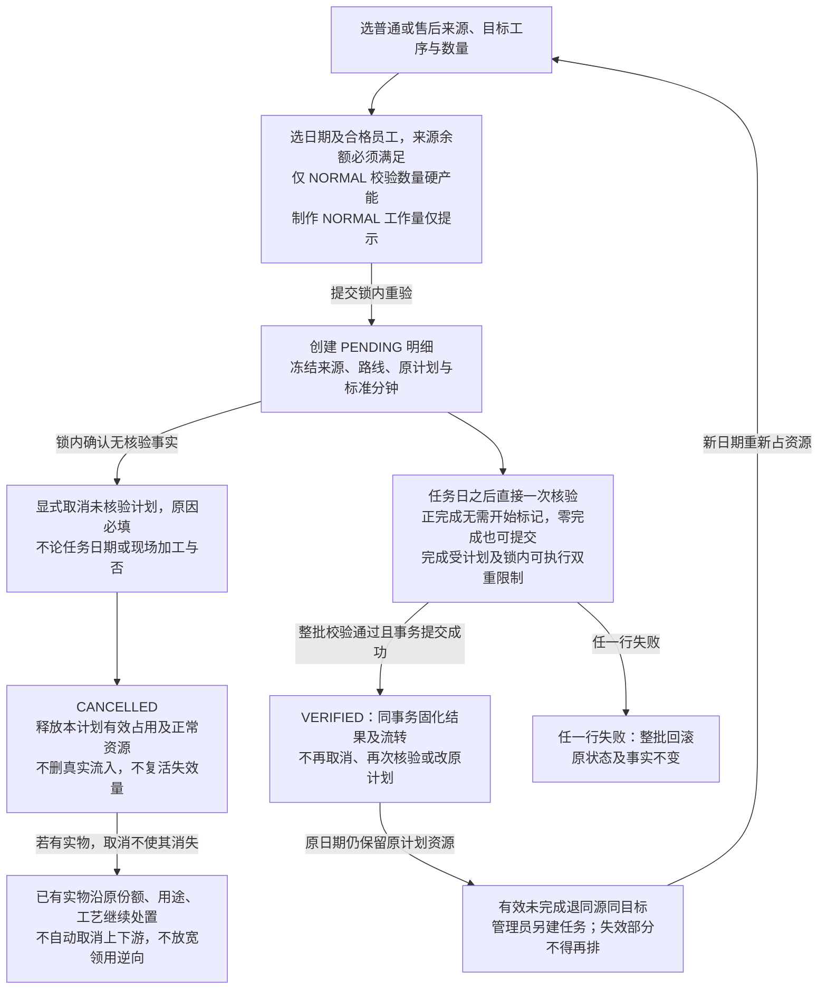
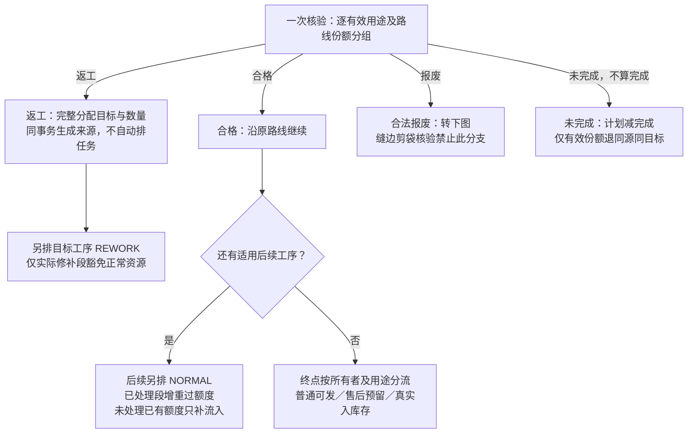
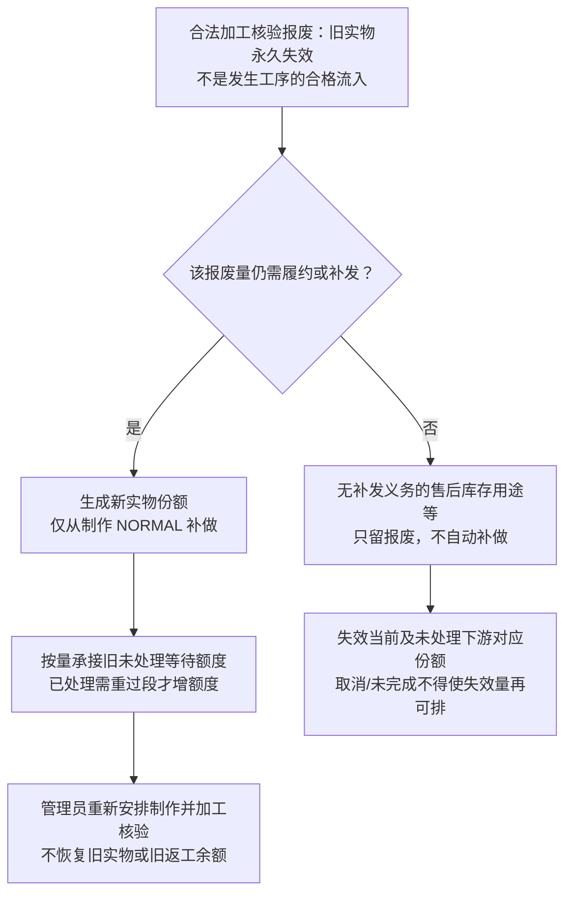
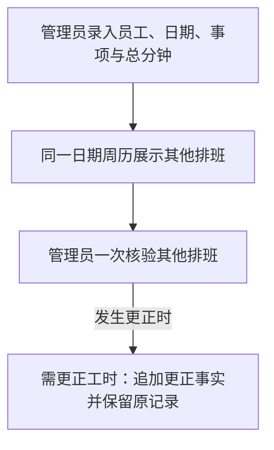

# 排班模块施工文档（制作排班、返工、报废补做与售后数量）

日期：2026-09-27

修改人：chen

状态：**已确认业务规则同步稿，待评审、未实施**。本文取代 `production-module-design.md` 作为下一轮施工输入；旧文档和归档 change 仅保留历史证据，不证明新模型已落地。本次只同步文档，不执行代码改造、清库或验收。

关联文档：`domain-and-quantity-model.md`、`database-design.md`、`after-sales-module-design.md`；实施规格与任务在 `openspec/changes/restructure-scheduling-module/`。已发布 `openspec/specs/` 保留当前基线，实施并归档后才合入新规格。

## 0. 重构原因与迁移方式

### 0.1 本轮纠正的概念

- 「超额预占」是对需求的误解：真正需要的是管理员安排**制作工序**时的工作量提示。删除超额任务和未来预占，不做超额并表。
- 返工必须同时记录来源和目标工序，不再一律挂制作，也不允许所有工序自行原地返工。
- 报废表示实物不可再用；仍有履约或补发需求时从制作重新做，不再回到报废发生工序的可执行流入。
- 客户需求、工序可安排额度、实际流入、正常资源占用和售后覆盖必须分开，不能用一条全局减法替代来源守恒。
- 其他排班仍独立记录工时，但与制作排班进入同一日期周历；并不要求合并其数据库表。

### 0.2 迁移方式

本机未上线，实施时直接改写 `V1__yumi_v2_schema.sql` 并清库重建，不做兼容迁移、历史数据搬迁或双读双写。本轮文档更新不执行清库；实施须先确认目标连接与本机数据边界。

## 1. 模块模型

### 1.1 顶层两类

```text
排班
├─ 制作排班：有商品与工序，任务类型 NORMAL / REWORK
│  ├─ 制作
│  ├─ 捏毛装袋
│  └─ 缝边剪袋（仅适用路线）
└─ 其他排班：无商品、无工序，只记录独立工时
```

模块全栈由 `production` 改为 `scheduling`。正常加工、返工后的后续加工、报废补做均是 `NORMAL`；只有选定目标上的实际修补段是 `REWORK`。售后所有权与用途不是第三种任务类型。

### 1.2 发生工序、目标工序与报废矩阵

| 核验入口 / 当前实际加工工序 | 不合格可分配的返工目标 | 能否报废 |
| --- | --- | --- |
| 制作 `MAKING` | 制作 | 可以 |
| 捏毛装袋 `PACKING_BAG` | 制作 | 可以 |
| 缝边剪袋 `SEAM_CUTTING` | 制作、捏毛装袋 | 不可以 |
| 售后退回核验 | 制作、捏毛装袋、缝边剪袋（符合原商品/订单适用路线） | 可以直接登记退回件报废 |

前三行同时适用于正常加工和修补任务的核验。再次返工按**本次实际修补工序**判定目标，而非沿用最初发生工序。只有制作可以返到自身；售后退回不是缝边工序核验，退回件直接报废不违反缝边禁止报废。

三道工序均可能执行合法来源指定的 `REWORK`，但缝边目标只能来自符合路线的售后退回入口。禁止普通缝边核验把返工分配回缝边。

### 1.3 其他排班

保留员工、日期、事项、小时、分钟、总分钟、一次核验与工时更正。不得关联商品数量、订单来源或工序流入；不计制作工作量提示。在周历中与制作排班同级显示，不放在下方独立列表。

## 2. 数据结构

以下是目标逻辑结构；字段精度、关联约束须由实施任务落实并测试，不代表当前库已有这些字段。

### 2.0 命名与所有权

| 逻辑对象 | 目标表 / 归属 |
| --- | --- |
| 任务头、明细、核验 | `scheduling_tasks`、`scheduling_task_items`、`scheduling_verifications` / scheduling |
| 返工来源与目标分配 | `rework_sources` 及核验分配明细 / scheduling；保留订单或售后业务所有者 |
| 报废、制作补做额度 | `scheduling_scrap_records`、`scheduling_quantity_returns` / scheduling |
| 工序额度、实际流转与来源链 | 可追溯来源分配/流转事实 / scheduling，通过接口接入对应业务台账 |
| 未完成提醒 | `scheduling_reminders` / scheduling |
| 其他排班 | `other_schedules`、`other_schedule_verifications`、`other_schedule_time_corrections` |
| 售后需求、用途、覆盖、可补发与已补发 | `after_sales_*` / orders；共享排班不能改变所有权 |
| 库存批次与入库流水 | inventory；售后库存用途须有终点入库事实 |

### 2.1 任务头

保存编号、日期、员工及快照、工序及快照、`task_type`、备注、版本与审计。`task_type` 仅 `NORMAL`、`REWORK`；不保存权威数量汇总。一个任务的日期、员工、工序和类型一致，可含多订单、多产品的普通来源明细；普通与售后不可混选，售后任务不得跨 case。全部来源查询（包括全局返工列表、补做列表、订单履约视图）均按 tasks C2 返回真实来源ID及 `afterSalesItemId` / `afterSalesCaseId`：ORDER 两者均 null，AFTER_SALES 两者必非空且关联一致。全局新建直接使用响应归属，不依赖此前页面导航参数、不猜 case ID，服务端仍逐行重验（任务2.2、3.8、4.4、5.3、8.4）。

### 2.2 任务明细

保存任务引用、明细编号、业务所有者（普通订单或售后明细）、产品/订单/路线快照、实际执行 `node`、计划数量、来源类型与 ID、冻结标准分钟、估算分钟、能力快照、状态与取消审计。不设置开始任务/登记开工的接口、字段或隐式状态；此前执行登记及 C9 候选已于 2026-09-27 明确否决，不再待审批。取消与核验规则见§5.1。

来源须能表达初始订单缺口、返工、报废制作补做、后续重过工序额度与售后来源；不能只新增一个枚举而丢失其所有者、用途或路线。`REWORK` 明细工序必须等于来源的目标工序，`NORMAL` 明细必须消费对应工序的正常额度。

状态只有 `PENDING → VERIFIED` 或 `PENDING → CANCELLED`。明细创建后不直接改数量、日期、工序、来源与类型；调整未核验计划须显式取消并重新安排。任务内相同业务明细、工序、来源的重复有效行拒绝；**不同任务可以拆分同一来源余额**。

### 2.3 核验事实与分配明细

每明细最多一次核验，保存计划快照、完成、合格、返工、报废、未完成、操作人、任务业务日期、实际核验时间、审计。核验时间必须晚于任务日期（按统一业务时区比较业务日），不得把录入日期当工作日期。

```text
完成 = 合格 + 返工 + 报废
未完成 = 计划 - 完成
缝边剪袋：报废 = 0，完成 = 合格 + 返工
```

返工目标分配明细保存核验引用、目标工序、数量与来源关联；售后退回分配还保存补发/库存用途。分配合计必须等于返工总量，在同一核验事务生成来源。

来源创建同事务即生成初始真实 `purposeAllocationId`，单用途也必须持久化，不能以虚拟ID替代或等减量时才初始化。物理 `physicalShareId` 贯穿 root、源、任务分配、用途与 flow，表示数量级份额而非要求逐件序列号；每份额的 `routeSnapshotId` 绑定不可变适用路线、缝边工艺及标准分钟版本。修补和重过继承原实物快照，新正常制造使用对应需求冻结的新制造快照，不能因同为有缝而允许工艺A替代B（tasks C7，3.1、4.6、5.1）。HTTP核验使用 `purposeAllocations[{allocationId,qualifiedQuantity,reworkQuantity,scrapQuantity,reworkAllocations}]`；allocationId引用持久化purposeAllocationId，由服务端解析physicalShareId、用途与路线，不接受客户端另传或改写这些属性，也不得消费已替代份额。仅一个有效用途/路线份额时可省略分组，由服务端规范化为该真实引用；多个有效份额必须逐组提交，即使用途相同但路线不同，也不能猜测各路线核验结果。组完成不超有效未处理份额及可执行量，组汇总等于明细结果；未完成仍由原计划份额减完成计算，但只有仍有效未处理量回同源同目标，失效部分关联原报废不回可排（§2.7）。合格 flow、返工子源及补做判定继承对应 share 的有效用途/路线，原计划与历史资源不改。

### 2.4 返工来源

保存来源类型、原核验/退回核验及分配行、原任务明细、发生工序 `origin_node`、目标工序 `target_node`、订单或售后明细、产品、用途、适用路线、总量、有效占用/消费量、轮次、父来源与审计。售后退回用入口类型追溯，不虚构一个生产发生工序。

```text
来源可安排余额 = 来源总量 - 累计终止量 - PENDING原占用
                 - 已核验实际修补处理量 - invalidatedUnoccupied（见§2.7）
```

也可维护等价已安排投影，但须能从分配、取消、核验和未完成回退事实重建。完成中的合格、返工、报废均消费本轮；只有未完成中的有效未处理份额回退本轮可排余额，失效份额不得随核验或取消复活（§2.7）。新一轮返工创建新来源，不把再次不合格加回旧来源。

同一核验分配行只能生成一次来源；来源可跨多任务拆分，不能以 `UNIQUE(source_id)` 限制安排次数。锁内保证累计占用不超量，按具体来源与目标分余额，不把同产品不同来源混池。

### 2.5 报废事实

保留发生工序/退回入口、数量、原因、订单或售后所有者、任务/核验、返工父源、用途、操作人与时间。不可编辑删除；后续新任务再次报废是新的事实，不能重复核验旧明细来追加。

### 2.6 制作补做额度

`scheduling_quantity_returns` 的语义改为**报废后从制作重新做的 NORMAL 额度**，不是发生工序实际流入。保存报废事实、原所有者、目标 `MAKING`、数量、分配与消费、后续适用路线及原覆盖链。

仍有履约/补发需求的加工报废按报废份额唯一生成对应补做额度；库存用途或已取消需求的报废不补做，直接退回报废只留事实，其独立补发缺口通过显式正常授权处理。数据库不能要求“每条报废必有回转”，但须保证同一报废量不能重复补做。返工报废不得恢复旧返工余额。

补做必须创建新 `physicalShareId`，以 `replacesPhysicalShareId`、quantity、scrapRecordId 和前后 allocation 映射承接旧失败份额（tasks C7，4.7）。按数量替换原尚未处理等待 source/task 的有效份额映射，保留等待ID、原计划与历史资源，不新增第二份等待额度，补做合格前仍无流入；已处理段需重过时由4.6新增额度。旧 root 仅供追溯，旧失败覆盖退出、新补做覆盖承接一次；再次报废追加下一次替代，不复活旧实物。固定验收为制作1/装袋等待1→两次制作报废补做→最终合格承接原等待1，终点和覆盖始终只计1。

### 2.7 后续加工与重过工序来源

每笔来源链保存业务所有者、用途、适用缝边路线、前序事实、目标工序、数量，以及与已存在正常需求/等待计划的承接关系。**可安排额度和实际流入是不同事实维度**：重过已处理工序须有新增加工额度；还未加工且已有原额度/等待计划的工序只补实际流入，不重复增额度。

消费与承接关联必须可追溯，不能靠“全局待安排量取最大值/负数截零”掩盖重复。重过缝边的件数必须继续走缝边，不得因历史累计缝边流入已达原缝边数量而变成无需缝边。

**库存 share 报废后的等待失效（目标未实施）**：上游库存用途报废且不补做时，同一核验事务为该 share 在下游未处理的对应额度追加失效事实，以 `scrap + target + share` 幂等关联原报废。不属于细化任务6.2的无实物终止、不新记一次报废、不再次释放覆盖、不释放计划资源；PENDING 原计划及分配原占用不改，失效 share 可执行为0。后续核验 `unfinished = 原计划 - completed` 不变，但仅仍有效未处理部分回可排；失效部分关联原报废，不能当 unfinished 重排，合法取消也不能复活。

```text
可安排 = total - terminated - pending原占用 - processed - invalidatedUnoccupied
invalidatedUnoccupied = 已不再由PENDING原占用扣除且未处理的失效份额
```

`processed` 含合格/返工/报废的实际处理；失效不充当处理。`invalidatedQuantity` 为失效总量，不能在 PENDING 原占用仍扣着该份额时再全量扣一次；核验或取消解除原占用后相应未处理失效量才进入 `invalidatedUnoccupiedQuantity`。不涉及终止或失效时相应减项为0，加工工序来源的完整投影均按此式重建；成品领用SHIPPABLE锚点无加工额度，不套此式，其终点可处置量按§3.6独立派生。来源/明细 View 可同时列上述两个失效字段，明确原计划、有效可执行和可重排的差别。

`SCRAP_RETURNED` 或普通减单合法直接处置实物时，失效范围必须包含**当前未处理 source 与全部对应未处理下游等待份额**，而非仅下游。使用同一 `scrap_record_id + target_source_id + physical_share_id` 唯一键；先显式合法解除全部相关占用，实际加工/消费及核验事实不得借计划取消抹除；直接处置仍须满足原入口实物条件。来源1直接报废1后 balance=0、processed=0、terminated=0；不是任务加工消费、不是无实物 termination，重放/取消/重建均不可复活（tasks C7，6.4）。

### 2.8 提醒

保留 `INCOMPLETE` 等与未完成事实相关的处理提示；取消 `OVERTIME_PENDING_VERIFY`、`PLAN_ADJUSTMENT` 及未来计划调整机制。制作工作量为查询/预览结果，不落独立提醒表，不成为数量事实。

### 2.9 其他排班

保留三张独立工时表；总分钟为正整数，录入分钟 0–59；一次核验，错误追加更正事实。仅改变工作台使用位置，不把其他排班混入商品任务明细。

### 2.10 旧结构处置

- `production_tasks`、`production_task_items`、`production_verifications`、`production_reminders`、`production_quantity_returns` 改为对应 `scheduling_*`；旧报废真实表为 `scrap_records`，迁为 `scheduling_scrap_records`，不虚构 `production_scrap_records`。
- 删除 `overtime_tasks`、`overtime_task_items`、`overtime_preemptions`；不创建 `scheduling_overtime_preemptions`，不加入 `OVERTIME` 类型。
- 扩展返工来源、目标分配、重过工序及售后用途/覆盖事实；取消手工补建返工来源端点。
- 售后排班来源命名和跨模块接口同步，但售后台账仍归 orders。物理字段映射与约束在迁移任务中完整列出，不做兼容模型。

## 3. 数量流转

### 3.1 数量分层

分别计算客户需求、工序可安排量、实际流入/可执行量、产品日期工序正常产能、员工日期正常估算工时、返工来源余额、售后覆盖。各工序数量不能相加为订单数量；计划不是实物流入。

### 3.2 初始正常可安排量

无异常、无库存跳过时，订单 10 件、缝边 4 件，初始制作/装袋/缝边可安排分别为 10/10/4。每个初始工序来源：

```text
可安排 = 工序初始需求 - 累计终止量 - PENDING原计划占用
         - 已核验正常处理数量 - invalidatedUnoccupied（见§2.7）
```

处理数量使用完成量（合格 + 返工 + 报废），不是只减合格。不能先减全部未取消历史计划再减已核验量，否则重复扣减。库存跳过先抵扣对应初始缺口。

返工、报废补做、重过工序和售后使用各自来源余额；汇总只加互斥的来源，不直接把异常量全部加回初始需求。产能和工时另按未取消 `NORMAL` **原计划量**记录，不能混用这个可安排公式。

### 3.3 当前可执行量

下游只消费已登记且 `routeSnapshotId` 工艺兼容的实际合格流入或库存接入，扣除已处理量后，在同所有者、来源/承接链、目标工序、有效用途及完整路线兼容池内，向所有有效未核验 `PENDING` 明细按 `taskDate/itemId` 稳定分配；计算某明细可执行量时扣除已分配给其他明细的量。是否已在现场加工不改变排序，不保留开始优先或开始后保护。返工执行来自具体目标来源；首道正常制作来自已授权的订单缺口或制作补做来源，不要求凭空提供前序实物。

读模型与核验锁内重算共用同一分配算法，包括新建更早日期计划、后到流入、用途替代及取消后的重算；读不落绑定事实。只分配已经存在的有效实物，不绑定未来流入、不增加额度/覆盖、不产生完成事实。核验消费实际完成，释放仍有效未完成分配；取消释放本计划有效来源占用及实物流入分配，失效部分按§2.7处理，不得复活。

没有上游实物仍可提前安排下游，但正完成核验不得超出锁内分配的真实可执行量。核验无需开始标记，零完成可在任务日之后直接核验。未完成或取消留下的未消费实物流入继续可用，不删除、不额外增加一份流入；已有实物仍沿原份额、用途和工艺处置。报废从来不是下游虚构实物流入。

### 3.4 返工与重过工序

仅实际修补段为 `REWORK`，不占正常产能/工时；合格后顺序经过适用下游段，后续段均 `NORMAL` 并占正常资源，但不增加客户需求。

例：需缝边的 10 件在缝边核验合格 8、返工 2，分配制作修补 1、装袋修补 1。第一件走制作 REWORK → 装袋 NORMAL → 缝边 NORMAL；第二件走装袋 REWORK → 缝边 NORMAL。新增正常加工量为装袋 1、缝边 2，最终可发货共 10，不是 12。

制作首次核验出现返工时，原装袋等待计划已有对应需求，修补合格只向它补流入；不能因返工又给装袋新增同量需求。多轮来源消费和缝边路线必须随链路延续。

### 3.5 普通订单生命周期与来源生产（tasks C8，3.1）

订单确认及变更 ADD 明细同事务冻结路线版本并生成各适用工序初始来源；未确认订单不建源，GET不得补建。增量只追加新起因授权，旧 total 不变；10→12新增2，12→8终止/处置4。按有缝/无缝及具体工艺快照比较 before/after，总量10、缝边4→2仍为有缝减少2、无缝增加2，工艺变化亦不能按净总量0跳过。各路线有效需求不得低于有效已发；新份额冻结变更确认时合法快照，已发、已执行实物及旧任务不改历史。

普通变更行使用 `dispositions[{sourceId,allocationId,quantity,action,cancelTaskItemIds,reason}]`，action限定 `TERMINATE_AUTHORIZATION` / `FINISH_TO_SURPLUS` / `SCRAP`。无实物减量须显式合法取消全部关联计划并终止各段多余额度，保留原计划量、余量待重排；实际实物按当前前沿去重，不能累加制作/装袋/缝边流入。继续完成转余量追加 INVENTORY 用途及等待映射，沿原路线到终点实际入库；合法报废退出订单用途、不为已取消需求补做，并按§2.7使当前及下游未处理份额失效。未核验任务可显式取消，不以现场加工与否为取消前置；但不能借取消或变更伪造加工结果、把已有实物当空授权终止，已有实物仍沿原份额/用途/工艺处置，缝边工序仍禁报废。每条减少路线的终止及实物处置合计精确等于所减有效未发需求，金额、需求、来源、取消、用途及库存同事务回滚。

普通与售后起因使用互斥 `orderChangeItemId` / `afterSalesDispositionId`，不得伪造售后 case 或 demandAdjustmentId。确认自动生成但未占用的授权不算执行事实；已确认订单只有在无排班、执行、核验、领用、发货及收款事实时才能直接取消，并同事务终止全部授权。已有事实须订单变更处理。已取消/关闭订单拒绝新 ORDER_DELIVERY 来源及计划，独立售后和合法 INVENTORY 余量链不误禁；关闭仍取原需求履约和结清条件，不能只看排班完成量。3.1先交付无实物链，4.2/4.7及6.5–6.7通用份额/入库核心就绪后回补实物分支。

### 3.6 普通库存接入、原发货与逆向（tasks C5/C8，3.2、4.5、8.9）

**期初工艺证据生产者**：扩展既有 `OpeningRequest`、库存批次及 `frontend/src/pages/inventory/InventoryPage.tsx` 期初录入，提交真实 `routeSeamRequired` 和有缝时所选合法 `seamTypeId`，由inventory冻结本域不可变路线/工艺/标准分钟快照，不依赖scheduling DTO；既有node/seamState继续校验已完成阶段。单批只表达一种真实路线/工艺，混合库存分批录入，客户端不得自填分钟；既有库存增量调整继承原批证据、不改工艺。scheduling适配器在领用时读取库存证据、生成/关联排班routeSnapshotId，不能要求期初有不存在的排班核验，也不能以当前订单工艺回写批次。1.5真实夹具/3.2核心覆盖期初无缝3→普通领用→普通发货以及有缝指定工艺版本分支，前端归8.7。

**成品来源与终点余额**：普通/售后所有成品直接领用均在同事务生成真实 `scheduling_sources` 的 `INVENTORY_INFLOW` 根、physicalShare和purposeAllocation，不能以inventoryAllocationLineId冒充sourceId。来源target_node允许SHIPPABLE追溯锚点，任务node仍仅三加工工序；锚点无加工额度/任务，total仅记录原接入量，可安排balance/可执行量恒0（业务不适用）。`terminalAvailableQuantity`独立由有效终点流入减发货/转库/逆向派生，不套§2.7加工balance公式；非终点份额该值为0。售后成品根直接记RESERVED一次，普通直接可发，不产生第二份制作授权。

`SourceView.targetNode` 和orders自有查询DTO同步为 `Node | 'SHIPPABLE'`，各purposeShares返回真实allocationId/physicalShareId/routeSnapshotId、terminalAvailableQuantity、completionEvidenceType及terminalVerificationId/inventoryAllocationLineId/inventoryMovementLineId；完成证据按§4.6实际分支互斥返回，非终点未完成时不伪造终点证据。GET售后case、售后scheduling-sources及普通fulfillment均须返回上述真实source/root和可处置份额，不仅返回汇总或写响应；3→1减量可由GET取得sourceId/allocationId及成品证据，锁内处置2。Receipt/Coverage共用同一真实source/root，创建表单过滤SHIPPABLE，服务端亦拒其建任务，不新增顶级来源页。

普通领用沿既有AllocationRequest扩展 `{orderId,reason,lines:[{batchId,orderItemId,quantity,seamQuantity,targetNode,cancelTaskItemIds}]}`，每行seamQuantity必传且范围0至quantity。按真实路线及实际完成阶段接入 flow/SHIPPABLE，同时追加跳过工序授权的终止事实并承接尚需工序，不能保留同一需求的初始制作授权和库存覆盖两份额度。受影响计划显式合法取消；已执行/消费份额不得再被库存覆盖。保留既有合法领用取消及 `reverseMovement`：经§10整批锁序重验全部 source/flow/coverage，只有接入后实际未加工、未核验、未发货、未转库、未被其他业务消费且关联占用已合法解除才反向撤销接入并恢复原库存一次。未核验或计划已取消不证明实际未加工，锁内须校验既有来源、flow、核验及消费证据；不使用开始标记，不新增人工确认操作或字段，也不宣称能自动识别未登记现场加工。普通仍缺需求以取消起因创建新授权，不回减历史 terminated、不复活旧ID；售后逆向按独立覆盖处理，不借普通取消接口绕过，也不新增售后取消HTTP。

普通发货草稿创建/修改每行必传 `quantity` 与 `seamQuantity`（0≤seam≤quantity），草稿不占份额。确认在 owner 锁内分别校验两类未发需求和兼容可发量，按稳定可发份额ID消费当前未消费部分，保存 `shipment_source_links` 的真实库存领用行或终点核验份额、routeSnapshotId及数量，sourceLineId不能为0；不能逐批从原始全部IN记录重分摊、不能用整单缝边总量猜本批，确认不二扣库存。

普通 void 只按原消费 links 追加逆向，恢复同来源、同路线可发余额，不删除链接、不恢复库存，并继续拒绝有效售后占用。已关闭等量 correction 在既有权限/状态条件下原子撤销旧有效消费并绑定同路线/同来源到替代批次，不能重新随机选源；失败原批次保持有效，同键重放不双释放。补发四入口隔离不得误禁这些普通合法逆向。验收10件有缝4无缝6：第一批无缝5、第二批有缝4无缝1及作废/更正重放；3.2须先产出真实原发货供5.1受理，不等待5.9隔离任务。

## 4. 核验规则

### 4.1 批量入口与日期

一次提交多条明细，整批先 inspect 收集引用，再按§10一次分层加锁并重验全部任务日期、归属、状态、数量等式、可执行和来源边界；禁止逐行各自完整走L后再锁下一行owner。任一失败整批回滚。已核验明细绝不二次核验或取消。全部校验通过后，同事务落核验、流转、返工来源、报废补做、未完成回退及提醒。

### 4.2 数量等式

数量为非负整数，完成不超过计划与锁内重算的可执行量。未完成服务端计算。缝边剪袋允许返工但报废必须为 0；目标按 §1.2 校验。其他排班不进入商品数量等式。

### 4.3 返工目标必须分配完整

提交返工总量时必须提交全部目标分配。例如缝边返工 5：制作 2、装袋 3。遗漏、分配不足/超额、非法目标任一出现即整批拒绝并定位字段。核验与各目标来源同时落地，无“之后手工建来源”步骤，不自动生成排班。

未完成中仅仍有效未处理份额退回同一业务所有者、同一来源、同一目标可排；失效部分关联原报废不再可排（§2.7）。返工未完成不进入普通订单需求，售后未完成不进入原订单履约。

### 4.4 报废从制作补做

制作或装袋（含实际修补任务）报废意味着实物失效，保留原发生工序。仍需交付的量在同事务生成从制作开始的 NORMAL 补做额度，不改客户需求，不生成原工序合格或库存，不自动任务。

补做后的后续工序：已处理过的须有重过额度；尚未处理且已有原等待计划的不得重复增需求。返工报废消费旧修补来源，补做用新来源、新日期正常资源。售后库存用途/无需补发的报废不补做，只留明细；直接报废不自动取消独立补发需求。

### 4.5 售后核验与覆盖

售后受理分别保存 `returnedQuantity` / 必传 `returnedSeamQuantity` 与 `replacementRequiredQuantity` / 必传 `replacementSeamQuantity`，两类 seam 各自在0至对应总量内，总量0时 seam 显式0。补发总量只有缺省才默认退回量，显式0保留；两类 seam 完全独立，不能由另一值、整单缝边总量或比例猜测（tasks C8，5.1）。在原发货明细锁内，从§3.6的有效消费 links 选择并持久化原实物份额，退回每路线不超过所引原发货真实份额扣除其他有效退回占用后的余额；有效受理总上限和次数规则保持，不把退回+补发相加约束 acceptedQuantity。

退回实物及后续修补/重过继承原发货不可变 `routeSnapshotId`。受理另冻结本次新正常补发制造的合法工艺/分钟快照，缺合法工艺拒绝正 replacementSeamQuantity；新正常授权用此快照，不能覆盖原退回快照。同为有缝但工艺A/B不兼容的实物不能覆盖新承诺，本轮不新增跨工艺改造许可；不兼容实物可显式走库存用途或合法报废。

`VerifyReturnRequest` 显式提交实际 `returnedQuantity` / `returnedSeamQuantity`，满足 `0 <= returnedSeamQuantity <= returnedQuantity <= acceptedQuantity`。核验同事务按L先锁原发货明细、再锁售后明细，从有效原消费份额扣除其他有效退回占用后重验实际有缝/无缝两桶；追加受理预录到实际退回的前后差异，原子替换本明细未核验路线占用并保留旧引用历史，不改变其他有效退回占用。退回核验、占用替代、分配、建源与报废任一失败全回滚；独立补发承诺不变，核验后禁止覆盖。既有 `correct` 只记审计，没有未核验改量生产者，不能要求实退必须等于预录或先更正（tasks C3，5.4、8.7）。

售后退回核验一次分配「修补用于补发 + 修补用于库存 + 直接报废 = 本次实际退回」，修补分配显式标 `routeSeamRequired` 并保留原份额/快照；每路线修补合计不得超该路线实退量，直接报废各路线量=该路线实退−该路线修补，两路线差额之和必须等于 scrapQuantity，不以总报废掩盖错路线。目标遵守原实物适用路线；补发用途还须工艺兼容且不超对应路线 gap，库存用途不覆盖补发。允许只退不补、仅退款或无退回补发（任务5.1、5.4）。

```text
r ∈ {有缝, 无缝}
required[有缝] = replacementSeamQuantity
required[无缝] = replacementRequiredQuantity - replacementSeamQuantity
gap[r] = required[r] - shipped[r] - reserved[r] - covered[r]
covered[r] = 本路线用途为补发的未排/待加工/在制有效来源覆盖
reserved[r] = 本路线终点合格且仍预留补发数量
需求/覆盖/预留/已发/gap各项总量 = 该项有缝桶 + 无缝桶
```

每一路线独立校验，不能用总 gap 抵另一线路超额。库存领用和补发确认必须引用/消费真实路线份额，不能按总量任意猜配；分别不超路线 gap 或对应路线预留和未发需求。各减项按物理数量/来源链互斥计一次，不按工序累加。未排班的补发返工来源已覆盖需求；从来源到在制到最终合格只是覆盖迁移。退回补发分配、库存补发接入及正常来源创建等新增覆盖均不得超过锁内重算的未覆盖缺口；超出实物须显式决定库存用途或合法报废，不能静默改用途或用负数截零。这不是实退量或受理量的新上限。报废结束失败覆盖，再由同一缺口的制作补做承接，不重复创建。

只有已完成全部适用路线的实物才可补发或入库；完成可由真实终点核验或合法成品库存领用证明，不能要求成品库存虚构任务核验。库存用途最终形成可追溯批次与入库流水，不计可补发；补发确认才增加已补发。具体退回、用途、调整与退款契约见 `after-sales-module-design.md`。

### 4.6 转库完成证据与库存逆向（tasks C5/C8，5.6–5.7、6.7）

Receipt 属于 inventory，由 scheduling 适配器调用，普通余量与售后转库均不得 orders 直接调用 inventory。售后用 `AfterSalesInventoryReceiptService.receive(ReceiptRequest)`；普通用 `OrderSurplusReceiptService.receive(OrderReceiptRequest)`，共有inventory内部写核心/ReceiptResult，普通请求必有orderItemId/orderChangeItemId且不带售后FK，字段以tasks C5为准。售后领用需扩展既有inventory_allocations/inventory_allocation_lines的owner_type及互斥归属，在实际领用事务落真实头、行、movementLine、路线份额，不假设旧售后只有movement line就已有allocation line，普通/售后及非终点/终点共用这套既有头/行，不新建影子表，也不造仅满足FK的影子行（1.2/1.4、3.2/5.6）。完成证据与业务起因分别校验：

- `completionEvidenceType=TERMINAL_VERIFICATION`：必须关联真实 `terminalVerificationId` 及到终点的有效用途/实物份额，加工来源含无退回NORMAL不得省略；无退回时不造退回或返工FK。
- `completionEvidenceType=FINISHED_INVENTORY_ALLOCATION`：仅成品直接领用已进入普通终点可发或售后RESERVED、仍未消费份额的合格调整转库可用。必须追溯真实 batch、allocation、`inventoryAllocationLineId`、原出库 `inventoryMovementLineId`、physicalShareId和routeSnapshotId；terminalVerificationId为空。早期非终点接入不能冒用此分支，须取得后续真实终点核验。

两类互斥且不可全空，服务端验证 owner/source/allocation/产品/路线/数量与有效消费状态，completedNode/seamState由真实证据推导而非浏览器指定。售后减量关联真实 demandAdjustmentId/处置行；普通以 orderChangeItemId 为起因，不塞售后FK。入库幂等仍按 `originType+originId+originLineId`，同份额合法分次转库可用不同处置行；完成证据不是替代业务唯一键。

成品领用3减需至1转库2：保留预留1，创建新批次/入库2，不恢复旧批次、不冲销原出库、不二扣库存、不增加已补。需求/用途/份额消费/覆盖解除/批次/流水/来源关联任一失败全部回滚。既有 `reverseMovement` 必须同步 source、flow、coverage 逆向并重验全部关联，任一份额接入后已实际加工或被核验、发货、转库等消费则拒绝整笔逆向，即使尚有余量；PENDING或计划取消不构成可逆向证据，不以开始标记判定；合法未消费逆向先成功则其证据不可再转库。与普通领用取消统一锁序，同一起因串行去重，cancel与reverse不能各回库一次；取消/冲销仍只传reason，关联计划须事先显式合法取消。保留既有 `POST /api/inventory/movements/{id}/reverse`，不新增售后领用取消HTTP、不把reverseMovement漏掉或改名替代。逆向须区分起因：排班终点核验或需求处置生成的入库不可孤立冲销，返回STATE_CANNOT_CANCEL，本change不新增核验/处置撤销；独立期初/库存调整的既有合法冲销保持。

## 5. 取消、状态与来源余额

### 5.1 所有未核验计划均可取消，已核验不可取消

2026-09-27 已确认：不提供显式开始任务或登记开工，不新增开始字段、开始前置、开始优先分配或保护，也不以查看详情、创建计划、到达日期、实物流入或核验隐式生成开始状态。此前执行登记及 C9 候选已否决，不再待审批。

取消须为 PENDING 且无核验事实，原因必填，服务端按统一锁序重验。所有未核验计划不论任务日期在未来、当天或过去，也不论现场未加工、部分加工或已加工，均可取消；已核验不可取消。计划10现场已做6但未核验，仍可取消整条计划；取消只撤计划占用，不把现场6件变成未加工或凭空生成核验结果。

取消释放本计划有效来源占用、实物流入分配及该计划正常资源，不自动取消上下游、不删除真实流入、不改变其他明细事实，失效份额不复活。取消后已有实物沿原份额、用途及工艺继续按既有业务处置；取消不等于撤销加工、领用或消费，也不自动解除补发覆盖。PENDING、未核验或已取消均不足以证明无实物或未加工。无实物授权终止仍须实际无实物且无加工；库存逆向及直接退回报废仍受各自实物规则约束，服务端只能依据既有持久化来源、核验、流转、消费等证据校验，不得用不存在的开始标记或客户端声明替代，不新增人工确认操作或字段，也不宣称能自动感知未登记的现场加工。

核验仍只能在任务日期之后一次提交；正完成无需开始标记，完成0也可直接核验，完成不超计划和锁内可执行量。计划10次日核验完成6后，原明细为VERIFIED，余下有效4退原来源并须新建计划，原日期仍保留计划10的资源与估算工时；不可改回PENDING、再次核验或取消。取消与核验竞争按锁内事实决定，任一失败不留下部分释放或核验。

### 5.2 任务头与投影

任务头状态仅由明细事实、业务日期和未完成处理派生，不接受手工状态。全部取消才已取消；部分核验不能整头已核验；全部有效明细已核验时头已核验，未完成待处理是独立提示。来源余额、可执行、覆盖与提醒均可重建。

### 5.3 售后补发需求调整

调整显式提交新 `replacementRequiredQuantity` + `replacementSeamQuantity`，保留原因和前后值；seam 范围/冻结工艺合法，每路线 `newRequired[r] >= shipped[r]`。逐路线计算 `reduction[r] = max(oldRequired[r] - newRequired[r], 0)`，先用该路线调整前 gap 消减，`max(reduction[r] - gap[r], 0)` 须对已有来源/在制/合格覆盖明确处置。增量只产生该路线 gap，不自动来源或任务；总量相同但换路线仍是一减一增，不能用总 gap 抵减、改实物 route 或跳过减量处置。

尚无实物的NORMAL制作授权可按份额追加终止事实：须实际无实物且无加工，锁内重验既有来源、退回/库存接入、核验处理和下游流入证据；PENDING、无核验或计划已取消均不能证明此前提，不用开始标记或新增人工确认字段补证；原授权不改，有效授权=原授权−累计终止，可安排=有效授权−PENDING原占用−已核验处理−invalidatedUnoccupied（见§2.7）。若已排，调整须显式列出受影响的制作及后续等待计划，同事务合法取消、释放来源/正常资源并终止各段对应额度；不自动级联、不遗留失去额度的计划、不直接改原计划数量。计划5减2须取消整条5、终止2，余3待重新安排而非自动建任务。已终止量不能再安排或重复释放。

有退回/库存/在制实物的来源不能走无实物终止；取消任何未核验计划也不消灭实物。退回件须修补入库或合法报废，在制继续适用路线转库存；已合格超出量真实入库并解除补发预留。取消后实物沿原份额、用途和工艺继续处置，需求、计划处置、额度终止、覆盖和去向原子提交，与排班/取消/核验串行重验；不以计划状态替代实际无实物、无加工的业务前提。

`CONTINUE_TO_INVENTORY`（任务6.4/6.5）适用于真实退回、库存接入、前段合格的全部非终点有效份额，包括无任务、等待加工及现场已加工但尚未核验的情况，不以开始状态为条件，也不产生开始记录；已消费份额仍只能处置当前有效后继。只追加选中当前实物前沿未处理 share 的用途替代映射，并在同一锁内传播到既有下游等待来源和计划；保留原阶段、routeSnapshotId和路线，继续加工到终点才入库。初始真实用途在建源时已生成，6.5不是首次初始化。不得改整条 `source.purpose`、新增重复等待额度、修改原计划/历史资源或已处理历史；已被下游消费须选择当前有效后继，不冒用旧上游。用途替代、一次覆盖解除和传播同事务，核验按§2.3解析有效用途/route；库存 share 后续报废按§2.7失效，不补做。`SCRAP_RETURNED` 仅适用于退回后实际尚未修补加工、未被消费且符合退回直接处置条件的实物；计划未核验或已取消不能证明符合条件，不使用开始标记判定。须解除占用并失效当前及全部未处理等待份额，已加工部分按实际工序规则处置；终点份额使用 `TRANSFER_QUALIFIED_TO_INVENTORY`，完成证据按§4.6。

例：无退回正常授权5且实际无加工、无实物，补5减3后有效来源/覆盖3、终止2、库存0、报废0；退5补5且已合格5改补3时预留3、库存2；已补4不得减3。具体规则见售后施工文档§4.6。

**固定回归（目标未实施）**：同一无缝链制作计划5 + 装袋等待计划5，制作已有真实在制实物但尚未核验，按有效份额明确分为补发3/库存2（不经过开始登记，不把PENDING当作实物证据）；制作核验补发合格3、库存合格1、库存报废1。下游原计划5不改，有效4=补发3+库存1，失效1且不补做；PENDING 时余额 `5-0-5-0-0=0`。装袋核验4后 unfinished=1、可重排 `5-0-0-4-1=0`，终点预留3/库存1；两段各自历史资源仍按原计划5保留。若下游尚未核验而显式取消（不论现场是否加工），失效1转为 invalidatedUnoccupied，最多重排其余有效4，不能复活第5件。

## 6. 删除超额任务与未来预占

取消旧超额任务表、服务、端点、DTO、前端类型/入口、预占/释放、未来计划减少建议及超额专属错误码。不向统一任务增加 OVERTIME，不保留改名后的预占表。旧名只能出现在迁移删除说明、拒绝测试或明确历史文档中。

工作量超出不是数量超排许可；正常需求余额和产品日产能仍须校验。工作量不足也不自动生成任务或预占未来计划。

## 7. 制作工作量提示

只用于管理员安排**制作**任务，按员工 + 任务日期汇总全部未取消的 MAKING NORMAL 明细冻结估算分钟，含本次草稿、不重复计入本次已保存任务。涵盖正常制作、报废补做和售后正常制作；排除实际 REWORK 和其他排班。

```text
有效制作分钟 = 工作日小时数 × 60 × 制品有效工时率
已排分钟 = Σ（NORMAL 制作计划数量 × 冻结单件标准分钟）
差额 = 已排分钟 - 有效制作分钟
```

有效小时 8 × 75% = 6：已排 5.5 小时提示余量 30 分钟；已排 6.5 小时提示超出 30 分钟；相等显示刚好。只提示不拦截，不是工资/绩效指标；不扩展到装袋或缝边的可用工时提醒。

服务器提供**提交前预览**、创建响应、详情与工作台一致计算；前端不复制公式。正常工时和产品日期工序数量硬产能仍各自独立，REWORK 后续 NORMAL 仍计正常资源。

计算使用 BigDecimal，标准分钟汇总保持精确；有效分钟不提前取整，显示小时/分钟的舍入不得参与超出判定。预览返回工作日小时数、有效率、计算基准版本、已排/本次/合计/有效/差额分钟与结论。安排时用同一份当前配置计算该次提示，提交重新读取并返回实际基准；历史明细的标准分钟和资源快照不被新配置改写。

## 8. API 契约

以下为目标接口，写命令要求 `Idempotency-Key`；预览不写事实、不占额度。

| 能力 | 方法与路径 | 约束 |
| --- | --- | --- |
| 任务列表/详情 | `GET /api/scheduling-tasks`、`GET /api/scheduling-tasks/{id}` | 日期/员工/工序/类型/所有者筛选，返回来源与派生量 |
| 提交前预览 | `POST /api/scheduling-tasks/preview` | 接收员工、日期、类型与草稿明细，返回服务端制作工作量；无占用 |
| 创建任务 | `POST /api/scheduling-tasks` | 仅 NORMAL/REWORK；来源、资格、日期、正常产能锁内校验 |
| 事实时间线 | `GET /api/scheduling-tasks/{id}/facts` | 按 factTime、factType、factId 稳定排序，跨事实类型避免同 ID 冲突 |
| 取消明细 | `POST /api/scheduling-tasks/{id}/items/{itemId}/cancel` | PENDING且无核验事实、原因必填；不论任务日期或现场加工与否均可取消，锁内释放本计划有效占用及正常资源，不删实物、不复活失效量 |
| 批量核验 | `POST /api/scheduling-tasks/{id}/verify` | 任务日之后一次，正完成无需开始标记、零完成可直接提交，完成受计划及锁内可执行约束；各行数量与 `reworkAllocations[{targetNode,quantity}]`；按§2.3以allocationId提交各有效用途/路线份额的分组结果，仅唯一有效份额可由服务端规范化，失效量不回可排，整批原子 |
| 返工来源查询 | `GET /api/rework-sources`、`GET /api/rework-sources/{id}` | 来源/发生工序/目标/用途/轮次/余额；不提供独立 POST 建来源 |
| 报废与补做查询 | `GET /api/scheduling-scraps`、`GET /api/scheduling-scraps/{id}`、`GET /api/scheduling-quantity-returns` | 原发生工序与制作补做目标分列 |
| 未完成提醒 | `GET /api/scheduling-reminders`、`POST /api/scheduling-reminders/{id}/defer` | 不包含超额与未来调整 |
| 其他排班 | `GET/POST /api/other-schedules`、`POST /api/other-schedules/{id}/verify`、`/cancel`、`/corrections` | 独立分钟事实 |
| 普通订单履约选源 | `GET /api/orders/{id}/fulfillment` | 每明细schedulingSources返回orders自有SchedulingSourceView、字段映射C2，含真实SHIPPABLE锚点/source/root、allocation与terminalAvailableQuantity/完成证据；FulfillmentService经orders自有query port读取，GET不建源 |
| 普通发货草稿/确认/逆向 | 既有普通发货创建、PATCH、`/confirm`、`/void`、`/corrections` | 每行quantity+seamQuantity；确认保存真实source links，void/correction只逆转/转移同份额，补发身份仍拒绝 |
| 售后受理 | `POST /api/orders/{orderId}/after-sales` | returnedSeamQuantity与replacementSeamQuantity分别必传；原发货真实退回份额上限及新制造快照独立校验 |
| 售后退回 | `POST /api/after-sales/{caseId}/verify-return` | 显式实际returnedQuantity/returnedSeamQuantity（0≤seam≤total≤acceptedQuantity）；锁原发货/售后重验两桶并记录预录差异、替代未核验占用，不改补发承诺；分配带routeSeamRequired，实退减修补分路线报废且合计scrapQuantity，与建源同事务 |
| 售后详情/来源/排班 | `GET /api/after-sales/{caseId}`、`GET /api/after-sales/{caseId}/scheduling-sources`、`POST /api/after-sales/{caseId}/scheduling-sources/tasks` | GET按C2返回真实source/root/allocation、路线/用途余额及完成证据，含SHIPPABLE锚点与独立terminalAvailableQuantity；创建仅加工来源、拒SHIPPABLE，专用权限及case归属校验 |
| 售后正常缺口授权 | `POST /api/after-sales/{caseId}/scheduling-sources` | 明细、正quantity、seamQuantity、原因；0<=seam<=quantity，seam及quantity-seam分别不超有缝/无缝gap；同事务建quantity的MAKING/PACKING_BAG及seamQuantity的SEAM_CUTTING等待源，同root份额覆盖一次、生成初始真实用途，不建任务/返工源 |
| 售后需求与去向调整 | `POST /api/after-sales/{caseId}/corrections` | 新replacementRequiredQuantity + replacementSeamQuantity、原因及逐路线处置；等总量换路线仍按一减一增，原子解除覆盖/传播用途/转库存 |

普通创建不能伪造售后来源绕过售后所有者校验；从返工来源进入排班也使用统一任务创建，不新增第二套创建模型。统一响应信封沿用平台契约。

## 9. 前端页面与工作台

### 9.1 正式路由

| 路由 | 页面与关键行为 |
| --- | --- |
| `/scheduling` | 日期横向周历、今日视图、指标条；制作与其他排班同格，员工属性/筛选与固定色标记 |
| `/scheduling/tasks/new` | 全页统一新建；先制作/其他，再正常/返工，来源目标就近解释，制作提交前预览 |
| `/scheduling/tasks/:id` | 只读头/明细/来源/路线/核验/分配/报废/补做/覆盖时间线，无提交控件 |
| `/scheduling/tasks/:id/verify` | 多明细一次提交，按目标拆分返工；缝边显示返工但不显示报废 |
| `/orders/:id` 的售后区域 | 只读事实与显式退回核验、需求调整、用途处理、排班和补发入口 |

### 9.2 交互约束

统一新建，不以来源/额度为顶级导航；员工不是周历主横向维度。工作台明细不提供开始/登记开工操作或字段，也不由查看详情、到达日期、创建计划或流入自动触发开始。未核验计划均可显式取消，不按日期或现场加工情况禁用；已核验不可取消，服务端锁内重验。正完成及零完成都直接进入任务日之后的一次核验，详情保持只读。REWORK 展示实际目标工序、原来源与用途，不统一写“制作返工”。区分加工可安排、实际流入、可执行、核验完成、资源提示与终点terminalAvailableQuantity；GET中的SHIPPABLE真实锚点供处置追溯，不可在新建任务中选择。期初InventoryPage显式录路线/合法工艺；售后退回核验显式录本次实际returnedQuantity/returnedSeamQuantity、展示预录差异，不要求先更正，补发承诺保持独立。未完整分配的返工目标按明细字段报错；批量失败明确告知无任何部分事实。保留已确认原型和项目 Ant Design 视觉语言，不借模型变更另行换皮。

## 10. 事务、锁定顺序与幂等

### 10.1 事务拥有者

排班应用服务拥有任务创建/取消/批量核验；orders拥有普通确认/变更/取消/关闭、退回、补发调整/确认业务事务；InventoryService保留库存命令薄入口。调用方向按§11最小端口反转，外层业务命令开启事务，内部协调器、写端口、ledger、Receipt和writer以 `MANDATORY` 加入并断言已有事务。同线程、同数据库事务提交全部来源、覆盖、核验、补做、流入、入库和业务幂等结果；禁止 afterCommit、异步、`REQUIRES_NEW`、内部HTTP或跨事务拆分 inspect/lockAndValidate/applyLocked。

### 10.2 一致锁序

事务公共契约L：**整批只读 inspect 引用 → owner/来源上限（受理先原发货明细）→ task头及明细 → source/share/coverage → capacity → inventory → 稳定序列锁**。每层先收齐整批物理键，再按稳定ID/复合键排序加锁、重验归属/版本/余额，无对象跳过而不反序；编号在业务锁后分配。禁止逐行完整走L、下一行再回owner。1.2将每条路径映射到具体行，容量必须有实体锁，不以空SUM代替。

orders普通/售后 dispositions 端口使用 `inspect`（收齐整个变更/调整的引用）、`lockAndValidate`（整批按层锁并重验）、`applyLocked`（仅写已经验证并持锁的事实）三段，同一外层事务完成。普通全单所有ADD、无实物增减、路线/工艺变化及实物/取消处置必须进入 `OrderSchedulingDispositionPort` 的一份 `Influence/LockedPlan`：先收集全单旧行/来源/任务/库存引用，inspect→owner锁→lockAndValidate其余L锁→orders写变更应用结果→applyLocked同时建新源及处置旧份额，一次L而非逐行apply循环各走L，也不调用生命周期变更旁路。确认ADD由orders在该事务持久化 `order_change_item_applications(order_change_item_id UNIQUE,created_order_item_id,route_snapshot_id)`；UPDATE/REMOVE仍用原orderItemId。适配器依真实映射读取新明细/冻结快照，同商品双ADD各自追溯，不按商品、行号或查询顺序猜。新行无需补锁尚不存在资源，但所有既有资源须已纳入前面的锁计划。新增引用或版本变化不得偷偷反序补锁，应拒绝/按外层规则重试；底层取消只调用已持锁取消核心，不重入外层TaskService取消命令或重新走L。

InventoryService的普通领用、售后领用、既有 `reverseMovement` 均须在拿batch锁前调用inventory自有port进入scheduling协调器；协调器先收齐owner/task/source/coverage/capacity，再调用inventory底层writer执行批次/流水。Receipt/writer不得回调InventoryService或反向端口，不在持库存锁后首次反锁owner。创建、取消、整批核验、普通变更、退回/减量、发货确认/逆向、领用/逆向及入库共享此锁序（任务2.1、3.1–3.4、4.1–4.3、5.6–5.7、6.1–6.8）。

### 10.3 幂等

核验唯一键、核验目标分配唯一键、报废补做幂等键、初始用途/用途替代及传播幂等键、下游失效的scrap+target+share唯一键、来源分配/覆盖迁移/终点入库事实唯一键共同防重复。相同幂等键同请求返回首次结果，同键不同请求返回冲突。并发重算来源、覆盖、实际流入与产能，失败整笔回滚。

## 11. 模块边界与错误码

### 11.1 最小端口反转与所有权（任务2.1/2.2；tasks C10目标契约）

模块研究结论采用**最小端口反转**，不是仅把调用改为public。三模块编译DAG固定为 `scheduling → inventory → orders` 且 `scheduling → orders`；禁止 `orders → scheduling/inventory`、`inventory → scheduling`。scheduling管执行，orders管普通/独立售后需求和ledger/coverage，inventory管批次、Receipt及底层 `InventoryAllocationWriter`；catalog管资格快照、calculation管公式。编译方向与运行时依赖倒置分开，不以共享任务改变台账归属。

| 端口及定义归属 | 消费者 / scheduling实现 | 目标职责 |
| --- | --- | --- |
| `orders.port.OrderSchedulingSourceQueryPort` | FulfillmentService / `scheduling.integration.orders` Adapter | 查询真实来源；返回orders自有 `SchedulingSourceView`，逐字段映射C2，包括case归属、purposeShares、routeSnapshotId及失效余额 |
| `orders.port.OrderSchedulingLifecyclePort` | orders确认/取消/关闭/退回业务入口 / `scheduling.integration.orders` Adapter | 确认建源、取消、关闭守卫、退回建源，不提供普通变更写入口 |
| `orders.port.OrderSchedulingDispositionPort` | 全单普通变更 / `scheduling.integration.orders` Adapter | ADD、无实物增减、路线/工艺变化、实物/取消处置统一一份Influence/LockedPlan，经inspect/lockAndValidate/applyLocked建新源及处置旧份额 |
| `orders.port.AfterSalesSchedulingDispositionPort` | 售后调整 / `scheduling.integration.orders` Adapter | 售后终止、非终点用途转换、SCRAP_RETURNED、终点转库及等待映射的三段处理 |
| `inventory.port.InventorySchedulingPort` | InventoryService薄入口 / `scheduling.integration.inventory` Adapter | 普通/售后领用及既有reverseMovement的来源、flow、coverage协调，进入时尚未持batch锁 |

方法签名精确沿tasks C10：query为 `sourcesByOrderItems(List<Long>)` 返回 `Map<Long,List<OrderSchedulingSourceQueryPort.SchedulingSourceView>>`；lifecycle仅为initializeOrder(orderId)、cancelOrder(orderId)、verifyOrderClosure(orderId)、applyReturnVerification(verificationId)，删除applyOrderChange，不保留无实物变更旁路。全部普通变更统一由OrderSchedulingDispositionPort编排，不能对同一起因双写。普通Disposition为inspect(OrderDispositionRequest)→Influence、lockAndValidate(Influence)→LockedPlan、applyLocked(LockedPlan,changeId)；售后使用自己的DemandDispositionRequest/Influence/LockedPlan与adjustmentId，不能混用起因。inventory端口为allocateToOrder、allocateToAfterSales、cancelAllocation及reverseMovement，使用inventory自有请求/结果。Influence含整批按L分层的引用/版本，LockedPlan为锁内验证的内部计划，客户端不能宣称已持锁；具体Adapter类名和字段闭包按C10表落类。

orders与inventory各自拥有port包及该包DTO，以 `@NamedInterface("port")` 精确暴露（不开放整个实现包）。端口参数、返回值、泛型、嵌套record/枚举、异常及注解引用的业务类型都必须归接口拥有者，不得偷带scheduling实现类型；inventory端口亦不得带scheduling类型。HTTP C2 SourceView与orders SchedulingSourceView字段对应，但不是同一个跨模块实现DTO；FulfillmentService只依赖orders自有query port，不调用scheduling服务、不import其类型。适配器在 `scheduling/integration/{orders,inventory}` 内转换到实现模型，不能搬业务DTO到shared来伪装无环。

scheduling通过orders公开ledger/coverage入口写所属台账，通过inventory公开Receipt/writer写库存；普通余量及售后转库均经scheduling适配器，orders不直接调用inventory。Adapter不得回调OrderService、AfterSalesService、FulfillmentService；orders ledger只依赖repo（不依赖应用服务/反向port），库存Receipt/writer只走底层写路径，禁止回调InventoryService或协调port。由此避免编译无环但Spring构造注入/运行调用成环；禁止 `@Lazy`、allow-circular-references、OPEN模块或shared业务DTO掩盖循环。

### 11.2 模块与真实上下文门禁（任务2.1、2.2、9.2）

`ModuleStructureTest` 把模块预期中的production改为scheduling，并断言上述DAG、NamedInterface访问及端口完整签名闭包不泄漏实现模块类型。`YumiApplicationTest` 使用真实全Spring上下文，明确禁lazy/循环依赖，每个反向端口只有唯一真实Adapter，不用mock/空桩代替接线；前移到2.1/2.2并在9.2全量回归。真实订单确认→来源查询→任务、库存接入→原发货→退回、普通/售后减量→库存及既有逆向均须接通，并在来源、ledger/coverage、取消、Receipt/writer等写点注入失败，证明同事务全回滚。此处是未来验收目标，本轮不运行应用测试、不宣称门禁通过。

### 11.3 错误码

优先复用 `VALIDATION_INVALID`、`NOT_FOUND`、`AUTH_REQUIRED`、`CONFLICT_VERSION`、`CONFLICT_DUPLICATE`、`CONFLICT_IDEMPOTENCY`、`STATE_ALREADY_VERIFIED`、`STATE_NOT_CANCELABLE`、`STATE_NOT_EDITABLE`、`QUANTITY_INVALID`、`QUANTITY_NOT_EXECUTABLE`、`VERIFICATION_EQUATION_INVALID`、`SOURCE_INSUFFICIENT`、`SOURCE_INVALID`、`EMPLOYEE_NOT_ELIGIBLE`、`CAPACITY_EXCEEDED` 及既有售后错误。

目标非法、缝边报废、核验日期未到返回字段级 `VALIDATION_INVALID`；分配等式错误返回核验等式错误；减少至已补发之下返回数量错误。删去超额专属码，错误按明细/字段定位，不把软工作量提示做成拒绝码。

## 12. 不变量

1. 顶层制作/其他，商品任务仅 NORMAL/REWORK，无超额及未来预占。
2. 任务头不参与数量，明细最小事实边界，头状态派生。
3. 返工来源和目标同时追溯，目标按当前工序矩阵，只有制作可原地返工。
4. 返工目标一次分配完，与核验同事务；不手工补建来源、不自动任务。
5. 实际修补才豁免正常资源，后续 NORMAL 含售后均计正常资源。
6. 已处理需重过的工序补加工额度，未处理既有额度不重复增加；客户需求不增加。
7. 重过缝边保留原适用路线，不因历史累计量误分流。
8. 缝边无报废，完成等于合格加返工。
9. 每明细一次核验，在任务日期之后；已核验不能取消或继续填剩余。
10. 未完成仅有效未处理份额退同源同目标；失效部分关联原报废不可重排、取消不复活，PENDING失效不双扣；历史原计划资源保留，新日期重新占用。
11. 所有未核验计划均可取消，不论任务日期或现场加工与否；已核验不可取消，取消释放本计划有效占用及正常资源，不级联取消上下游、不抹除实际流入，失效不复活。
12. 报废需交付则从制作 NORMAL 补做，不虚构发生工序流入，不恢复旧返工余额。
13. 无补发义务的售后报废留明细、不补做；报废不自动取消既有补发承诺。
14. 正常待安排不重复扣已核验计划；来源占用与实际流入分别守恒。
15. 产品日期工序产能是数量硬约束；员工制作有效工时是软提示。
16. 工作量提交前由服务端预览，不计 REWORK/其他，不扩到其他工序。
17. 售后退回/补发独立，用途与目标分开；所有权不丢失。
18. 补发覆盖按来源链只算一次，未排补发来源也已覆盖。
19. 适用路线终点才可补发/入库，完成证据为互斥的真实终点核验或成品领用链，入库实际落批次与流水，补发确认才增加已补发。
20. 补发减量不低于已补发，非终点实物无任务/尚未加工亦可继续转库存，已覆盖量有明确去向，实物不随减量消失。
21. 其他排班独立工时且进入统一周历，不产生商品事实。
22. 事实不可覆盖，投影可重建；整批inspect与逐层锁定、同线程外层事务/内部MANDATORY及幂等保证原子性，禁止逐行反序重入。
23. 普通确认/ADD/增减/路线工艺变化/取消关闭均同步源生命周期，售后不反写原订单；普通变更起因不借售后FK。
24. 原发货quantity/seamQuantity消费真实source links，void/correction只恢复或传递同份额；returnedSeamQuantity与replacementSeamQuantity独立，退回守原发货真实路线份额上限。
25. routeSnapshotId冻结工艺，退回修补/重过不套新制造快照；补做以新physicalShareId及replacesPhysicalShareId数量级映射承接原等待一次。
26. SCRAP_RETURNED失效当前及全部未处理下游份额，processed/terminated不冒充处置；existing reverseMovement同步source/flow/coverage，不漏逆向或重复回库。
27. 全局来源返回真实afterSalesCaseId；编译DAG及真实Bean接线均按§11门禁，不以lazy、循环开关、OPEN或shared业务DTO规避。

## 13. 不做项

不做自动排产、未来预占、OVERTIME/REMAKE、工资绩效、普通核验通用编辑/冲销、手工改来源余额、物理删除事实；不新增“返工产品当前阶段”独立状态子系统。路线和来源追溯只用于真实加工与数量守恒。

不把文档通过、机器测试通过或截图等同用户签字；不以本轮文档更新声称代码或库已实现。

## 14. 实施顺序与验收口径

1. 按2026-09-27已确认规则排除执行登记及C9候选，不再把它们列为1.1待审批项；1.2落定既有来源/核验/取消所需字段、FK及锁行，不新增开始字段；获独立库授权后才按1.3–1.5旧基线RED→同批V1改写/重建GREEN，不因本轮文档授权执行清库。
2. 2.1/2.2全栈改名与最小端口反转同批接线，前移ModuleStructureTest/YumiApplicationTest真实模块和Bean门禁，删除超额及手工来源入口；不是等末尾发现环再加lazy。
3. 3.1/3.2交付普通确认/ADD/无实物变更及库存→原发货真实路线生产链，3.4创建；4组接核验、返工重过及新physicalShare补做承接，回补普通实物减单与逆向。
4. 5.1/5.4退回真实份额与新制造快照隔离；5.2–5.9覆盖/库存/补发，6组按C7完成无实物终止、非终点转用途、当前及下游失效、两类完成证据转库及reverseMovement竞争。
5. 7组制作工作量预览；8组正式周历/全局case选源/核验/普通发货及售后操作同步真实字段。
6. 9.1–9.3完整门禁后重建授权验收基线，再正式路由浏览器自测；9.4用户亲自签字，9.5归档另行授权。

逐项 RED/GREEN、失败回滚、幂等、并发及重建证据见tasks/evidence-template，全部仍未实施。除了10/6、缝边8+2、5→3/1/1等待失效，还须覆盖C8普通ADD/10→12→8/等总量路线与工艺变更/取消关闭、两批发货及同份额逆向、退回与补发路线独立；C7重复补做承接原等待、直接报废当前源不可复活、无任务/尚未加工实物转库存、两种Receipt证据；删除C9候选保护用例，改为验证同兼容池所有未核验计划按taskDate/itemId分配、新建更早计划及后到流入共用排序、读与核验锁内算法一致、完成消费与有效未完成释放、不绑定未来实物；覆盖未来/当天/过去及现场未做/部分做/已做的未核验计划均可取消、已核验拒绝、正完成无需开始标记及零完成直接核验、取消与核验竞争不双释放、取消不删流入且不复活失效量。另验证计划取消不放开已实际加工/消费的领用逆向，PENDING或取消不能证明无实物、无加工。补充C10 `mixedOrderChangeUsesOneLockPlan`（同单A成品转库+B无实物减量）及 `twoSameProductAddsKeepDistinctOriginMappings`（同商品双ADD映射/来源不交叉）；C5 `finishedInventoryRootIsQueryableButNotSchedulable` 和 `finishedAllocationThreeToOneUsesReturnedSourceIds` 必须真实GET取ID、终点余额/证据，验证不可排及3→1转新库2（3.2/5.6、6.7/8.8）。C3覆盖核验实退不同于预录时的两桶重验、旧占用替代与差异审计、其他退回占用不变、补发承诺不变，以及越acceptedQuantity/越原发货路线余额和建源失败全回滚，不通过更正审计伪造生产者。§11门禁须真实上下文、唯一端口实现及跨模块失败注入，不以文档或编译通过代替行为证据。

## 15. 已确认决策与工程待落项

业务规则以 2026-09-27 本轮确认为准，取代旧“超额并表、制作单一返工池、缝边不返工、同工序报废回转、全工序工作量提示”。全栈改名、单基线重建及其他排班进周历保持。

编号工程目标沿tasks C1为ST+6位序号、序列键scheduling_tasks，1.2仍须核对编号空间；逻辑来源/覆盖/替代/失效/原发货逆向与两类完成证据的物理列、FK、唯一键及锁行按C1/C7/C8落定，不重新打开已确认业务。最小端口反转结论已明确，接口拥有者、DAG与事务边界不得再留为任意方案。一次执行登记及C9开始后保护/后到优先分配已明确否决，不再待审批，不实施其接口、字段或守卫；未核验计划取消及同兼容池taskDate/itemId稳定分配按§3.3/§5.1执行；所有实施、测试、视觉验收和签字仍未完成，本轮不提交、不代签。

## 16. 管理员排班与异常回流图

本节均为**重构目标，未实施**；引用本文 §1–7、§10–11 及 [领域数量模型](domain-and-quantity-model.md) §6–8。执行登记及 C9 已否决，图中无开始前置，取消只以是否核验为边界，不代表实物逆向放开。全系统阅读入口见 [总体架构 §1](system-architecture.md)。

### 16.1 从选来源到一次性核验



核验成功箭头表示**整批校验和事务提交成功**；任一失败停留原状态，不会进入 VERIFIED。未完成不是第四种状态：计划 10、完成 6 后原明细已核验，余下有效 4 另排；原日期仍占计划 10，新计划另占资源。任务头状态由明细、日期与未完成提示派生，不允许手工整头标已核验。

所有有效未核验明细在同兼容池按 `taskDate/itemId` 稳定分配已有真实流入，读与核验锁内重算共用算法，不绑定未来实物、不增加额度/覆盖。完成消费、有效未完成释放、取消释放本计划有效占用；失效份额不能重新可排。未核验或取消不证明未加工或无实物，库存逆向及直接报废仍须满足各自实物条件，不能使用不存在的开始标记判定。

### 16.2 核验结果：合格、返工、报废与未完成

**结果去向图：后续任务都重新走 §16.1，不回到原明细二次核验。**



**报废后续图：旧失败实物与新补做份额分开。**



返工目标由**本次实际加工工序**决定：制作→制作；捏毛装袋→制作；缝边剪袋→制作或捏毛装袋；仅合法售后退回可给出适用的缝边修补目标。再次返工消费旧来源，创建下一轮来源，不加回旧余额。报废补做不是 REWORK，也不能从报废发生的下游开始；新份额按量替代旧失败份额，需求和覆盖不因轮次重复增加。

例：缝边核验 10 件，合格 8、返工 2（制作修补 1、装袋修补 1）。前者再走制作 REWORK→装袋 NORMAL→缝边 NORMAL，后者走装袋 REWORK→缝边 NORMAL；增加的是装袋加工 1、缝边加工 2，最终交付需求仍是 10。

### 16.3 其他排班：只记录独立工时



依据：本文 §1.3、§2.9。其他排班不挂商品、工序或订单来源，不进入制作工作量提示，不影响客户需求、实物流入与商品数量台账；不因与制作排班共用周历而合并成商品任务。
