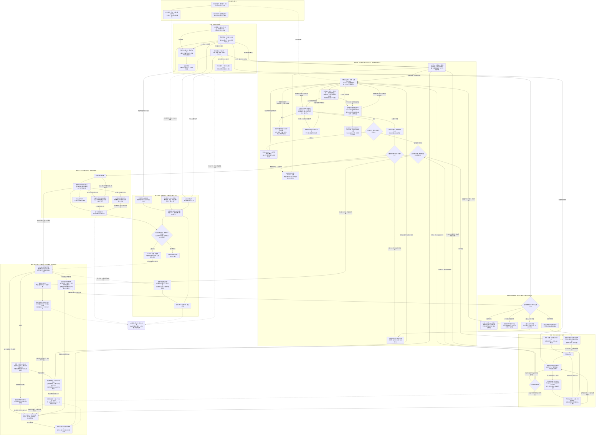
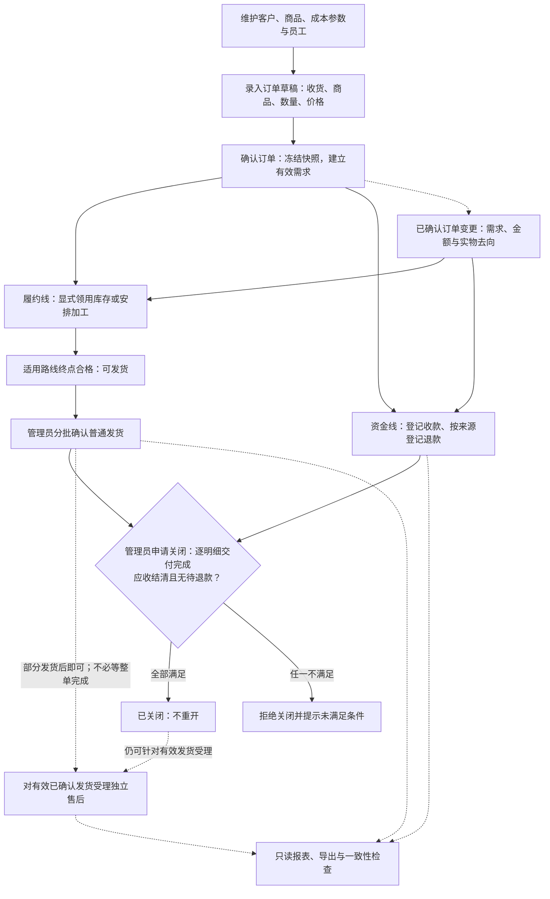
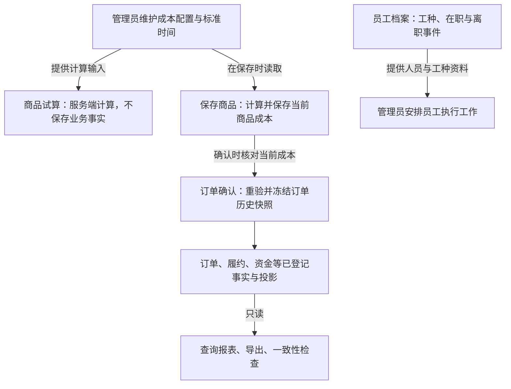
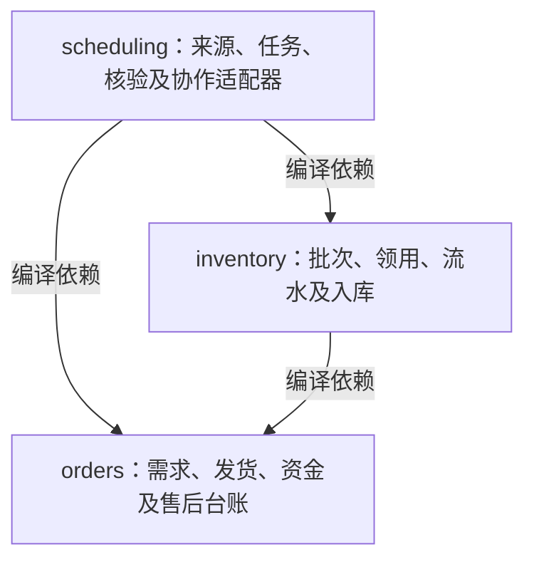

# YUMI V2 总体架构方案

## 全系统完整业务流程图

**一张图读完整闭环：订单 → 库存/加工 → 普通发货，与资金并行汇合关闭；返工、补做、减量处置、售后和库存回流均在本图连接。** 本图统一表达重构后的业务目标，**不是现有代码已完成图**；具体实现差异见 §1.2。2026-09-27 已否决执行登记及 C9 开始保护候选，不再待审批；无显式或隐式开始步骤，未核验计划均可取消，已核验不可取消，实物处置和库存逆向仍遵循原业务规则。

按分区追踪同一份额：实线是业务推进/数量去向，虚线是入口、约束或只读关联，均不代表异步；标注「管理员」的动作必须显式发起，不是上一步自动执行。分支允许按量拆分，但同一份额不可重复消费。此图有意保留完整连接，适合放大查看；后面的专题图只用于下钻。



**读图边界与依据**：订单/库存/份额及逆向见 [领域与数量模型 §4–12、§15](domain-and-quantity-model.md)，加工和异常流转见 [排班设计 §16](scheduling-module-design.md)，退回/覆盖/补发/减量见 [售后设计 §11](after-sales-module-design.md)，收退款与关闭见 [资金设计 §11](settlement-module-design.md)；现有处理方法证据见本文 §1.2。所有批量写入和跨模块流转须同事务重验，失败整体回滚，图中的回路表示后续新任务或新事实，不是修改已核验事实。

- 原订单和售后分别计算需求、预留、已发与两桶数量；同为有缝不代表工艺兼容。退回沿原实物快照，新制造沿新授权快照，不按图中汇合节点混池或换工艺标签。
- 普通发货作废可反向自己的消费，不能套用库存领用逆向的「已消费则拒绝」；已关闭等量更正不重开订单。售后补发不走普通修改/作废/更正入口，核验或处置入库不允许通用孤立冲销，独立期初/调整保留既有合法冲销。
- 执行登记及C9候选已否决，不再待审批。所有未核验计划不论日期或现场加工与否均可取消；已核验不可取消。所有有效未核验计划在同兼容池按taskDate/itemId稳定分配已有真实流入，读与核验锁内共用算法，完成消费、有效未完成释放、取消释放本计划有效占用，不删流入、不复活失效量、不绑定未来实物、不增额度/覆盖。
- 计划取消不消灭实物、不撤销实际加工/消费，不自动取消上下游或解除覆盖。无实物授权终止仍须实际无实物且无加工，PENDING/未核验/取消均不是证明；直接退回报废仍限退回后实际未修补加工等合法条件，库存逆向仍拒绝接入后实际加工或消费。服务端按既有来源、核验、流转及消费证据校验，不用开始标记或新增人工确认操作/字段，不宣称能自动感知未登记现场加工。已有实物沿原份额、用途和工艺继续处置。售后减量后的合法报废及退回直接报废不自动补做，尚存补发缺口须显式正常授权。
- 收款和发货互不前置；售后处理完成不是原订单关闭的第四个条件。其他排班仅记录独立工时，不占制作工作量、不变商品数量。

## 1. 状态与范围

本文以全系统业务流程为入口，区分既有处理路径与 `restructure-scheduling-module` 的待实施目标。订单、库存、生产、发货、资金、售后和报表已有代码；不能把排班重构目标当作当前实现，也不能再把整个系统写成尚未建设。业务依据见 `../requirements/order-fulfillment-requirements.md`。

目标是以单体部署和单库事务支撑首期订单履约闭环，同时为工资、多管理员权限和未来财务模块保留清晰边界。下列流程于 2026-09-27 按代码及目标规格核对，仅为文档梳理，不代表运行验收。§2–11 保留总体技术方案；其中目标包结构、ORM 使用方式和部署描述不是完整的现状盘点，当前排班边界以 §6 及排班施工文档为准。

### 1.1 全系统业务总览

**视图性质：业务目标总览，不是现有实现完成图。** 管理员是系统操作人，员工是业务执行人。图中的「进入」表示具备业务入口，不是系统自动创建下一步；实线表示业务推进，虚线表示关联、观察或独立支线，不表示异步消息。



- 资金与履约并行：现有收款不要求先发货，发货不要求先付款；图中两个入口不是二选一，也不是先收齐款才能生产。
- 草稿库存计划不占库；订单确认不等于领用，不自动创建加工任务。实际领用才扣原批库存，发货不再次扣库。
- 原订单变更、售后需求调整、原发货更正是三种不同业务动作；售后不回写原订单需求、已发、应收或主状态。
- 生产处理完成不等于客户已收齐，售后完成也不是原订单关闭的第四个条件。售后退款单列，不破坏原订单结清净额。

### 1.2 分层阅读与证据索引

| 要回答的问题 | 图与正文落点 | 状态 |
| --- | --- | --- |
| 系统如何从基础资料走到订单交付与结清？ | 本文 §1.1、§1.3 | 总览为目标；基础资料路径有代码证据 |
| 订单何时确认、变更、取消或关闭？ | [领域与数量模型](domain-and-quantity-model.md) §15.1 | 既有状态骨架 + 标明重构附加动作 |
| 库存与加工如何汇合，数量为什么不能相加？ | 同文 §15.2–15.3；[数量流 DOT](quantity-flow.dot) | 重构目标 |
| 减量后实物去哪，作废与冲销有何区别？ | 同文 §15.4–15.5 | 重构目标；计划取消与实物逆向分开 |
| 正常、返工、报废、未完成如何继续？ | [排班设计](scheduling-module-design.md) §16 | 重构目标；无开始步骤，已核验不可取消 |
| 退回、补发、库存用途与覆盖如何闭环？ | [售后设计](after-sales-module-design.md) §11 | 重构目标 |
| 收款、两类退款与关闭如何衔接？ | [资金与关闭设计](settlement-module-design.md) §11 | 现有处理路径的静态核对 |
| 编译依赖与同事务协作如何区分？ | 本文 §6；排班设计 §11 | 重构目标，不是业务流程图 |

现有处理路径证据（链接到实现，不以旧阶段文档代替代码）：

- [OrderService](../../backend/src/main/java/com/yumi/orders/order/OrderService.java)：`create`、`confirm`、`cancel`；确认重验草稿并冻结快照，库存计划不足须显式处理，实际领用另行执行。
- [OrderChangeService](../../backend/src/main/java/com/yumi/orders/change/OrderChangeService.java)：创建/确认变更、已发下限及金额重算；当前记录超出处理方案不代表目标实物处置已闭环。
- [ShipmentService](../../backend/src/main/java/com/yumi/orders/shipment/ShipmentService.java)：草稿、确认、作废、等量更正；当前聚合履约反向不能充当目标真实份额反向的证据。
- [SettlementService](../../backend/src/main/java/com/yumi/orders/settlement/SettlementService.java)：`registerPayment`、`registerRefund`、`close`、`totalsOf`；收退款公式和三条件关闭。
- [AfterSalesService](../../backend/src/main/java/com/yumi/orders/aftersales/AfterSalesService.java)：受理、退回与专用补发入口已有实现；目标的路线份额、共享来源及覆盖去向仍须按活动 change 实施。
- [ReportService](../../backend/src/main/java/com/yumi/reports/ReportService.java)：查询、导出与一致性检查读取事实/投影，不自动修复业务数量。

**已发现的现状差异，不在图中隐去：** 普通发货创建草稿检查订单已确认，但当前确认方法未再次校验订单主状态；来源链接仍写占位行 ID，等量更正仍重新链接来源，未达到目标同份额传递。退款当前校验来源存在及订单归属，不能宣称已验证来源已确认。本次只记录这些边界，不修改实现；发货目标守卫与份额闭环由活动 change 的订单生命周期规格和任务 3.2、6.8 承接，退款来源确认状态不在本次新增规则。

本次图示检查记录（2026-09-27）：取消规则修订后，五份 Markdown 共18张 Mermaid 图（开头完整总图62节点）已重新用本机 Mermaid 10.9.5 与 Chrome 离线解析、渲染；节点声明、页面错误与标签溢出检查通过，保留开头完整连通总图。取消、核验、稳定分配及实物边界经独立图文复核，无确定冲突；此前退回直接报废、REWORK资源限制和核验失败箭头修正保留。DOT仅做节点/边结构检查，本机无Graphviz，未验证布局渲染。严格OpenSpec校验7项通过，任务仍59项未勾选；图示及文档检查不等于应用测试、实施验收或业务签字。

### 1.3 支撑业务：配置、商品、员工与只读输出

**视图性质：现有处理方法静态核对。** 商品保存与订单确认是两次不同冻结；修改配置不等于批量重算全部历史商品和订单。



依据：[SettingsService](../../backend/src/main/java/com/yumi/catalog/settings/SettingsService.java)、[ProductService](../../backend/src/main/java/com/yumi/catalog/product/ProductService.java)、[EmployeeService](../../backend/src/main/java/com/yumi/catalog/employee/service/EmployeeService.java) 及上述订单、报表服务。员工离职/重新入职追加事件；不是删除历史排班。试算结果不是订单确认事实；报表输出不驱动发货、补发或收款。具体排班资格和资源限制见排班设计，不由此图推导工资功能。

## 2. 关键决策

| 决策 | 选择 | 原因 |
| --- | --- | --- |
| 系统形态 | 模块化单体 | 业务事务高度关联，首期不需要微服务复杂度 |
| 后端 | Java 21 LTS + Spring Boot 3.5.x | 强事务、成熟数据访问和长期复杂业务维护能力 |
| 模块治理 | Spring Modulith | 在单体内验证模块依赖并限制内部实现泄漏 |
| 构建 | Maven | 与 Spring Boot、Flyway 和测试工具链成熟集成 |
| 数据访问 | Spring Data JPA + Hibernate | 聚合写入和常规查询使用 JPA，复杂只读查询允许专用 SQL |
| 数据库迁移 | Flyway | SQL 迁移是数据库结构唯一来源 |
| 数据库 | MySQL 8.x | 支持事务、约束、行级锁和单机云部署 |
| 前端 | React + TypeScript | 浏览器和 Electron 共用业务前端 |
| 桌面端 | Electron 薄壳 | 只提供桌面增强，不承载业务规则或直连数据库 |
| 一致性 | 单库事务 + 不可变业务事实 | 首期无需消息队列和分布式事务 |
| 金额 | Java `BigDecimal` + MySQL `DECIMAL(19,4)` | 避免二进制浮点误差 |
| 部署 | 单云服务器应用与 MySQL 同机 | 控制首期成本，数据库不暴露公网 |

## 3. 系统上下文

管理员通过浏览器或 Electron 访问同一套 React 前端。客户端通过 HTTPS 调用 Spring Boot API，API 访问 MySQL 和文件存储。客户端禁止直连数据库。

```text
管理员
  ├─ 浏览器 ─────┐
  └─ Electron ───┼─ HTTPS ─> Spring Boot 模块化单体 ─> MySQL
                 │                              └──────> 文件存储
                 └─ 共用 React 业务前端
```

架构源文件见 `system-architecture.dsl`，部署细节见 `deployment-architecture.md`。

## 4. 顶级业务模块

### 4.1 身份与审计 `identity`

负责管理员登录、密码验证、会话、当前操作人和审计上下文。账号表示操作人，员工档案表示业务执行人。

### 4.2 基础资料 `catalog`

负责商品、成本参数、星级配置、包装档位、客户和员工。已确认订单只能读取冻结快照，不能用当前资料覆盖历史。

### 4.3 订单 `orders`

订单是围绕订单生命周期的核心业务模块，内部组件包括：

```text
orders
├── order            订单、明细、确认和快照
├── change           订单变更、取消剩余需求和金额重算
├── fulfillment      履约事实与当前数量投影
├── shipping         发货、物流变更和发货更正
├── settlement       收款、退款、实收净额和待退款
├── aftersales       退回、售后返工、报废、补发和售后退款
└── closing          履约与款项条件检查、订单关闭
```

订单模块拥有订单主状态、当前有效需求、履约台账、可发货数量、累计有效发货、收退款关联、售后台账和关闭判定。独立数据库表不代表独立顶级模块。

### 4.4 库存 `inventory`

负责库存批次、库存流水、期初库存、盘点调整、订单领用、取消领用、工序合格库存和订单余量库存。库存批次不绑定目标订单，订单使用库存必须通过领用命令和不可变流水。

### 4.5 现有生产 `production` 与目标排班 `scheduling`

现有代码仍使用 `production`，包含旧超额机制；重构目标改为 `scheduling`，负责制作/其他排班、一次性核验、分目标返工、从制作补做、售后执行和未完成提示。目标删除超额任务、未来预占及计划调整建议，不是合表或改名保留。制作工作量只给管理员软提示，正常数量硬产能独立校验。排班不拥有订单需求或主状态，售后执行不回写普通履约。

### 4.6 文件与导出 `files`

负责商品图片、受控下载、PDF/打印数据准备和表格导出。历史输出读取业务快照，不回读当前资料替换历史值。

### 4.7 集中计算 `calculation`（无持久化支撑模块）

负责商品及后续已建设业务的数值公式：金额与比例精度策略、商品计价链；订单、库存、生产的公式随对应业务接入，未建设业务不提前创建空分类。模块没有数据库表、Repository 或实体，不访问 HTTP、当前时间或登录上下文，只接收不可变数值输入并返回结果。业务模块通过公开命名接口单向调用；事务、引用选择、快照冻结、并发锁、事实入账与持久化仍属业务模块。公式清单与测试编号见 `formula-catalog.md`，方案与边界见 `formula-management-design.md`。

## 5. Java 包与模块边界

```text
com.yumi
├── identity
├── catalog
├── orders
│   ├── order
│   ├── change
│   ├── fulfillment
│   ├── shipping
│   ├── settlement
│   ├── aftersales
│   └── closing
├── inventory
├── production
├── files
├── calculation
│   ├── product
│   ├── order（随业务接入）
│   ├── inventory（随业务接入）
│   ├── production（随业务接入）
│   ├── payroll（业务确认后接入）
│   └── finance（业务确认后接入）
└── shared
```

每个顶级模块公开应用服务和必要的公开 DTO；实体、Repository 和内部领域服务留在模块内部。Spring Modulith 边界测试必须阻止跨模块访问内部包。`shared` 只保存稳定的技术型值对象和基础能力，不承载业务流程，也不得成为通用杂物包。`calculation` 是唯一允许承载业务数值公式的位置，边界测试要求它没有任何出边（不依赖业务模块、Repository、实体或外部可变状态）。

## 6. 依赖与协作

**下图仅是本次重构涉及三个业务模块的目标编译依赖，不是运行调用先后，也不冒充全系统现状依赖图。** 完整端口契约见排班设计 §11 和活动 change 的 tasks C10。



运行时，orders 通过 **orders 自有端口及 DTO** 请求协作，inventory 通过 **inventory 自有端口及 DTO** 请求协调，由 scheduling 中的 adapter 实现。这样业务请求可以从订单发起，Java 类型仍不出现 orders → scheduling/inventory 或 inventory → scheduling 反向边。adapter 不回注上层订单/售后/库存服务，Receipt/writer 不再回调协作端口。

外层业务命令拥有事务；内部写端口与底层 writer/receipt 经 Spring 代理以 `MANDATORY` 加入同一事务，任一步失败整体回滚。无异步、内部 HTTP、`REQUIRES_NEW` 或提交后补账。整批收集影响范围，再按所有者 → 任务 → 来源/份额/覆盖 → 容量 → 库存 → 稳定序列锁顺序重验，不能逐行重新走锁层。

身份审计提供操作人、基础资料提供冻结证据；业务公式单向调用无持久化 `calculation`。这些职责关系不在上图冒充已扫描的编译依赖。禁止跨模块直接访问内部 Repository、实体或表。

## 7. 数据访问与迁移

Flyway SQL 是数据库结构唯一来源，迁移文件位于 `backend/src/main/resources/db/migration`。后端 Maven 工程位于 `backend/`，共享 React/TypeScript 前端位于 `frontend/`，Electron 薄壳位于 `frontend/electron/`。Hibernate 配置为：

```yaml
spring:
  jpa:
    hibernate:
      ddl-auto: validate
```

禁止在任何环境使用 Hibernate `update` 维护正式结构。普通聚合写入使用 Spring Data JPA；复杂统计、列表和事实重建可使用专用只读 Repository、JPQL 或原生 SQL，但不得绕过领域命令写入业务事实。

## 8. 关键事务与并发

目标要求以下操作分别在单个数据库事务中完成：订单确认、整单变更确认、库存领用或合法逆向、排班批量核验、发货确认或更正、收退款登记、售后退回核验与补发确认、需求/用途处置及真实入库、订单关闭。目标没有超额预占/释放命令；这些事务要求不代表当前实现已经全部达标。

技术方案使用：

- Spring `@Transactional` 定义事务边界；
- JPA `@Version` 处理常规并发修改；
- `PESSIMISTIC_WRITE` 或显式 `SELECT ... FOR UPDATE` 锁定关键数量余额；
- 数据库唯一约束防止来源重复消费和重复核验；
- 幂等请求标识防止客户端重试重复写入；
- 事务内重新读取权威数量，不信任客户端汇总。

## 9. 数据与金额原则

- Java 金额、成本、单价和比例使用 `BigDecimal`，禁止使用 `double` 或 `float` 产生权威结果；
- API 金额使用十进制字符串；
- 订单确认快照、生产核验、库存流水、发货确认、收款、退款和售后核验均为不可变事实；
- 错误通过冲销、更正或反向事实处理；
- 汇总投影必须能从事实重建；
- 所有业务时间使用服务端时间，业务日期和创建时间分开保存。

## 10. API 与客户端边界

API 采用资源查询和业务命令，不提供通用状态更新接口。例如：

```text
POST /orders
POST /orders/{id}/confirm
POST /orders/{id}/change-orders
POST /order-changes/{id}/confirm
POST /production-tasks/{id}/verify
POST /inventory-allocations
POST /orders/{orderId}/shipments/{shipmentId}/confirm
POST /orders/{id}/close
POST /orders/{orderId}/after-sales/{caseId}/verify-return
```

React 前端按基础资料、订单、生产工作台和库存组织业务工作区；发货、收退款和售后入口位于订单工作区。Electron 主进程只负责窗口、打印、文件选择和系统集成。

## 11. 测试与架构门禁

- JUnit 5：领域规则和金额计算；
- Spring Boot 集成测试：事务和业务命令；
- 本机 MySQL：约束、锁、Flyway 和并发集成测试；沿用 Testcontainers 暂缓的既有豁免，不把本机结果称为容器验收；
- Spring Modulith：模块依赖验证；
- Flyway：空库迁移、重复校验和迁移历史验证；
- API 契约测试：金额字符串、状态和错误响应；
- 端到端测试：订单确认、部分发货后并行售后与剩余履约、结清关闭，以及已关闭订单继续售后的路径。

进入实现前，需求、领域、数据库、部署和路线图必须对模块边界、数量口径、库存扣减、订单关闭和售后独立台账保持一致。
